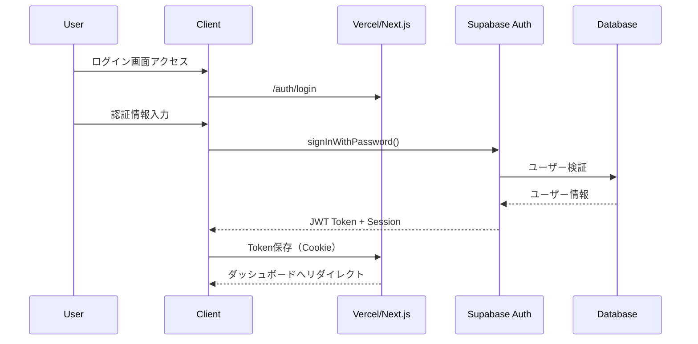
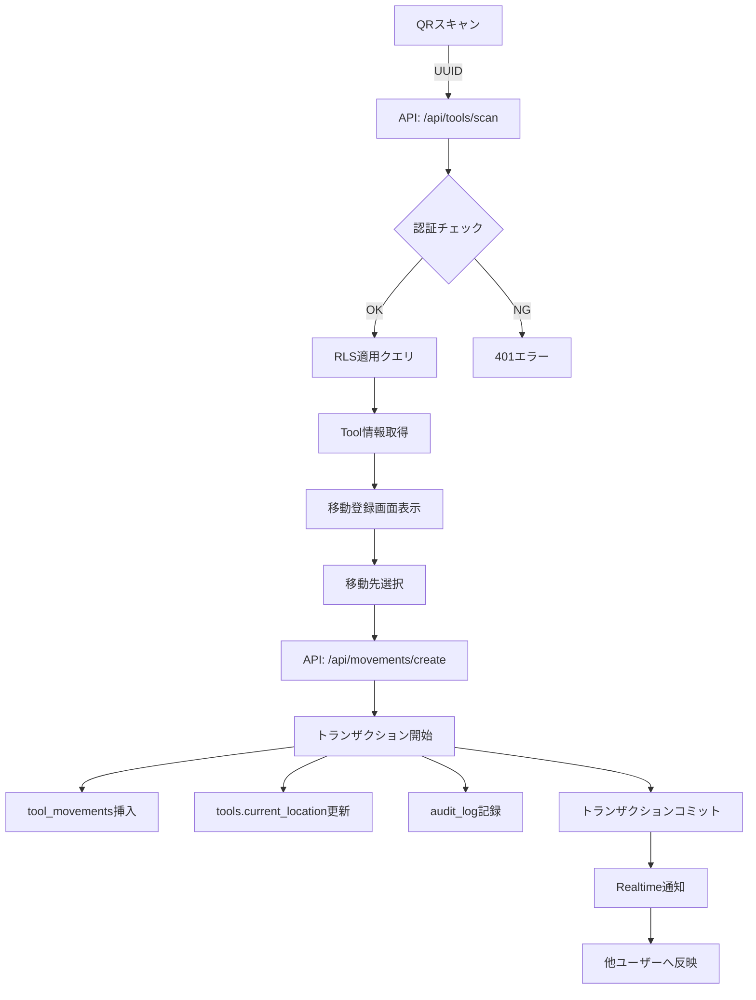
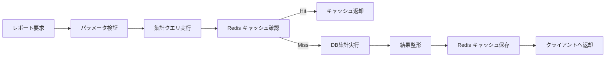

# システムアーキテクチャ設計書

## 目次
1. [システム概要](#1-システム概要)
2. [全体アーキテクチャ](#2-全体アーキテクチャ)
3. [技術スタック](#3-技術スタック)
4. [データベース設計](#4-データベース設計)
5. [認証・セキュリティ](#5-認証セキュリティ)
6. [データフロー](#6-データフロー)
7. [ディレクトリ構造](#7-ディレクトリ構造)
8. [API設計](#8-api設計)
9. [リアルタイム機能](#9-リアルタイム機能)
10. [パフォーマンス・スケーラビリティ](#10-パフォーマンススケーラビリティ)

---

## 1. システム概要

### 1.1 アーキテクチャパターン
- **マルチテナントSaaS型アーキテクチャ**
- **サーバーレス・エッジコンピューティング**
- **マイクロサービス指向**（将来的な拡張性を考慮）

### 1.2 設計原則
- **セキュリティファースト**: UUID、RLS、監査ログ
- **スケーラビリティ**: 水平スケーリング対応
- **高可用性**: 99.9%のアップタイム目標
- **DX重視**: 開発効率とメンテナンス性

---

## 2. 全体アーキテクチャ

### 2.1 システム構成図

```
┌─────────────────────────────────────────────────────────────┐
│                        クライアント層                          │
├────────────────┬────────────────┬────────────────────────────┤
│   Web App      │   Mobile Web    │    PWA                   │
│  (Desktop)     │   (iOS/Android) │  (オフライン対応)         │
└────────┬───────┴────────┬───────┴────────┬──────────────────┘
         │                 │                 │
         └─────────────────┼─────────────────┘
                           │ HTTPS
                           ▼
┌─────────────────────────────────────────────────────────────┐
│                    エッジ・CDN層 (Vercel Edge Network)        │
├─────────────────────────────────────────────────────────────┤
│  - 静的アセット配信                                           │
│  - エッジファンクション                                       │
│  - グローバルキャッシング                                     │
└───────────────────────────┬─────────────────────────────────┘
                            │
                            ▼
┌─────────────────────────────────────────────────────────────┐
│                 アプリケーション層 (Next.js on Vercel)        │
├─────────────────────────────────────────────────────────────┤
│  ┌──────────────────────────────────────────────────────┐  │
│  │  App Router                                          │  │
│  ├──────────────────────────────────────────────────────┤  │
│  │  - Server Components (RSC)                           │  │
│  │  - API Routes (/app/api/*)                          │  │
│  │  - Middleware (認証、レート制限)                      │  │
│  │  - Server Actions                                    │  │
│  └──────────────────────────────────────────────────────┘  │
└───────────────────────────┬─────────────────────────────────┘
                            │
        ┌───────────────────┼───────────────────┐
        │                   │                   │
        ▼                   ▼                   ▼
┌──────────────┐   ┌──────────────┐   ┌──────────────┐
│   Supabase   │   │  Upstash     │   │   外部API    │
│              │   │   Redis      │   │              │
├──────────────┤   ├──────────────┤   ├──────────────┤
│ PostgreSQL   │   │ Rate Limit   │   │ Slack API    │
│ Auth         │   │ Cache        │   │ Email API    │
│ Storage      │   │ Session      │   │ SMS API      │
│ Realtime     │   └──────────────┘   └──────────────┘
│ Vector       │
└──────────────┘
```

### 2.2 マルチテナント構成

```
                    tool-manager.com
                           │
        ┌──────────────────┼──────────────────┐
        │                  │                  │
        ▼                  ▼                  ▼
  a-kensetsu.*        b-tosou.*         c-denki.*
  (A建設株式会社)      (B塗装工業)        (C電気工事)
        │                  │                  │
        └──────────────────┼──────────────────┘
                           │
                    Supabase (Single DB)
                           │
                    Row Level Security
                    ├── Organization A Data
                    ├── Organization B Data
                    └── Organization C Data
```

---

## 3. 技術スタック

### 3.1 フロントエンド
```json
{
  "framework": "Next.js 14 (App Router)",
  "language": "TypeScript 5.x",
  "styling": "Tailwind CSS 3.4",
  "ui-components": "Shadcn/ui",
  "state-management": "Zustand",
  "forms": "React Hook Form + Zod",
  "data-fetching": "@tanstack/react-query v5",
  "icons": "Lucide React",
  "charts": "Recharts",
  "qr-code": "html5-qrcode, qrcode",
  "pwa": "next-pwa"
}
```

### 3.2 バックエンド・インフラ
```json
{
  "hosting": "Vercel",
  "database": "Supabase PostgreSQL",
  "auth": "Supabase Auth",
  "storage": "Supabase Storage",
  "cache": "Upstash Redis",
  "realtime": "Supabase Realtime",
  "monitoring": "Vercel Analytics",
  "error-tracking": "Sentry"
}
```

---

## 4. データベース設計

### 4.1 主要テーブル構造

#### organizations（組織）
```sql
CREATE TABLE organizations (
  id UUID PRIMARY KEY DEFAULT uuid_generate_v4(),
  name TEXT NOT NULL,
  subdomain TEXT UNIQUE NOT NULL,
  plan TEXT CHECK (plan IN ('basic', 'premium', 'enterprise')),
  payment_method TEXT CHECK (payment_method IN ('invoice', 'bank_transfer')),
  max_users INTEGER DEFAULT 20,
  max_tools INTEGER DEFAULT 500,
  is_active BOOLEAN DEFAULT true,
  created_at TIMESTAMP DEFAULT NOW(),
  updated_at TIMESTAMP DEFAULT NOW()
);

CREATE INDEX idx_organizations_subdomain ON organizations(subdomain);
```

#### users（ユーザー）
```sql
CREATE TABLE users (
  id UUID PRIMARY KEY DEFAULT uuid_generate_v4(),
  organization_id UUID NOT NULL REFERENCES organizations(id),
  email TEXT UNIQUE NOT NULL,
  name TEXT NOT NULL,
  role TEXT CHECK (role IN ('admin', 'leader', 'staff')),
  deleted_at TIMESTAMP,
  created_at TIMESTAMP DEFAULT NOW(),
  updated_at TIMESTAMP DEFAULT NOW()
);

CREATE INDEX idx_users_organization ON users(organization_id);
CREATE INDEX idx_users_email ON users(email);
```

#### tools（道具）
```sql
CREATE TABLE tools (
  id UUID PRIMARY KEY DEFAULT uuid_generate_v4(),
  organization_id UUID NOT NULL REFERENCES organizations(id),
  tool_code TEXT NOT NULL,
  category_id UUID REFERENCES tool_categories(id),
  name TEXT NOT NULL,
  model_number TEXT,
  manufacturer TEXT,
  purchase_date DATE,
  purchase_price DECIMAL(10, 2),
  status TEXT CHECK (status IN ('normal', 'repair', 'broken', 'disposed')),
  current_location_id UUID REFERENCES locations(id),
  management_type TEXT CHECK (management_type IN ('individual', 'quantity')),
  current_quantity INTEGER,
  unit TEXT,
  custom_fields JSONB,
  deleted_at TIMESTAMP,
  created_at TIMESTAMP DEFAULT NOW(),
  updated_at TIMESTAMP DEFAULT NOW(),

  UNIQUE(organization_id, tool_code)
);

CREATE INDEX idx_tools_organization ON tools(organization_id);
CREATE INDEX idx_tools_category ON tools(category_id);
CREATE INDEX idx_tools_location ON tools(current_location_id);
CREATE INDEX idx_tools_status ON tools(status);
```

#### tool_movements（移動履歴）
```sql
CREATE TABLE tool_movements (
  id UUID PRIMARY KEY DEFAULT uuid_generate_v4(),
  organization_id UUID NOT NULL REFERENCES organizations(id),
  tool_id UUID NOT NULL REFERENCES tools(id),
  user_id UUID NOT NULL REFERENCES users(id),
  from_location_id UUID REFERENCES locations(id),
  to_location_id UUID REFERENCES locations(id),
  movement_type TEXT CHECK (movement_type IN ('checkout', 'checkin', 'transfer')),
  quantity INTEGER DEFAULT 1,
  note TEXT,
  moved_at TIMESTAMP DEFAULT NOW(),
  deleted_at TIMESTAMP,
  created_at TIMESTAMP DEFAULT NOW()
);

CREATE INDEX idx_movements_organization ON tool_movements(organization_id);
CREATE INDEX idx_movements_tool ON tool_movements(tool_id);
CREATE INDEX idx_movements_user ON tool_movements(user_id);
CREATE INDEX idx_movements_date ON tool_movements(moved_at DESC);
```

#### locations（場所）
```sql
CREATE TABLE locations (
  id UUID PRIMARY KEY DEFAULT uuid_generate_v4(),
  organization_id UUID NOT NULL REFERENCES organizations(id),
  type TEXT CHECK (type IN ('company', 'site')),
  name TEXT NOT NULL,
  address TEXT,
  manager_name TEXT,
  is_active BOOLEAN DEFAULT true,
  deleted_at TIMESTAMP,
  created_at TIMESTAMP DEFAULT NOW(),
  updated_at TIMESTAMP DEFAULT NOW()
);

CREATE INDEX idx_locations_organization ON locations(organization_id);
```

#### organization_features（機能フラグ）
```sql
CREATE TABLE organization_features (
  id UUID PRIMARY KEY DEFAULT uuid_generate_v4(),
  organization_id UUID NOT NULL REFERENCES organizations(id),
  feature_key TEXT NOT NULL,
  is_enabled BOOLEAN DEFAULT false,
  config JSONB DEFAULT '{}',
  enabled_at TIMESTAMP,
  enabled_by UUID REFERENCES users(id),

  UNIQUE(organization_id, feature_key)
);

CREATE INDEX idx_features_organization ON organization_features(organization_id);
```

#### audit_logs（監査ログ）
```sql
CREATE TABLE audit_logs (
  id UUID PRIMARY KEY DEFAULT uuid_generate_v4(),
  organization_id UUID REFERENCES organizations(id),
  user_id UUID REFERENCES users(id),
  action TEXT NOT NULL,
  table_name TEXT NOT NULL,
  record_id UUID,
  old_value JSONB,
  new_value JSONB,
  ip_address INET,
  user_agent TEXT,
  reason TEXT,
  created_at TIMESTAMP DEFAULT NOW()
);

CREATE INDEX idx_audit_logs_org ON audit_logs(organization_id);
CREATE INDEX idx_audit_logs_user ON audit_logs(user_id);
CREATE INDEX idx_audit_logs_created ON audit_logs(created_at DESC);
CREATE INDEX idx_audit_logs_table ON audit_logs(table_name, record_id);
```

### 4.2 Row Level Security (RLS) ポリシー

```sql
-- tools テーブルのRLS
ALTER TABLE tools ENABLE ROW LEVEL SECURITY;

CREATE POLICY "tools_isolation" ON tools
  FOR ALL
  USING (
    organization_id = (
      SELECT organization_id FROM users WHERE id = auth.uid()
    )
  );

-- 論理削除を考慮したポリシー
CREATE POLICY "tools_select" ON tools
  FOR SELECT
  USING (
    organization_id = (
      SELECT organization_id FROM users WHERE id = auth.uid()
    )
    AND deleted_at IS NULL
  );
```

### 4.3 ストアドプロシージャによるデータ操作

**重要**: 一部の操作ではRLSポリシーの制約を回避するため、ストアドプロシージャを使用しています。

#### 削除操作

削除操作は`delete_tool()`ストアドプロシージャを使用します。

**理由:**
- RLSポリシーの`WITH CHECK`句とUPDATE操作の競合を回避
- 組織IDのチェックは関数内で実行し、セキュリティを保証
- `SECURITY DEFINER`により、RLSを回避して確実に削除を実行

```sql
CREATE OR REPLACE FUNCTION public.delete_tool(tool_id UUID)
RETURNS JSON AS $$
DECLARE
    user_org_id UUID;
    tool_org_id UUID;
BEGIN
    -- 現在のユーザーの組織IDを取得
    SELECT organization_id INTO user_org_id
    FROM public.users
    WHERE id = auth.uid();

    IF user_org_id IS NULL THEN
        RETURN json_build_object('error', 'ユーザーの組織が見つかりません');
    END IF;

    -- 削除対象の道具の組織IDを取得
    SELECT organization_id INTO tool_org_id
    FROM public.tools
    WHERE id = tool_id AND deleted_at IS NULL;

    IF tool_org_id IS NULL THEN
        RETURN json_build_object('error', '道具が見つかりません');
    END IF;

    -- 組織が一致するかチェック
    IF user_org_id != tool_org_id THEN
        RETURN json_build_object('error', '権限がありません');
    END IF;

    -- 論理削除を実行
    UPDATE public.tools
    SET deleted_at = NOW(),
        updated_at = NOW()
    WHERE id = tool_id;

    RETURN json_build_object('success', true, 'id', tool_id);
END;
$$ LANGUAGE plpgsql SECURITY DEFINER;
```

**使用方法:**
```typescript
// Server Action内で使用
const { data, error } = await supabase.rpc('delete_tool', {
  tool_id: toolId
});
```

**今後の方針:**
- 他の操作（作成、更新、取得）で同様のRLS問題が発生した場合、同じパターンでストアドプロシージャを作成
- 必要に応じて、全操作をストアドプロシージャに統一することも検討

---

## 5. 認証・セキュリティ

### 5.1 認証フロー



### 5.2 セキュリティ層

```
1. ネットワークレベル
   - HTTPS強制
   - CSP (Content Security Policy)
   - CORS設定

2. アプリケーションレベル
   - JWT認証
   - セッション管理
   - CSRF対策

3. データベースレベル
   - Row Level Security
   - UUID主キー（推測不可能）
   - 論理削除

4. 監査・監視
   - 全操作の監査ログ
   - レート制限（Upstash Redis）
   - 異常検知アラート
```

---

## 6. データフロー

### 6.1 QRスキャン→移動登録フロー



### 6.2 レポート生成フロー



---

## 7. ディレクトリ構造

```
field-tool-manager/
├── app/                          # Next.js App Router
│   ├── (auth)/                   # 認証関連ルート
│   │   ├── login/
│   │   ├── reset-password/
│   │   └── layout.tsx
│   ├── (dashboard)/              # メインアプリケーション
│   │   ├── layout.tsx           # 共通レイアウト（ヘッダー、サイドバー）
│   │   ├── page.tsx             # ダッシュボード
│   │   ├── tools/               # 道具管理
│   │   │   ├── page.tsx        # 一覧
│   │   │   ├── [id]/           # 詳細
│   │   │   └── new/            # 新規登録
│   │   ├── scan/                # QRスキャン
│   │   ├── movements/           # 移動履歴
│   │   ├── reports/             # レポート
│   │   ├── users/               # ユーザー管理
│   │   └── settings/            # 設定
│   ├── admin/                    # システム管理者
│   │   ├── organizations/       # 顧客管理
│   │   ├── features/            # 機能フラグ
│   │   └── billing/             # 請求管理
│   ├── api/                      # API Routes
│   │   ├── auth/
│   │   ├── tools/
│   │   ├── movements/
│   │   └── webhook/
│   └── layout.tsx                # ルートレイアウト
│
├── components/                    # 共通コンポーネント
│   ├── ui/                       # 基本UIコンポーネント
│   │   ├── button.tsx
│   │   ├── input.tsx
│   │   ├── table.tsx
│   │   └── ...
│   ├── features/                 # 機能別コンポーネント
│   │   ├── tool-list/
│   │   ├── qr-scanner/
│   │   └── movement-form/
│   └── layouts/                  # レイアウトコンポーネント
│       ├── header.tsx
│       ├── sidebar.tsx
│       └── footer.tsx
│
├── lib/                          # ライブラリ・ユーティリティ
│   ├── supabase/                # Supabase設定
│   │   ├── client.ts
│   │   ├── server.ts
│   │   └── types.ts
│   ├── auth/                    # 認証関連
│   ├── api/                     # API クライアント
│   ├── utils/                   # ユーティリティ関数
│   └── constants/               # 定数定義
│
├── hooks/                        # カスタムフック
│   ├── use-auth.ts
│   ├── use-tools.ts
│   └── use-feature-flag.ts
│
├── types/                        # TypeScript型定義
│   ├── database.ts
│   ├── api.ts
│   └── ui.ts
│
├── styles/                       # グローバルスタイル
│   └── globals.css
│
├── public/                       # 静的ファイル
│   ├── images/
│   └── manifest.json            # PWA設定
│
├── docs/                         # ドキュメント
│   ├── ARCHITECTURE.md
│   ├── CONTRIBUTING.md
│   ├── FEATURES.md
│   └── MANUAL.md
│
├── scripts/                      # ユーティリティスクリプト
│   ├── setup-db.ts
│   └── seed-data.ts
│
├── tests/                        # テストファイル
│   ├── unit/
│   ├── integration/
│   └── e2e/
│
└── config files                  # 設定ファイル
    ├── next.config.js
    ├── tailwind.config.ts
    ├── tsconfig.json
    ├── package.json
    └── .env.local
```

---

## 8. API設計

### 8.1 RESTful API エンドポイント

```
認証
POST   /api/auth/login          # ログイン
POST   /api/auth/logout         # ログアウト
POST   /api/auth/refresh        # トークン更新
POST   /api/auth/reset-password # パスワードリセット

道具管理
GET    /api/tools               # 道具一覧
GET    /api/tools/:id          # 道具詳細
POST   /api/tools               # 道具登録
PUT    /api/tools/:id          # 道具更新
DELETE /api/tools/:id          # 道具削除（論理）
POST   /api/tools/import        # 一括インポート
POST   /api/tools/scan          # QRスキャン

移動管理
GET    /api/movements           # 移動履歴
POST   /api/movements           # 移動登録
GET    /api/movements/tool/:id # 道具別履歴

レポート
GET    /api/reports/inventory   # 在庫レポート
GET    /api/reports/movements   # 移動レポート
GET    /api/reports/costs      # コスト分析

管理者
GET    /api/admin/organizations      # 顧客一覧
POST   /api/admin/organizations      # 顧客登録
PUT    /api/admin/features/:orgId    # 機能フラグ更新
POST   /api/admin/invoices           # 請求書発行
```

### 8.2 リクエスト/レスポンス形式

```typescript
// 標準レスポンス形式
interface ApiResponse<T> {
  success: boolean;
  data?: T;
  error?: {
    code: string;
    message: string;
    details?: any;
  };
  meta?: {
    page?: number;
    limit?: number;
    total?: number;
  };
}

// エラーレスポンス例
{
  "success": false,
  "error": {
    "code": "UNAUTHORIZED",
    "message": "認証が必要です",
    "details": null
  }
}
```

---

## 9. リアルタイム機能

### 9.1 Supabase Realtime 設定

```typescript
// リアルタイム購読の実装
const supabase = createClient();

// 道具の移動をリアルタイムで監視
const channel = supabase
  .channel('tool-movements')
  .on(
    'postgres_changes',
    {
      event: 'INSERT',
      schema: 'public',
      table: 'tool_movements',
      filter: `organization_id=eq.${organizationId}`
    },
    (payload) => {
      // 新しい移動が登録されたら画面更新
      console.log('New movement:', payload);
      updateMovementList(payload.new);
    }
  )
  .subscribe();

// 在庫アラートのリアルタイム通知
const alertChannel = supabase
  .channel('stock-alerts')
  .on(
    'postgres_changes',
    {
      event: 'UPDATE',
      schema: 'public',
      table: 'tools',
      filter: `current_quantity=lt.min_stock_alert`
    },
    (payload) => {
      // 低在庫アラート表示
      showLowStockAlert(payload.new);
    }
  )
  .subscribe();
```

---

## 10. パフォーマンス・スケーラビリティ

### 10.1 パフォーマンス最適化

```typescript
// 1. データフェッチの最適化
// Parallel fetch with Promise.all
const [tools, categories, locations] = await Promise.all([
  getTools(),
  getCategories(),
  getLocations()
]);

// 2. ページネーション実装
const ITEMS_PER_PAGE = 50;
const offset = (page - 1) * ITEMS_PER_PAGE;

const { data, count } = await supabase
  .from('tools')
  .select('*', { count: 'exact' })
  .range(offset, offset + ITEMS_PER_PAGE - 1);

// 3. 仮想スクロール（大量データ表示）
import { FixedSizeList } from 'react-window';

// 4. 画像最適化
import Image from 'next/image';
<Image
  src="/tool.jpg"
  alt="Tool"
  width={300}
  height={200}
  loading="lazy"
  placeholder="blur"
/>
```

### 10.2 キャッシング戦略

```typescript
// Redis キャッシング (Upstash)
import { Redis } from '@upstash/redis';

const redis = new Redis({
  url: process.env.UPSTASH_REDIS_REST_URL!,
  token: process.env.UPSTASH_REDIS_REST_TOKEN!,
});

// キャッシュ実装例
async function getCachedData(key: string, fetcher: () => Promise<any>) {
  // キャッシュ確認
  const cached = await redis.get(key);
  if (cached) return cached;

  // データフェッチ
  const data = await fetcher();

  // キャッシュ保存（TTL: 5分）
  await redis.setex(key, 300, JSON.stringify(data));

  return data;
}
```

### 10.3 負荷分散・スケーリング

```
1. 水平スケーリング
   - Vercel の自動スケーリング
   - Supabase の Connection Pooling
   - Redis クラスタリング

2. CDN 活用
   - 静的アセットの最適配信
   - エッジキャッシング
   - 地理的分散

3. データベース最適化
   - インデックス最適化
   - パーティショニング（将来的）
   - Read Replica（必要時）
```

### 10.4 監視・アラート

```typescript
// パフォーマンス監視
- Core Web Vitals
  - LCP < 2.5s
  - FID < 100ms
  - CLS < 0.1

// エラー監視（Sentry）
import * as Sentry from '@sentry/nextjs';

Sentry.init({
  dsn: process.env.SENTRY_DSN,
  environment: process.env.NODE_ENV,
  tracesSampleRate: 1.0,
});

// カスタムメトリクス
Sentry.metrics.set('tools.count', toolCount);
Sentry.metrics.increment('qr.scan.success');
```

---

## 更新履歴

- 2024-11-30: 初版作成
- セクション1-10: システム全体設計を記載