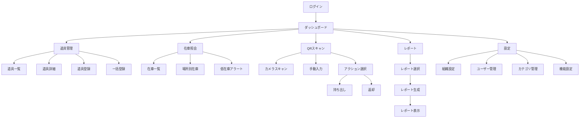
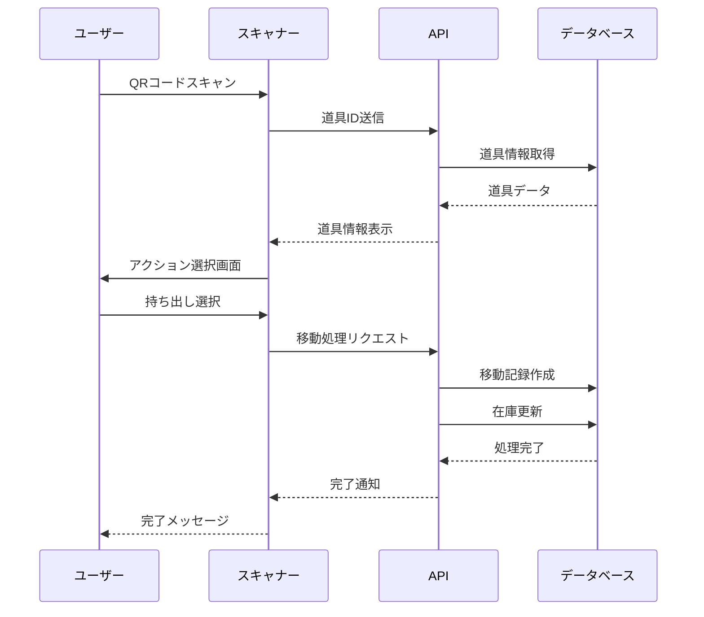

# 機能要件詳細仕様書

## 目次

1. [基本機能](#1-基本機能)
   - [1.1 道具管理](#11-道具管理)
   - [1.2 QRコードシステム](#12-qrコードシステム)
   - [1.3 在庫・所在管理](#13-在庫所在管理)
   - [1.4 移動履歴](#14-移動履歴)
   - [1.5 道具セット管理](#15-道具セット管理)
   - [1.6 レポート機能](#16-レポート機能)
2. [ユーザー管理機能](#2-ユーザー管理機能)
3. [システム管理機能](#3-システム管理機能)
4. [オプション機能](#4-オプション機能)
5. [画面遷移図](#5-画面遷移図)
6. [業務フロー](#6-業務フロー)

---

## 1. 基本機能

### 1.1 道具管理

#### 1.1.1 道具マスタ管理

##### 機能概要
道具の基本情報を管理する中核機能。個品管理と数量管理の2つのモードをサポート。

##### データモデル
```typescript
interface Tool {
  id: string;                    // UUID (自動生成)
  tool_code: string;             // 道具コード (組織内で一意)
  name: string;                  // 道具名
  category_id: string;           // カテゴリID
  management_type: 'individual' | 'quantity'; // 管理タイプ
  description?: string;          // 説明
  manufacturer?: string;         // メーカー名
  model_number?: string;         // 型番
  purchase_date?: Date;          // 購入日
  purchase_price?: number;       // 購入価格
  disposal_date?: Date;          // 廃棄日
  current_quantity?: number;     // 現在数量（数量管理の場合）
  min_quantity?: number;         // 最小在庫数
  custom_fields?: Record<string, any>; // カスタムフィールド
  status: ToolStatus;            // ステータス
  location_id?: string;          // 現在地（個品管理の場合）
  created_at: Date;              // 作成日時
  updated_at: Date;              // 更新日時
  deleted_at?: Date;             // 削除日時（論理削除）
}

enum ToolStatus {
  NORMAL = 'normal',           // 正常
  REPAIR = 'repair',           // 修理中
  BROKEN = 'broken',           // 故障
  DISPOSED = 'disposed',       // 廃棄済み
  LOST = 'lost'               // 紛失
}
```

##### 画面仕様

###### 道具一覧画面
```
┌─────────────────────────────────────────────────┐
│ 道具管理                                        │
├─────────────────────────────────────────────────┤
│ [+ 新規追加] [一括登録] [エクスポート]          │
│                                                 │
│ 検索: [___________] カテゴリ: [▼すべて]       │
│ 管理タイプ: [▼すべて] ステータス: [▼すべて]   │
│                                                 │
│ ┌───┬─────────┬─────────┬──────┬──────┬────┐ │
│ │選択│道具コード│道具名   │カテゴリ│ステータス│操作│ │
│ ├───┼─────────┼─────────┼──────┼──────┼────┤ │
│ │□ │T-001    │ドライバー│工具  │正常  │編集│ │
│ │□ │T-002    │ドリル   │電動工具│修理中│編集│ │
│ └───┴─────────┴─────────┴──────┴──────┴────┘ │
│                                                 │
│ [削除] [ステータス変更]  ページ: < 1 2 3 >     │
└─────────────────────────────────────────────────┘
```

###### 道具詳細・編集画面
```
┌─────────────────────────────────────────────────┐
│ 道具詳細 - T-001                               │
├─────────────────────────────────────────────────┤
│ 基本情報                                        │
│ ─────────                                      │
│ 道具コード*: [T-001_______]                    │
│ 道具名*: [ドライバー_______]                   │
│ カテゴリ*: [▼工具_________]                   │
│ 管理タイプ*: (●)個品管理 ( )数量管理          │
│                                                 │
│ 詳細情報                                        │
│ ─────────                                      │
│ メーカー: [マキタ_________]                    │
│ 型番: [DF457D__________]                       │
│ 購入日: [2024/01/15_____]                      │
│ 購入価格: [¥15,000______]                      │
│ ステータス: [▼正常_______]                    │
│                                                 │
│ 在庫管理                                        │
│ ─────────                                      │
│ 最小在庫数: [5___________]                     │
│ 現在地: [▼本社倉庫______]                     │
│                                                 │
│ カスタムフィールド                              │
│ ─────────                                      │
│ [+ フィールド追加]                             │
│                                                 │
│ QRコード                                        │
│ ─────────                                      │
│ [QRコードを表示] [印刷]                        │
│                                                 │
│ [保存] [キャンセル]                            │
└─────────────────────────────────────────────────┘
```

##### 業務ロジック

###### 道具登録
```typescript
async function createTool(data: CreateToolDto): Promise<Tool> {
  // 1. 入力検証
  validateToolData(data);

  // 2. 道具コードの重複チェック
  const existing = await checkDuplicateCode(data.tool_code);
  if (existing) throw new Error('道具コードが既に使用されています');

  // 3. カテゴリの存在確認
  const category = await getCategory(data.category_id);
  if (!category) throw new Error('無効なカテゴリです');

  // 4. 道具データ作成
  const tool = await db.tools.create({
    ...data,
    id: generateUUID(),
    created_at: new Date(),
    updated_at: new Date()
  });

  // 5. QRコード生成
  const qrCode = await generateQRCode(tool.id);

  // 6. 監査ログ記録
  await createAuditLog('tool_created', tool);

  return tool;
}
```

###### 一括登録
```typescript
async function bulkCreateTools(file: File): Promise<BulkResult> {
  // 1. ファイル解析（Excel/CSV）
  const rows = await parseFile(file);

  // 2. バッチ検証
  const validationResults = rows.map(validateToolData);

  // 3. トランザクション処理
  const results = await db.transaction(async (tx) => {
    const created = [];
    const failed = [];

    for (const row of rows) {
      try {
        const tool = await tx.tools.create(row);
        created.push(tool);
      } catch (error) {
        failed.push({ row, error: error.message });
      }
    }

    return { created, failed };
  });

  // 4. QRコード一括生成
  for (const tool of results.created) {
    await generateQRCode(tool.id);
  }

  return results;
}
```

---

### 1.2 QRコードシステム

#### 1.2.1 QRコード仕様

##### コード形式
```
https://tool-manager.com/qr/{UUID}

例: https://tool-manager.com/qr/550e8400-e29b-41d4-a716-446655440000
```

##### セキュリティ要件
- UUID v4を使用（推測不可能）
- HTTPS必須
- 認証済みユーザーのみアクセス可能
- 組織間のアクセス制御（RLS）

#### 1.2.2 QRコードスキャン機能

##### 画面仕様
```
┌─────────────────────────────────────────────────┐
│ QRコードスキャン                               │
├─────────────────────────────────────────────────┤
│                                                 │
│     ┌────────────────────────┐                │
│     │                        │                │
│     │   カメラビュー         │                │
│     │                        │                │
│     │   [■]←スキャン枠      │                │
│     │                        │                │
│     └────────────────────────┘                │
│                                                 │
│ [ライト ON/OFF] [カメラ切替]                   │
│                                                 │
│ または                                          │
│                                                 │
│ 道具コード入力: [___________] [検索]           │
└─────────────────────────────────────────────────┘
```

##### スキャン後の処理フロー
```typescript
async function handleQRScan(qrData: string): Promise<void> {
  try {
    // 1. QRデータ解析
    const toolId = extractToolId(qrData);

    // 2. 道具情報取得
    const tool = await getTool(toolId);
    if (!tool) throw new Error('道具が見つかりません');

    // 3. 権限チェック
    if (!hasAccess(tool)) throw new Error('アクセス権限がありません');

    // 4. アクション選択画面へ遷移
    navigateToActionSelect(tool);

  } catch (error) {
    showError(error.message);
    // エラーログ記録
    logScanError(qrData, error);
  }
}
```

##### アクション選択画面
```
┌─────────────────────────────────────────────────┐
│ 道具アクション - T-001 ドライバー              │
├─────────────────────────────────────────────────┤
│                                                 │
│ 現在地: 本社倉庫                               │
│ ステータス: 正常                               │
│                                                 │
│ アクションを選択:                              │
│                                                 │
│ ┌──────────────┐ ┌──────────────┐            │
│ │              │ │              │            │
│ │   持ち出し    │ │    返却      │            │
│ │      📤      │ │      📥      │            │
│ └──────────────┘ └──────────────┘            │
│                                                 │
│ ┌──────────────┐ ┌──────────────┐            │
│ │              │ │              │            │
│ │ ステータス変更│ │   詳細表示   │            │
│ │      🔧      │ │      📋      │            │
│ └──────────────┘ └──────────────┘            │
│                                                 │
│ [キャンセル]                                   │
└─────────────────────────────────────────────────┘
```

---

### 1.3 在庫・所在管理

#### 1.3.1 場所マスタ管理

##### データモデル
```typescript
interface Location {
  id: string;                  // UUID
  organization_id: string;     // 組織ID
  name: string;               // 場所名
  type: LocationType;         // 場所タイプ
  address?: string;           // 住所
  latitude?: number;          // 緯度
  longitude?: number;         // 経度
  manager_id?: string;        // 責任者ID
  contact_phone?: string;     // 連絡先電話番号
  is_active: boolean;         // 有効フラグ
  created_at: Date;
  updated_at: Date;
}

enum LocationType {
  WAREHOUSE = 'warehouse',     // 倉庫
  SITE = 'site',              // 現場
  OFFICE = 'office',          // 事務所
  VEHICLE = 'vehicle',        // 車両
  OTHER = 'other'             // その他
}
```

##### 在庫照会画面
```
┌─────────────────────────────────────────────────┐
│ 在庫照会                                        │
├─────────────────────────────────────────────────┤
│ 場所: [▼すべて_____] カテゴリ: [▼すべて_____] │
│                                                 │
│ ■ 在庫サマリー                                 │
│ ┌────────────┬──────┬──────┬──────┐         │
│ │場所        │総数  │使用中│在庫  │         │
│ ├────────────┼──────┼──────┼──────┤         │
│ │本社倉庫    │ 150  │  45  │ 105  │         │
│ │A現場       │  30  │  28  │   2  │         │
│ │B現場       │  25  │  20  │   5  │         │
│ └────────────┴──────┴──────┴──────┘         │
│                                                 │
│ ■ 道具別在庫                                   │
│ ┌────────────┬──────┬──────────────┐       │
│ │道具名      │在庫数│分布          │       │
│ ├────────────┼──────┼──────────────┤       │
│ │ドライバー  │  15  │本社:10 A現場:5│       │
│ │ドリル      │   8  │本社:5 B現場:3 │       │
│ │サンダー    │   3  │本社:3        │       │
│ └────────────┴──────┴──────────────┘       │
│                                                 │
│ [エクスポート] [印刷]                          │
└─────────────────────────────────────────────────┘
```

#### 1.3.2 移動処理

##### 持ち出し処理
```typescript
async function checkOutTool(
  toolId: string,
  toLocationId: string,
  userId: string,
  quantity: number = 1
): Promise<ToolMovement> {
  return db.transaction(async (tx) => {
    // 1. 道具情報取得
    const tool = await tx.tools.findById(toolId);

    // 2. 在庫確認（数量管理の場合）
    if (tool.management_type === 'quantity') {
      if (tool.current_quantity < quantity) {
        throw new Error('在庫が不足しています');
      }
    }

    // 3. 移動記録作成
    const movement = await tx.tool_movements.create({
      tool_id: toolId,
      from_location_id: tool.location_id,
      to_location_id: toLocationId,
      movement_type: 'checkout',
      quantity: quantity,
      moved_by: userId,
      moved_at: new Date()
    });

    // 4. 道具の現在地更新
    if (tool.management_type === 'individual') {
      await tx.tools.update(toolId, {
        location_id: toLocationId
      });
    } else {
      // 数量管理の場合は在庫数を減らす
      await tx.tools.update(toolId, {
        current_quantity: tool.current_quantity - quantity
      });
    }

    // 5. 通知送信（オプション）
    await sendMovementNotification(movement);

    // 6. 監査ログ
    await createAuditLog('tool_checkout', movement);

    return movement;
  });
}
```

##### 返却処理
```typescript
async function returnTool(
  toolId: string,
  toLocationId: string,
  userId: string,
  quantity: number = 1,
  condition: ToolStatus = 'normal'
): Promise<ToolMovement> {
  return db.transaction(async (tx) => {
    // 1. 移動記録作成
    const movement = await tx.tool_movements.create({
      tool_id: toolId,
      to_location_id: toLocationId,
      movement_type: 'return',
      quantity: quantity,
      moved_by: userId,
      moved_at: new Date(),
      condition: condition
    });

    // 2. 道具の状態更新
    const updates: any = {};

    if (tool.management_type === 'individual') {
      updates.location_id = toLocationId;
      updates.status = condition;
    } else {
      updates.current_quantity = tool.current_quantity + quantity;
    }

    await tx.tools.update(toolId, updates);

    // 3. 状態が異常の場合はアラート
    if (condition !== 'normal') {
      await createMaintenanceAlert(toolId, condition);
    }

    return movement;
  });
}
```

---

### 1.4 移動履歴

#### 1.4.1 移動履歴データモデル
```typescript
interface ToolMovement {
  id: string;                    // UUID
  tool_id: string;              // 道具ID
  from_location_id?: string;    // 元の場所ID
  to_location_id?: string;      // 移動先ID
  movement_type: MovementType;  // 移動タイプ
  quantity: number;              // 数量
  moved_by: string;             // 実施者ID
  moved_at: Date;               // 実施日時
  notes?: string;               // 備考
  condition?: ToolStatus;       // 返却時の状態
  created_at: Date;
}

enum MovementType {
  CHECKOUT = 'checkout',        // 持ち出し
  RETURN = 'return',           // 返却
  TRANSFER = 'transfer',       // 移動
  ADJUSTMENT = 'adjustment',   // 棚卸調整
  DISPOSAL = 'disposal',       // 廃棄
  LOST = 'lost'               // 紛失
}
```

#### 1.4.2 移動履歴画面
```
┌─────────────────────────────────────────────────┐
│ 移動履歴                                        │
├─────────────────────────────────────────────────┤
│ 期間: [2024/01/01] ～ [2024/01/31] [検索]      │
│ 道具: [___________] 場所: [▼すべて]            │
│                                                 │
│ ┌──────────┬────────┬──────┬──────┬──────┬──────┐ │
│ │日時      │道具    │種別  │元    │先    │実施者│ │
│ ├──────────┼────────┼──────┼──────┼──────┼──────┤ │
│ │01/31 15:30│ドリル │持出  │倉庫  │A現場 │田中  │ │
│ │01/31 14:20│ドライバー│返却  │B現場 │倉庫  │鈴木  │ │
│ │01/31 10:15│サンダー│移動  │A現場 │B現場 │佐藤  │ │
│ └──────────┴────────┴──────┴──────┴──────┴──────┘ │
│                                                 │
│ [CSVエクスポート] [印刷]                       │
└─────────────────────────────────────────────────┘
```

#### 1.4.3 複数道具の一括移動 ✨NEW

##### 概要
移動先を先に選択してから、複数の道具を連続でスキャン/選択して一括登録できる機能。
倉庫から現場への持ち出し、現場から倉庫への返却、現場間の移動の3パターンに対応。

##### 対応パターン
1. **倉庫 → 現場**（持ち出し）
2. **現場 → 倉庫**（返却）
3. **現場 → 現場**（移動）

##### ユーザーフロー
```
1. 移動先を選択
   ↓
2. 移動先の詳細を選択（現場の場合は現場名、倉庫の場合は倉庫位置（任意））
   ↓
3. 道具を検索/スキャンして選択リストに追加
   ↓
4. 複数道具を選択
   ↓
5. 一括登録ボタンをクリック
   ↓
6. 全ての道具の移動履歴を一括作成
```

##### UI画面
```
┌─────────────────────────────────────────────────┐
│ 複数道具の一括移動                              │
├─────────────────────────────────────────────────┤
│                                                 │
│ 1. 移動先を選択                                 │
│ ┌──────────┐ ┌──────────┐ ┌──────────┐        │
│ │   🏢     │ │   🏗️     │ │   🔧     │        │
│ │  倉庫    │ │   現場    │ │   修理    │        │
│ └──────────┘ └──────────┘ └──────────┘        │
│                                                 │
│ 現場: [▼A現場___________________]               │
│                                                 │
│ 2. 道具を選択                                   │
│ 検索: [___________________________]             │
│                                                 │
│ 3. 選択中の道具（3件）            [すべてクリア]│
│ ┌─────────────────────────────────────────────┐ │
│ │ ドライバー (#T-001)          現在地: 倉庫  [削除]│ │
│ │ サンダー (#T-015)            現在地: 倉庫  [削除]│ │
│ │ ドリル (#T-032)              現在地: 倉庫  [削除]│ │
│ └─────────────────────────────────────────────┘ │
│                                                 │
│ [3件を一括登録]  [キャンセル]                  │
└─────────────────────────────────────────────────┘
```

##### 実装詳細
```typescript
async function bulkMovement(
  toolItemIds: string[],
  destinationType: 'warehouse' | 'site' | 'repair',
  destinationSiteId?: string,
  destinationWarehouseLocationId?: string
): Promise<BulkMovementResult> {
  const results = {
    success: 0,
    failed: 0,
    errors: [] as string[]
  };

  for (const toolItemId of toolItemIds) {
    try {
      // 1. 移動履歴を作成
      await db.movements.create({
        tool_item_id: toolItemId,
        to_location: destinationType,
        site_id: destinationSiteId,
      });

      // 2. 道具の現在位置を更新
      const updateData: any = {
        current_location: destinationType,
        status: destinationType === 'repair' ? 'in_repair' : 'in_use',
      };

      if (destinationType === 'site') {
        updateData.current_site_id = destinationSiteId;
        updateData.warehouse_location_id = null;
      } else if (destinationType === 'warehouse') {
        updateData.current_site_id = null;
        updateData.warehouse_location_id = destinationWarehouseLocationId || null;
      }

      await db.tool_items.update(toolItemId, updateData);

      results.success++;
    } catch (error) {
      results.failed++;
      results.errors.push(`${toolItemId}: ${error.message}`);
    }
  }

  return results;
}
```

##### ルーティング
- `/movements/bulk` - 一括移動ページ

##### コンポーネント
- `BulkMovementForm.tsx` - 一括移動フォーム（Client Component）
  - 移動先選択UI
  - 道具検索・選択UI
  - 選択済み道具リスト表示
  - 一括登録処理
  - 進捗表示

---

### 1.5 道具セット管理

#### 1.5.1 機能概要

よく一緒に使う道具の組み合わせを「セット」として登録し、一括で移動できる機能。
例：基本工具セット、電動工具セット、外壁塗装セットなど

#### 1.5.2 データモデル

```typescript
interface ToolSet {
  id: string;                    // UUID
  organization_id: string;       // 組織ID
  name: string;                  // セット名（例：基本工具セット）
  description?: string;          // 説明
  created_by: string;            // 作成者ユーザーID
  created_at: Date;              // 作成日時
  updated_at: Date;              // 更新日時
  deleted_at?: Date;             // 削除日時（論理削除）
}

interface ToolSetItem {
  id: string;                    // UUID
  tool_set_id: string;           // 道具セットID
  tool_item_id: string;          // 個別アイテムID（特定のシリアル番号を持つ実物）
  created_at: Date;              // 作成日時
}
```

#### 1.5.3 主要機能

##### セット登録
- **セット名と説明の入力**
- **個別アイテムの選択**
  - チェックボックスで複数選択
  - 道具マスタごとにグループ化表示
  - 検索機能（道具名、型番、シリアル番号）
  - 各アイテムの状態・現在地を表示
- **バリデーション**
  - 同じ組織内で重複するセット名は不可
  - 最低1つ以上のアイテムが必要

##### セット一覧
- セット名、説明、含まれるアイテム数を表示
- セット詳細へのリンク
- セット一括移動ボタン

##### セット詳細
- セット情報（名前、説明、作成者、作成日、アイテム数）
- 含まれる道具の一覧（道具マスタごとにグループ化）
  - 各アイテムのシリアル番号、状態、現在地
  - 個別アイテムへのリンク（詳細、移動）
- セット削除ボタン
- セット一括移動ボタン

##### セット一括移動
- セット内の全アイテムを同じ移動先に一括移動
- 各アイテムの移動種別を自動判定
  - 倉庫→現場：持ち出し（check_out）
  - 現場→倉庫：返却（check_in）
  - 現場→現場：移動（transfer）
  - 修理関連：repair / return_from_repair
- 成功/失敗カウント表示
- エラーハンドリング（一部失敗でも続行）
- 履歴に「[セット移動]」タグを自動付与

#### 1.5.4 画面仕様

##### セット一覧画面
```
┌─────────────────────────────────────────────────┐
│ 道具セット管理                                  │
├─────────────────────────────────────────────────┤
│ [+ 新規作成]                                    │
│                                                 │
│ ┌───────────────────────────────────────────┐   │
│ │ 基本工具セット                            │   │
│ │ よく使う基本的な工具の組み合わせ          │   │
│ │ アイテム数: 5個                           │   │
│ │ [詳細] [📦 セット移動]                   │   │
│ └───────────────────────────────────────────┘   │
│                                                 │
│ ┌───────────────────────────────────────────┐   │
│ │ 電動工具セット                            │   │
│ │ 電動工具一式                              │   │
│ │ アイテム数: 3個                           │   │
│ │ [詳細] [📦 セット移動]                   │   │
│ └───────────────────────────────────────────┘   │
└─────────────────────────────────────────────────┘
```

##### セット登録画面
```
┌─────────────────────────────────────────────────┐
│ 道具セット新規作成                              │
├─────────────────────────────────────────────────┤
│ セット名*: [基本工具セット_______________]     │
│                                                 │
│ 説明: [________________________________]        │
│       [よく使う基本的な工具の組み合わせ]       │
│                                                 │
│ 道具を選択* (3個選択中)                        │
│ 検索: [___道具名、型番、シリアル番号で検索___] │
│                                                 │
│ ┌──────────────────────────────────────────┐    │
│ │ ▼ インパクトドライバー (DF457D)          │    │
│ │   ☑ #001  [利用可能] 📍倉庫              │    │
│ │   ☐ #002  [使用中]   📍A現場             │    │
│ │   ☑ #005  [利用可能] 📍倉庫              │    │
│ │                                          │    │
│ │ ▼ サンダー (BO4556)                      │    │
│ │   ☑ #001  [利用可能] 📍倉庫              │    │
│ └──────────────────────────────────────────┘    │
│                                                 │
│ [セットを作成 (3個)]  [キャンセル]             │
└─────────────────────────────────────────────────┘
```

##### セット詳細画面
```
┌─────────────────────────────────────────────────┐
│ 基本工具セット                                  │
├─────────────────────────────────────────────────┤
│ [📦 セットごと移動]  [🗑️ セットを削除]       │
│                                                 │
│ よく使う基本的な工具の組み合わせ                │
│                                                 │
│ 作成者: 山田太郎  作成日: 2024/12/01           │
│ アイテム数: 3個                                 │
│                                                 │
│ 含まれる道具                                    │
│ ───────────                                    │
│ ┌──────────────────────────────────────────┐    │
│ │ インパクトドライバー (DF457D)            │    │
│ │ メーカー: マキタ                         │    │
│ ├──────────────────────────────────────────┤    │
│ │ #001  [利用可能] 📍倉庫  [詳細] [📦 移動]│    │
│ │ #005  [利用可能] 📍倉庫  [詳細] [📦 移動]│    │
│ └──────────────────────────────────────────┘    │
│                                                 │
│ ┌──────────────────────────────────────────┐    │
│ │ サンダー (BO4556)                        │    │
│ │ メーカー: マキタ                         │    │
│ ├──────────────────────────────────────────┤    │
│ │ #001  [利用可能] 📍倉庫  [詳細] [📦 移動]│    │
│ └──────────────────────────────────────────┘    │
└─────────────────────────────────────────────────┘
```

##### セット一括移動画面
```
┌─────────────────────────────────────────────────┐
│ 移動を登録                                      │
│ 道具セット: 基本工具セット                      │
├─────────────────────────────────────────────────┤
│ 移動する道具 (3個)                              │
│ ┌──────────────────────────────────────────┐    │
│ │ インパクトドライバー #001 現在地: 倉庫   │    │
│ │ インパクトドライバー #005 現在地: 倉庫   │    │
│ │ サンダー #001 現在地: 倉庫               │    │
│ └──────────────────────────────────────────┘    │
│                                                 │
│ 移動先*                                         │
│ ┌──────────────────────────────────────────┐    │
│ │ 🏗️ 現場に移動                            │    │
│ │ 持ち出し                                 │    │
│ └──────────────────────────────────────────┘    │
│ [▼ A現場を選択...]                             │
│                                                 │
│ メモ: [________________________________]        │
│                                                 │
│ [セット一括移動 (3個)]  [キャンセル]           │
└─────────────────────────────────────────────────┘
```

#### 1.5.5 ユースケース

1. **現場への持ち出し**
   - 「基本工具セット」を選択
   - 「セットごと移動」をクリック
   - A現場を選択して一括移動
   - 全アイテムが「倉庫」→「A現場」に移動

2. **現場からの返却**
   - A現場で作業完了
   - 「基本工具セット」を選択
   - 「倉庫に戻す」を選択して一括返却
   - 全アイテムが「A現場」→「倉庫」に移動

3. **現場間の移動**
   - A現場からB現場に工具が必要
   - 「基本工具セット」を選択
   - B現場を選択して移動
   - 全アイテムが「A現場」→「B現場」に移動

#### 1.5.6 権限

- **スタッフ**: セット一覧閲覧、セット移動
- **リーダー**: 上記 + セット作成・編集
- **管理者**: 上記 + セット削除

#### 1.5.7 技術仕様

##### ルート構成
- `/tool-sets` - セット一覧
- `/tool-sets/new` - セット作成
- `/tool-sets/[id]` - セット詳細
- `/movements/new?tool_set_id=[id]` - セット一括移動

##### Server Actions
```typescript
// app/tool-sets/actions.ts
export async function createToolSet(formData: FormData)
export async function deleteToolSet(id: string)

// app/movements/actions.ts
export async function createMovement(formData: FormData) // セット対応済み
```

##### データベーステーブル
```sql
-- 道具セット
CREATE TABLE tool_sets (
  id UUID PRIMARY KEY DEFAULT gen_random_uuid(),
  organization_id UUID NOT NULL REFERENCES organizations(id),
  name TEXT NOT NULL,
  description TEXT,
  created_by UUID NOT NULL REFERENCES users(id),
  created_at TIMESTAMPTZ NOT NULL DEFAULT NOW(),
  updated_at TIMESTAMPTZ NOT NULL DEFAULT NOW(),
  deleted_at TIMESTAMPTZ,
  UNIQUE(organization_id, name) -- 組織内でセット名は一意
);

-- 道具セットアイテム（個別アイテムとの紐付け）
CREATE TABLE tool_set_items (
  id UUID PRIMARY KEY DEFAULT gen_random_uuid(),
  tool_set_id UUID NOT NULL REFERENCES tool_sets(id) ON DELETE CASCADE,
  tool_item_id UUID NOT NULL REFERENCES tool_items(id),
  created_at TIMESTAMPTZ NOT NULL DEFAULT NOW(),
  UNIQUE(tool_set_id, tool_item_id) -- セット内で同じアイテムは1回のみ
);
```

---

### 1.6 レポート機能

#### 1.6.1 レポート種別

##### 在庫レポート
```typescript
interface InventoryReport {
  generated_at: Date;
  period: { from: Date; to: Date };
  summary: {
    total_tools: number;
    total_value: number;
    by_category: CategorySummary[];
    by_location: LocationSummary[];
  };
  low_stock_alerts: Tool[];
  high_value_items: Tool[];
}
```

##### 利用状況レポート
```typescript
interface UsageReport {
  period: { from: Date; to: Date };
  most_used_tools: {
    tool: Tool;
    usage_count: number;
    total_days: number;
  }[];
  user_statistics: {
    user: User;
    checkout_count: number;
    return_rate: number;
  }[];
  location_activity: {
    location: Location;
    in_count: number;
    out_count: number;
  }[];
}
```

##### 棚卸レポート
```typescript
interface InventoryAuditReport {
  audit_date: Date;
  auditor: User;
  discrepancies: {
    tool: Tool;
    system_quantity: number;
    actual_quantity: number;
    difference: number;
  }[];
  missing_items: Tool[];
  adjustment_summary: {
    total_adjustments: number;
    value_impact: number;
  };
}
```

#### 1.5.2 レポート生成画面
```
┌─────────────────────────────────────────────────┐
│ レポート生成                                    │
├─────────────────────────────────────────────────┤
│ レポートタイプ*: [▼在庫レポート___]            │
│                                                 │
│ 期間設定                                        │
│ ─────────                                      │
│ 開始日*: [2024/01/01_____]                     │
│ 終了日*: [2024/01/31_____]                     │
│                                                 │
│ フィルター条件                                  │
│ ─────────                                      │
│ カテゴリ: [▼すべて______]                     │
│ 場所: [▼すべて__________]                      │
│ ステータス: [▼すべて____]                      │
│                                                 │
│ 出力形式                                        │
│ ─────────                                      │
│ ( ) 画面表示                                   │
│ (●) PDFダウンロード                            │
│ ( ) Excelダウンロード                          │
│ ( ) メール送信                                 │
│                                                 │
│ [レポート生成] [キャンセル]                    │
└─────────────────────────────────────────────────┘
```

---

## 2. ユーザー管理機能

### 2.1 ユーザー管理

#### データモデル
```typescript
interface User {
  id: string;                  // UUID
  organization_id: string;     // 組織ID
  email: string;              // メールアドレス（ログインID）
  name: string;               // 氏名
  role: UserRole;             // 役割
  department?: string;        // 部署
  employee_id?: string;       // 社員番号
  phone?: string;             // 電話番号
  is_active: boolean;         // 有効フラグ
  last_login_at?: Date;       // 最終ログイン日時
  created_at: Date;
  updated_at: Date;
}

enum UserRole {
  ADMIN = 'admin',           // 管理者（全権限）
  LEADER = 'leader',         // リーダー（承認権限あり）
  STAFF = 'staff'           // スタッフ（基本操作のみ）
}
```

#### 権限マトリックス
```
┌─────────────────────┬──────┬────────┬───────┐
│機能                 │Admin │Leader  │Staff  │
├─────────────────────┼──────┼────────┼───────┤
│道具登録・編集       │ ✓    │ ✓      │ -     │
│道具削除             │ ✓    │ -      │ -     │
│QRコード発行         │ ✓    │ ✓      │ -     │
│持ち出し・返却       │ ✓    │ ✓      │ ✓     │
│レポート閲覧         │ ✓    │ ✓      │ △*    │
│ユーザー管理         │ ✓    │ -      │ -     │
│システム設定         │ ✓    │ -      │ -     │
└─────────────────────┴──────┴────────┴───────┘
* 自分の履歴のみ閲覧可能
```

#### ユーザー管理画面
```
┌─────────────────────────────────────────────────┐
│ ユーザー管理                                    │
├─────────────────────────────────────────────────┤
│ [+ 新規ユーザー] [一括招待]                    │
│                                                 │
│ ┌───┬──────────┬────────┬──────┬──────┬────┐ │
│ │ID │氏名      │メール  │役割  │状態  │操作│ │
│ ├───┼──────────┼────────┼──────┼──────┼────┤ │
│ │001│田中太郎  │tanaka@ │管理者│有効  │編集│ │
│ │002│鈴木花子  │suzuki@ │リーダー│有効  │編集│ │
│ │003│佐藤次郎  │sato@   │スタッフ│無効  │編集│ │
│ └───┴──────────┴────────┴──────┴──────┴────┘ │
└─────────────────────────────────────────────────┘
```

---

## 3. システム管理機能

### 3.1 組織設定

#### 組織プロファイル
```typescript
interface Organization {
  id: string;                     // UUID
  name: string;                   // 組織名
  subdomain: string;              // サブドメイン
  industry_type: IndustryType;   // 業界タイプ
  employee_count: number;         // 従業員数
  contact_email: string;          // 連絡先メール
  contact_phone: string;          // 連絡先電話
  address: string;                // 住所
  billing_plan: BillingPlan;      // 契約プラン
  contract_start_date: Date;      // 契約開始日
  contract_end_date?: Date;       // 契約終了日
  settings: OrganizationSettings; // 設定
  created_at: Date;
  updated_at: Date;
}

interface OrganizationSettings {
  timezone: string;               // タイムゾーン
  date_format: string;            // 日付形式
  currency: string;               // 通貨
  language: string;               // 言語
  working_hours: {                // 営業時間
    start: string;
    end: string;
  };
  notification_settings: {        // 通知設定
    low_stock_alert: boolean;
    maintenance_reminder: boolean;
    daily_report: boolean;
  };
}
```

### 3.2 カテゴリ管理

#### カテゴリマスタ
```typescript
interface ToolCategory {
  id: string;                    // UUID
  organization_id: string;       // 組織ID
  name: string;                 // カテゴリ名
  parent_id?: string;           // 親カテゴリID
  sort_order: number;           // 表示順
  is_active: boolean;           // 有効フラグ
  created_at: Date;
  updated_at: Date;
}
```

#### カテゴリ管理画面
```
┌─────────────────────────────────────────────────┐
│ カテゴリ管理                                    │
├─────────────────────────────────────────────────┤
│ [+ 新規カテゴリ]                               │
│                                                 │
│ ▼ 工具                                         │
│   ├─ 手工具                                    │
│   │   ├─ ドライバー                           │
│   │   ├─ ペンチ                               │
│   │   └─ ハンマー                             │
│   └─ 電動工具                                  │
│       ├─ ドリル                               │
│       └─ サンダー                             │
│ ▼ 測定器                                       │
│   ├─ メジャー                                 │
│   └─ レベル                                   │
│                                                 │
│ [編集] [削除] [並び順変更]                     │
└─────────────────────────────────────────────────┘
```

### 3.3 監査ログ

#### 監査ログモデル
```typescript
interface AuditLog {
  id: string;                   // UUID
  organization_id: string;      // 組織ID
  user_id: string;              // ユーザーID
  action: string;               // アクション
  resource_type: string;        // リソースタイプ
  resource_id: string;          // リソースID
  changes?: Record<string, any>; // 変更内容
  ip_address?: string;          // IPアドレス
  user_agent?: string;          // ユーザーエージェント
  created_at: Date;
}
```

#### 監査ログ画面
```
┌─────────────────────────────────────────────────┐
│ 監査ログ                                        │
├─────────────────────────────────────────────────┤
│ 期間: [2024/01/01] ～ [2024/01/31]            │
│ ユーザー: [▼すべて] アクション: [▼すべて]     │
│                                                 │
│ ┌──────────┬────────┬────────┬──────────────┐ │
│ │日時      │ユーザー│アクション│詳細          │ │
│ ├──────────┼────────┼────────┼──────────────┤ │
│ │01/31 15:30│田中    │道具追加│T-100 ドリル  │ │
│ │01/31 14:20│鈴木    │ユーザー編集│佐藤の権限変更│ │
│ │01/31 10:15│システム│自動バックアップ│完了      │ │
│ └──────────┴────────┴────────┴──────────────┘ │
│                                                 │
│ [エクスポート]                                 │
└─────────────────────────────────────────────────┘
```

---

## 4. オプション機能

### 4.1 機能一覧と説明

#### 4.1.1 高度なデータ管理機能

##### bulk_import（一括データ取込）
```typescript
interface BulkImportFeature {
  enabled: boolean;
  config: {
    max_rows: number;           // 最大行数（デフォルト: 10000）
    allowed_formats: string[];  // 許可形式（xlsx, csv）
    template_url: string;       // テンプレートURL
  };
}

// 実装例
async function bulkImport(file: File): Promise<ImportResult> {
  // 1. ファイル検証
  validateFileFormat(file);

  // 2. データ解析
  const data = await parseFile(file);

  // 3. バリデーション
  const errors = validateData(data);
  if (errors.length > 0) {
    return { success: false, errors };
  }

  // 4. トランザクション処理
  return db.transaction(async (tx) => {
    const results = [];
    for (const row of data) {
      const tool = await tx.tools.create(row);
      results.push(tool);
    }
    return { success: true, imported: results.length };
  });
}
```

##### data_export（データエクスポート）
```typescript
interface DataExportFeature {
  enabled: boolean;
  config: {
    formats: ['xlsx', 'csv', 'pdf'];
    max_rows: number;
    include_images: boolean;    // QRコード画像含む
  };
}
```

##### custom_fields（カスタムフィールド）
```typescript
interface CustomFieldsFeature {
  enabled: boolean;
  config: {
    max_fields: number;         // 最大フィールド数
    field_types: string[];      // text, number, date, select
  };
}

// カスタムフィールド定義
interface CustomFieldDefinition {
  key: string;
  label: string;
  type: 'text' | 'number' | 'date' | 'select';
  required: boolean;
  options?: string[];          // selectの場合
}
```

#### 4.1.2 高度なレポート機能

##### advanced_analytics（高度な分析）
```typescript
interface AdvancedAnalyticsFeature {
  enabled: boolean;
  config: {
    charts: ['bar', 'line', 'pie', 'heatmap'];
    metrics: [
      'utilization_rate',      // 稼働率
      'turnover_rate',         // 回転率
      'cost_analysis',         // コスト分析
      'trend_forecast'         // トレンド予測
    ];
  };
}
```

##### scheduled_reports（定期レポート）
```typescript
interface ScheduledReportsFeature {
  enabled: boolean;
  config: {
    frequencies: ['daily', 'weekly', 'monthly'];
    delivery_methods: ['email', 'slack'];
    max_schedules: number;
  };
}

// スケジュール設定
interface ReportSchedule {
  id: string;
  report_type: string;
  frequency: string;
  recipients: string[];
  filters: Record<string, any>;
  next_run_at: Date;
}
```

#### 4.1.3 通知機能

##### email_notifications（メール通知）
```typescript
interface EmailNotificationsFeature {
  enabled: boolean;
  config: {
    smtp_settings?: {
      host: string;
      port: number;
      secure: boolean;
    };
    templates: EmailTemplate[];
  };
}

interface EmailTemplate {
  event: 'low_stock' | 'maintenance_due' | 'overdue_return';
  subject: string;
  body: string;
  recipients: string[];
}
```

##### slack_integration（Slack連携）
```typescript
interface SlackIntegrationFeature {
  enabled: boolean;
  config: {
    workspace_id: string;
    channel_id: string;
    webhook_url: string;
    events: string[];          // 通知するイベント
  };
}
```

##### push_notifications（プッシュ通知）
```typescript
interface PushNotificationsFeature {
  enabled: boolean;
  config: {
    provider: 'firebase' | 'onesignal';
    app_id: string;
    api_key: string;
  };
}
```

#### 4.1.4 メンテナンス管理

##### maintenance_schedule（メンテナンススケジュール）
```typescript
interface MaintenanceScheduleFeature {
  enabled: boolean;
  config: {
    enable_preventive: boolean;  // 予防保全
    reminder_days: number[];      // リマインダー日数
  };
}

interface MaintenanceSchedule {
  id: string;
  tool_id: string;
  schedule_type: 'regular' | 'usage_based';
  interval_days?: number;
  usage_hours?: number;
  next_maintenance_date: Date;
  assigned_to?: string;
}
```

##### repair_tracking（修理履歴追跡）
```typescript
interface RepairTrackingFeature {
  enabled: boolean;
  config: {
    track_costs: boolean;
    track_vendors: boolean;
    require_approval: boolean;
  };
}

interface RepairRecord {
  id: string;
  tool_id: string;
  issue_description: string;
  repair_date: Date;
  cost?: number;
  vendor?: string;
  repaired_by: string;
  status: 'pending' | 'in_progress' | 'completed';
}
```

#### 4.1.5 拡張機能

##### api_access（API アクセス）
```typescript
interface APIAccessFeature {
  enabled: boolean;
  config: {
    rate_limit: number;         // リクエスト/分
    allowed_endpoints: string[];
    authentication: 'api_key' | 'oauth2';
  };
}

// APIキー管理
interface APIKey {
  id: string;
  name: string;
  key: string;
  permissions: string[];
  expires_at?: Date;
  last_used_at?: Date;
}
```

##### barcode_support（バーコード対応）
```typescript
interface BarcodeSupportFeature {
  enabled: boolean;
  config: {
    formats: ['code128', 'code39', 'ean13'];
    enable_printing: boolean;
  };
}
```

##### multi_language（多言語対応）
```typescript
interface MultiLanguageFeature {
  enabled: boolean;
  config: {
    available_languages: ['ja', 'en', 'zh', 'ko'];
    default_language: string;
  };
}
```

---

## 5. 画面遷移図

### 5.1 メイン画面遷移


### 5.2 道具操作フロー


---

## 6. 業務フロー

### 6.1 日次業務フロー

#### 朝の持ち出し
```
1. 作業員がスマートフォンでシステムにログイン
2. QRスキャン画面を開く
3. 必要な道具のQRコードをスキャン
4. 「持ち出し」を選択
5. 行き先（現場）を選択
6. 確認して完了
```

#### 夕方の返却
```
1. 作業員が倉庫に戻る
2. QRスキャン画面を開く
3. 返却する道具のQRコードをスキャン
4. 「返却」を選択
5. 道具の状態を選択（正常/要修理等）
6. 確認して完了
```

### 6.2 月次業務フロー

#### 棚卸作業
```
1. 管理者が棚卸モードを開始
2. 各場所の道具を順次スキャン
3. システムの在庫と実在庫を照合
4. 差異がある場合は調整入力
5. 棚卸レポートを生成
6. 承認者が確認・承認
```

#### 月次レポート生成
```
1. 管理者がレポート画面を開く
2. 月次レポートを選択
3. 対象月を指定
4. 必要なフィルターを設定
5. レポート生成実行
6. PDFダウンロードまたはメール送信
```

### 6.3 イレギュラー対応

#### 道具の紛失
```
1. 紛失を発見した作業員が報告
2. 管理者が該当道具を検索
3. ステータスを「紛失」に変更
4. 紛失報告書を作成
5. 必要に応じて代替品を手配
```

#### 故障対応
```
1. 故障を発見した作業員がQRスキャン
2. ステータスを「故障」に変更
3. 故障内容を入力
4. 修理依頼を作成
5. 修理業者への連絡
6. 修理完了後、ステータスを「正常」に戻す
```

---

## 更新履歴

- 2024-11-30: 初版作成（基本機能、ユーザー管理、システム管理、オプション機能）
- 2025-12-02: **v1.3.0実装完了** - スマート移動フォーム、位置修正モード、個別アイテム詳細ページ
- 2025-12-02: **v1.4.0実装完了** - 消耗品移動履歴機能

---

## 最新実装機能（v1.4.0）- 消耗品移動履歴

### 概要
消耗品の移動・調整を専用テーブルで記録し、履歴を追跡可能にする機能。個別管理道具の移動履歴（`tool_movements`）とは別に、消耗品専用の履歴管理を提供。

### 実装された機能

#### 1. 消耗品移動履歴テーブル（consumable_movements）

**データモデル**:
```typescript
interface ConsumableMovement {
  id: string;                          // UUID
  organization_id: string;             // 組織ID
  tool_id: string;                     // 道具ID（消耗品マスタ）
  movement_type: '入庫' | '出庫' | '移動' | '調整' | '棚卸';
  from_location_type: 'warehouse' | 'site';  // 移動元種別
  from_site_id?: string;               // 移動元現場ID
  to_location_type: 'warehouse' | 'site';    // 移動先種別
  to_site_id?: string;                 // 移動先現場ID
  quantity: number;                    // 数量
  notes?: string;                      // メモ
  performed_by: string;                // 実行者ID
  created_at: Date;                    // 実施日時
}
```

**特徴**:
- 個別管理道具とは別の専用テーブル
- 移動タイプに日本語を使用（入庫/出庫/移動/調整/棚卸）
- RLSポリシーで組織ごとにデータ分離
- 移動元・移動先の両方を記録

#### 2. 自動履歴記録

**移動処理時の動作**:
1. `consumable_inventory`テーブルの数量を更新
2. `consumable_movements`テーブルに履歴レコードを挿入

**記録されるタイミング**:
- 倉庫 → 現場への移動
- 現場 → 倉庫への移動
- 現場 → 現場への移動
- 在庫調整
- 棚卸

**実装ファイル**: [app/consumables/\[id\]/move/actions.ts](../app/consumables/[id]/move/actions.ts)

#### 3. 消耗品移動履歴ページ（/consumable-movements）

**URL**: `/consumable-movements`

**表示内容**:
- **移動種別バッジ**: 青いバッジで移動タイプを表示
- **道具情報**: 道具名、型番
- **移動詳細**:
  - 移動元（倉庫 / 現場名）
  - 移動先（倉庫 / 現場名）
  - 数量
- **メモ**: 移動時に入力されたメモ
- **メタ情報**: 実行者、実施日時

**画面仕様**:
```
┌─────────────────────────────────────────────────┐
│ 消耗品移動履歴                                  │
├─────────────────────────────────────────────────┤
│ ┌──────────────────────────────────────────┐    │
│ │ [移動] 軍手 (型番: ABC-123)              │    │
│ │ 移動元: 倉庫 → 移動先: A現場             │    │
│ │ 数量: 50個                               │    │
│ │ メモ: 現場作業用                         │    │
│ │ 実行者: 田中太郎  2024/12/02 14:30      │    │
│ └──────────────────────────────────────────┘    │
│                                                 │
│ ┌──────────────────────────────────────────┐    │
│ │ [移動] ビニールテープ                    │    │
│ │ 移動元: A現場 → 移動先: 倉庫             │    │
│ │ 数量: 10個                               │    │
│ │ 実行者: 鈴木花子  2024/12/02 10:15      │    │
│ └──────────────────────────────────────────┘    │
└─────────────────────────────────────────────────┘
```

**実装ファイル**: [app/consumable-movements/page.tsx](../app/consumable-movements/page.tsx)

#### 4. ナビゲーション統合

**追加されたリンク**:
- ダッシュボード: 「消耗品移動履歴」カード
- 消耗品一覧ページ: ナビゲーションメニューに追加
- 道具移動履歴ページ: ナビゲーションメニューに追加

**UI改善**:
- 「移動履歴」→「道具移動履歴」に名称変更（明確化）
- 消耗品移動履歴との区別を明確に

#### 5. データベースマイグレーション

**マイグレーションファイル**:
[supabase/migrations/20251202000015_create_consumable_movements.sql](../supabase/migrations/20251202000015_create_consumable_movements.sql)

**含まれる内容**:
- テーブル作成
- インデックス作成（organization_id, tool_id, created_at）
- RLSポリシー設定（SELECT, INSERT）
- コメント追加

### 技術仕様

#### データフロー
```
ユーザー操作
    ↓
消耗品移動フォーム
    ↓
Server Action (moveConsumable)
    ↓
┌─────────────────────┐
│ 1. 在庫更新          │ ← consumable_inventory
│ 2. 履歴記録          │ ← consumable_movements (NEW!)
└─────────────────────┘
    ↓
リダイレクト → 消耗品一覧
```

#### 個別管理道具との違い

| 項目 | 個別管理道具 | 消耗品 |
|------|-------------|--------|
| テーブル | `tool_movements` | `consumable_movements` |
| 移動種別 | check_out, check_in, transfer, repair等 | 移動, 調整, 棚卸等 |
| 数量 | 常に1 | 任意の数量 |
| アイテムID | `tool_item_id` | なし（マスタIDのみ） |
| 表示ページ | `/movements` | `/consumable-movements` |

### ユーザーメリット

1. **トレーサビリティ**: 消耗品の移動履歴を時系列で追跡可能
2. **監査対応**: いつ、誰が、何を、どこに移動したか記録
3. **在庫管理改善**: 移動パターンの分析が可能
4. **問題調査**: 在庫不一致時の原因特定に活用
5. **分離管理**: 個別管理道具と消耗品の履歴を別々に管理

---

## 最新実装機能（v1.3.0）

### スマート移動フォーム

#### 概要
移動種別を手動選択する代わりに、現在地と移動先から自動的に判定するインテリジェントなフォーム。

#### 実装された機能

**1. 移動種別の自動判定**
- 現在地: システムから自動取得（読み取り専用表示）
- 移動先: 3つの大きなボタンで選択
  - 🏢 倉庫に戻す
  - 🏗️ 現場に移動
  - 🔧 修理に出す
- 移動種別: 自動判定結果を青いボックスで表示

**判定ロジック**:
```
倉庫 → 現場 = 🔵 持ち出し (check_out)
現場 → 倉庫 = 🟢 返却 (check_in)
現場 → 現場 = 🔄 移動 (transfer)
任意 → 修理 = 🔧 修理 (repair)
修理 → 倉庫 = ✅ 修理完了 (return_from_repair)
```

**2. 位置修正モード**

システムの記録と実際の場所が異なる場合に使用する特別なモード。

**使用シーン**:
- 返却記録が漏れていた
- 移動登録を忘れていた
- 他の作業員が無断で移動した

**操作フロー**:
1. 「実際の場所が違う場合はこちら」ボタンをクリック
2. **STEP 1**: 実際の現在地を選択
   - 物理的に道具がある場所を選択
3. **STEP 2**: 移動先を選択
   - 位置修正後、道具をどこに移動するか
4. 位置修正の理由を入力（必須）
5. 登録

**監査ログ**:
- `movement_type = 'correction'`
- `notes = '[位置修正] ユーザー入力の理由'`
- 後から追跡可能

**3. 個別アイテム詳細ページ**

**URL**: `/tool-items/[id]`

**表示内容**:
- **基本情報セクション**
  - 道具名（マスタから）
  - シリアル番号（例: #001）
  - 型番
  - メーカー
  - 現在地（倉庫 / 現場名 / 修理中）
  - ステータス（利用可能 / 使用中 / メンテナンス / 紛失）

- **QRコード表示**
  - 200x200pxのQRコード画像
  - 印刷・保存可能

- **移動履歴タイムライン**
  - この個別アイテムのみの履歴
  - 日時、種別、移動元、移動先、実施者

- **アクション**
  - 📦 移動ボタン（移動フォームへ遷移）

**4. UI/UX改善の詳細**

**削除された冗長な要素**:
- ❌ 移動元現場の選択ドロップダウン
  - 理由: システムは既に現在地を知っている
  - 代替: 自動取得して読み取り専用で表示

- ❌ 移動種別の手動選択
  - 理由: 現在地と移動先から一意に決まる
  - 代替: 自動判定して結果を表示

- ❌ 数量入力フィールド
  - 理由: 個別アイテムは常に1個
  - 代替: hidden fieldで常に1を送信

- ❌ 移動履歴一覧の数量列
  - 理由: 個別管理では全て1で冗長
  - 代替: 削除してテーブルを簡潔に

**追加された直感的な要素**:
- ✅ 大きな3つのボタン
  - タッチデバイスでも操作しやすい
  - アイコンで視覚的に理解しやすい

- ✅ 現在地の自動表示
  - 📍 アイコン付きで明確
  - グレー背景で編集不可を視覚化

- ✅ 自動判定結果の表示
  - 青いボックスで目立つ
  - ユーザーの意図と合っているか確認可能

- ✅ 位置修正の処理説明
  - 黄色いボックスで注意喚起
  - 「1️⃣ システム記録を〜に修正」
  - 「2️⃣ その後〜に移動」

**5. 実装ファイル**

| ファイル | 役割 | タイプ |
|---------|------|--------|
| `/app/movements/new/page.tsx` | データ取得 | Server Component |
| `/app/movements/new/MovementForm.tsx` | フォームロジック | Client Component |
| `/app/tool-items/[id]/page.tsx` | 個別アイテム詳細 | Server Component |
| `/app/movements/page.tsx` | 移動履歴一覧 | Server Component |

**6. ユーザーフィードバック対応**

このバージョンは以下のユーザーフィードバックに基づいて実装：

1. **「個別のアイテムを移動してるのに数量入力おかしくない？」**
   → 数量フィールドを削除、hidden fieldで1を送信

2. **「道具の場所はわかってるのに選ぶの面倒じゃない？」**
   → 現在地を自動取得・表示、hidden fieldで送信

3. **「移動履歴のリンク先が道具マスタなのは不親切」**
   → 個別アイテム詳細ページを作成、リンク先を変更

4. **「現場にあるアイテムが持ち出し（倉庫→現場）とかは絶対ないですよね？」**
   → 移動種別を自動判定するロジックを実装

5. **「間違いが起こって本当は倉庫にあるのに現場にあることになっている際にどうしたら良い？」**
   → 位置修正モード（2ステップ）を実装

---