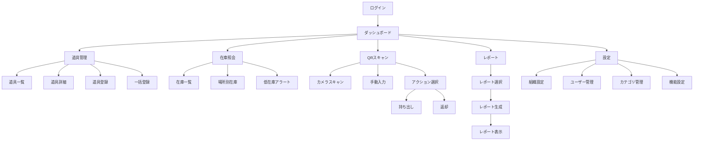
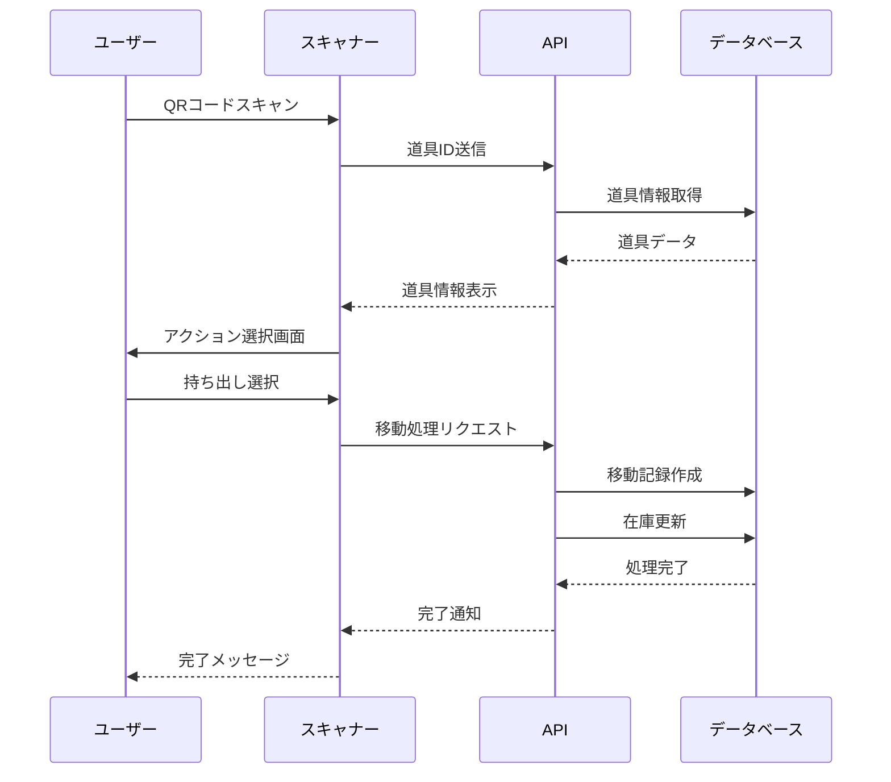

# 機能要件詳細仕様書

## 目次

1. [基本機能](#1-基本機能)
   - [1.1 道具管理](#11-道具管理)
   - [1.2 QRコードシステム](#12-qrコードシステム)
   - [1.3 在庫・所在管理](#13-在庫所在管理)
   - [1.4 移動履歴](#14-移動履歴)
   - [1.5 レポート機能](#15-レポート機能)
2. [ユーザー管理機能](#2-ユーザー管理機能)
3. [システム管理機能](#3-システム管理機能)
4. [オプション機能](#4-オプション機能)
5. [画面遷移図](#5-画面遷移図)
6. [業務フロー](#6-業務フロー)

---

## 1. 基本機能

### 1.1 道具管理

#### 1.1.1 道具マスタ管理

##### 機能概要
道具の基本情報を管理する中核機能。個品管理と数量管理の2つのモードをサポート。

##### データモデル
```typescript
interface Tool {
  id: string;                    // UUID (自動生成)
  tool_code: string;             // 道具コード (組織内で一意)
  name: string;                  // 道具名
  category_id: string;           // カテゴリID
  management_type: 'individual' | 'quantity'; // 管理タイプ
  description?: string;          // 説明
  manufacturer?: string;         // メーカー名
  model_number?: string;         // 型番
  purchase_date?: Date;          // 購入日
  purchase_price?: number;       // 購入価格
  disposal_date?: Date;          // 廃棄日
  current_quantity?: number;     // 現在数量（数量管理の場合）
  min_quantity?: number;         // 最小在庫数
  custom_fields?: Record<string, any>; // カスタムフィールド
  status: ToolStatus;            // ステータス
  location_id?: string;          // 現在地（個品管理の場合）
  created_at: Date;              // 作成日時
  updated_at: Date;              // 更新日時
  deleted_at?: Date;             // 削除日時（論理削除）
}

enum ToolStatus {
  NORMAL = 'normal',           // 正常
  REPAIR = 'repair',           // 修理中
  BROKEN = 'broken',           // 故障
  DISPOSED = 'disposed',       // 廃棄済み
  LOST = 'lost'               // 紛失
}
```

##### 画面仕様

###### 道具一覧画面
```
┌─────────────────────────────────────────────────┐
│ 道具管理                                        │
├─────────────────────────────────────────────────┤
│ [+ 新規追加] [一括登録] [エクスポート]          │
│                                                 │
│ 検索: [___________] カテゴリ: [▼すべて]       │
│ 管理タイプ: [▼すべて] ステータス: [▼すべて]   │
│                                                 │
│ ┌───┬─────────┬─────────┬──────┬──────┬────┐ │
│ │選択│道具コード│道具名   │カテゴリ│ステータス│操作│ │
│ ├───┼─────────┼─────────┼──────┼──────┼────┤ │
│ │□ │T-001    │ドライバー│工具  │正常  │編集│ │
│ │□ │T-002    │ドリル   │電動工具│修理中│編集│ │
│ └───┴─────────┴─────────┴──────┴──────┴────┘ │
│                                                 │
│ [削除] [ステータス変更]  ページ: < 1 2 3 >     │
└─────────────────────────────────────────────────┘
```

###### 道具詳細・編集画面
```
┌─────────────────────────────────────────────────┐
│ 道具詳細 - T-001                               │
├─────────────────────────────────────────────────┤
│ 基本情報                                        │
│ ─────────                                      │
│ 道具コード*: [T-001_______]                    │
│ 道具名*: [ドライバー_______]                   │
│ カテゴリ*: [▼工具_________]                   │
│ 管理タイプ*: (●)個品管理 ( )数量管理          │
│                                                 │
│ 詳細情報                                        │
│ ─────────                                      │
│ メーカー: [マキタ_________]                    │
│ 型番: [DF457D__________]                       │
│ 購入日: [2024/01/15_____]                      │
│ 購入価格: [¥15,000______]                      │
│ ステータス: [▼正常_______]                    │
│                                                 │
│ 在庫管理                                        │
│ ─────────                                      │
│ 最小在庫数: [5___________]                     │
│ 現在地: [▼本社倉庫______]                     │
│                                                 │
│ カスタムフィールド                              │
│ ─────────                                      │
│ [+ フィールド追加]                             │
│                                                 │
│ QRコード                                        │
│ ─────────                                      │
│ [QRコードを表示] [印刷]                        │
│                                                 │
│ [保存] [キャンセル]                            │
└─────────────────────────────────────────────────┘
```

##### 業務ロジック

###### 道具登録
```typescript
async function createTool(data: CreateToolDto): Promise<Tool> {
  // 1. 入力検証
  validateToolData(data);

  // 2. 道具コードの重複チェック
  const existing = await checkDuplicateCode(data.tool_code);
  if (existing) throw new Error('道具コードが既に使用されています');

  // 3. カテゴリの存在確認
  const category = await getCategory(data.category_id);
  if (!category) throw new Error('無効なカテゴリです');

  // 4. 道具データ作成
  const tool = await db.tools.create({
    ...data,
    id: generateUUID(),
    created_at: new Date(),
    updated_at: new Date()
  });

  // 5. QRコード生成
  const qrCode = await generateQRCode(tool.id);

  // 6. 監査ログ記録
  await createAuditLog('tool_created', tool);

  return tool;
}
```

###### 一括登録
```typescript
async function bulkCreateTools(file: File): Promise<BulkResult> {
  // 1. ファイル解析（Excel/CSV）
  const rows = await parseFile(file);

  // 2. バッチ検証
  const validationResults = rows.map(validateToolData);

  // 3. トランザクション処理
  const results = await db.transaction(async (tx) => {
    const created = [];
    const failed = [];

    for (const row of rows) {
      try {
        const tool = await tx.tools.create(row);
        created.push(tool);
      } catch (error) {
        failed.push({ row, error: error.message });
      }
    }

    return { created, failed };
  });

  // 4. QRコード一括生成
  for (const tool of results.created) {
    await generateQRCode(tool.id);
  }

  return results;
}
```

---

### 1.2 QRコードシステム

#### 1.2.1 QRコード仕様

##### コード形式
```
https://tool-manager.com/qr/{UUID}

例: https://tool-manager.com/qr/550e8400-e29b-41d4-a716-446655440000
```

##### セキュリティ要件
- UUID v4を使用（推測不可能）
- HTTPS必須
- 認証済みユーザーのみアクセス可能
- 組織間のアクセス制御（RLS）

#### 1.2.2 QRコードスキャン機能

##### 画面仕様
```
┌─────────────────────────────────────────────────┐
│ QRコードスキャン                               │
├─────────────────────────────────────────────────┤
│                                                 │
│     ┌────────────────────────┐                │
│     │                        │                │
│     │   カメラビュー         │                │
│     │                        │                │
│     │   [■]←スキャン枠      │                │
│     │                        │                │
│     └────────────────────────┘                │
│                                                 │
│ [ライト ON/OFF] [カメラ切替]                   │
│                                                 │
│ または                                          │
│                                                 │
│ 道具コード入力: [___________] [検索]           │
└─────────────────────────────────────────────────┘
```

##### スキャン後の処理フロー
```typescript
async function handleQRScan(qrData: string): Promise<void> {
  try {
    // 1. QRデータ解析
    const toolId = extractToolId(qrData);

    // 2. 道具情報取得
    const tool = await getTool(toolId);
    if (!tool) throw new Error('道具が見つかりません');

    // 3. 権限チェック
    if (!hasAccess(tool)) throw new Error('アクセス権限がありません');

    // 4. アクション選択画面へ遷移
    navigateToActionSelect(tool);

  } catch (error) {
    showError(error.message);
    // エラーログ記録
    logScanError(qrData, error);
  }
}
```

##### アクション選択画面
```
┌─────────────────────────────────────────────────┐
│ 道具アクション - T-001 ドライバー              │
├─────────────────────────────────────────────────┤
│                                                 │
│ 現在地: 本社倉庫                               │
│ ステータス: 正常                               │
│                                                 │
│ アクションを選択:                              │
│                                                 │
│ ┌──────────────┐ ┌──────────────┐            │
│ │              │ │              │            │
│ │   持ち出し    │ │    返却      │            │
│ │      📤      │ │      📥      │            │
│ └──────────────┘ └──────────────┘            │
│                                                 │
│ ┌──────────────┐ ┌──────────────┐            │
│ │              │ │              │            │
│ │ ステータス変更│ │   詳細表示   │            │
│ │      🔧      │ │      📋      │            │
│ └──────────────┘ └──────────────┘            │
│                                                 │
│ [キャンセル]                                   │
└─────────────────────────────────────────────────┘
```

---

### 1.3 在庫・所在管理

#### 1.3.1 場所マスタ管理

##### データモデル
```typescript
interface Location {
  id: string;                  // UUID
  organization_id: string;     // 組織ID
  name: string;               // 場所名
  type: LocationType;         // 場所タイプ
  address?: string;           // 住所
  latitude?: number;          // 緯度
  longitude?: number;         // 経度
  manager_id?: string;        // 責任者ID
  contact_phone?: string;     // 連絡先電話番号
  is_active: boolean;         // 有効フラグ
  created_at: Date;
  updated_at: Date;
}

enum LocationType {
  WAREHOUSE = 'warehouse',     // 倉庫
  SITE = 'site',              // 現場
  OFFICE = 'office',          // 事務所
  VEHICLE = 'vehicle',        // 車両
  OTHER = 'other'             // その他
}
```

##### 在庫照会画面
```
┌─────────────────────────────────────────────────┐
│ 在庫照会                                        │
├─────────────────────────────────────────────────┤
│ 場所: [▼すべて_____] カテゴリ: [▼すべて_____] │
│                                                 │
│ ■ 在庫サマリー                                 │
│ ┌────────────┬──────┬──────┬──────┐         │
│ │場所        │総数  │使用中│在庫  │         │
│ ├────────────┼──────┼──────┼──────┤         │
│ │本社倉庫    │ 150  │  45  │ 105  │         │
│ │A現場       │  30  │  28  │   2  │         │
│ │B現場       │  25  │  20  │   5  │         │
│ └────────────┴──────┴──────┴──────┘         │
│                                                 │
│ ■ 道具別在庫                                   │
│ ┌────────────┬──────┬──────────────┐       │
│ │道具名      │在庫数│分布          │       │
│ ├────────────┼──────┼──────────────┤       │
│ │ドライバー  │  15  │本社:10 A現場:5│       │
│ │ドリル      │   8  │本社:5 B現場:3 │       │
│ │サンダー    │   3  │本社:3        │       │
│ └────────────┴──────┴──────────────┘       │
│                                                 │
│ [エクスポート] [印刷]                          │
└─────────────────────────────────────────────────┘
```

#### 1.3.2 移動処理

##### 持ち出し処理
```typescript
async function checkOutTool(
  toolId: string,
  toLocationId: string,
  userId: string,
  quantity: number = 1
): Promise<ToolMovement> {
  return db.transaction(async (tx) => {
    // 1. 道具情報取得
    const tool = await tx.tools.findById(toolId);

    // 2. 在庫確認（数量管理の場合）
    if (tool.management_type === 'quantity') {
      if (tool.current_quantity < quantity) {
        throw new Error('在庫が不足しています');
      }
    }

    // 3. 移動記録作成
    const movement = await tx.tool_movements.create({
      tool_id: toolId,
      from_location_id: tool.location_id,
      to_location_id: toLocationId,
      movement_type: 'checkout',
      quantity: quantity,
      moved_by: userId,
      moved_at: new Date()
    });

    // 4. 道具の現在地更新
    if (tool.management_type === 'individual') {
      await tx.tools.update(toolId, {
        location_id: toLocationId
      });
    } else {
      // 数量管理の場合は在庫数を減らす
      await tx.tools.update(toolId, {
        current_quantity: tool.current_quantity - quantity
      });
    }

    // 5. 通知送信（オプション）
    await sendMovementNotification(movement);

    // 6. 監査ログ
    await createAuditLog('tool_checkout', movement);

    return movement;
  });
}
```

##### 返却処理
```typescript
async function returnTool(
  toolId: string,
  toLocationId: string,
  userId: string,
  quantity: number = 1,
  condition: ToolStatus = 'normal'
): Promise<ToolMovement> {
  return db.transaction(async (tx) => {
    // 1. 移動記録作成
    const movement = await tx.tool_movements.create({
      tool_id: toolId,
      to_location_id: toLocationId,
      movement_type: 'return',
      quantity: quantity,
      moved_by: userId,
      moved_at: new Date(),
      condition: condition
    });

    // 2. 道具の状態更新
    const updates: any = {};

    if (tool.management_type === 'individual') {
      updates.location_id = toLocationId;
      updates.status = condition;
    } else {
      updates.current_quantity = tool.current_quantity + quantity;
    }

    await tx.tools.update(toolId, updates);

    // 3. 状態が異常の場合はアラート
    if (condition !== 'normal') {
      await createMaintenanceAlert(toolId, condition);
    }

    return movement;
  });
}
```

---

### 1.4 移動履歴

#### 1.4.1 移動履歴データモデル
```typescript
interface ToolMovement {
  id: string;                    // UUID
  tool_id: string;              // 道具ID
  from_location_id?: string;    // 元の場所ID
  to_location_id?: string;      // 移動先ID
  movement_type: MovementType;  // 移動タイプ
  quantity: number;              // 数量
  moved_by: string;             // 実施者ID
  moved_at: Date;               // 実施日時
  notes?: string;               // 備考
  condition?: ToolStatus;       // 返却時の状態
  created_at: Date;
}

enum MovementType {
  CHECKOUT = 'checkout',        // 持ち出し
  RETURN = 'return',           // 返却
  TRANSFER = 'transfer',       // 移動
  ADJUSTMENT = 'adjustment',   // 棚卸調整
  DISPOSAL = 'disposal',       // 廃棄
  LOST = 'lost'               // 紛失
}
```

#### 1.4.2 移動履歴画面
```
┌─────────────────────────────────────────────────┐
│ 移動履歴                                        │
├─────────────────────────────────────────────────┤
│ 期間: [2024/01/01] ～ [2024/01/31] [検索]      │
│ 道具: [___________] 場所: [▼すべて]            │
│                                                 │
│ ┌──────────┬────────┬──────┬──────┬──────┬──────┐ │
│ │日時      │道具    │種別  │元    │先    │実施者│ │
│ ├──────────┼────────┼──────┼──────┼──────┼──────┤ │
│ │01/31 15:30│ドリル │持出  │倉庫  │A現場 │田中  │ │
│ │01/31 14:20│ドライバー│返却  │B現場 │倉庫  │鈴木  │ │
│ │01/31 10:15│サンダー│移動  │A現場 │B現場 │佐藤  │ │
│ └──────────┴────────┴──────┴──────┴──────┴──────┘ │
│                                                 │
│ [CSVエクスポート] [印刷]                       │
└─────────────────────────────────────────────────┘
```

---

### 1.5 レポート機能

#### 1.5.1 レポート種別

##### 在庫レポート
```typescript
interface InventoryReport {
  generated_at: Date;
  period: { from: Date; to: Date };
  summary: {
    total_tools: number;
    total_value: number;
    by_category: CategorySummary[];
    by_location: LocationSummary[];
  };
  low_stock_alerts: Tool[];
  high_value_items: Tool[];
}
```

##### 利用状況レポート
```typescript
interface UsageReport {
  period: { from: Date; to: Date };
  most_used_tools: {
    tool: Tool;
    usage_count: number;
    total_days: number;
  }[];
  user_statistics: {
    user: User;
    checkout_count: number;
    return_rate: number;
  }[];
  location_activity: {
    location: Location;
    in_count: number;
    out_count: number;
  }[];
}
```

##### 棚卸レポート
```typescript
interface InventoryAuditReport {
  audit_date: Date;
  auditor: User;
  discrepancies: {
    tool: Tool;
    system_quantity: number;
    actual_quantity: number;
    difference: number;
  }[];
  missing_items: Tool[];
  adjustment_summary: {
    total_adjustments: number;
    value_impact: number;
  };
}
```

#### 1.5.2 レポート生成画面
```
┌─────────────────────────────────────────────────┐
│ レポート生成                                    │
├─────────────────────────────────────────────────┤
│ レポートタイプ*: [▼在庫レポート___]            │
│                                                 │
│ 期間設定                                        │
│ ─────────                                      │
│ 開始日*: [2024/01/01_____]                     │
│ 終了日*: [2024/01/31_____]                     │
│                                                 │
│ フィルター条件                                  │
│ ─────────                                      │
│ カテゴリ: [▼すべて______]                     │
│ 場所: [▼すべて__________]                      │
│ ステータス: [▼すべて____]                      │
│                                                 │
│ 出力形式                                        │
│ ─────────                                      │
│ ( ) 画面表示                                   │
│ (●) PDFダウンロード                            │
│ ( ) Excelダウンロード                          │
│ ( ) メール送信                                 │
│                                                 │
│ [レポート生成] [キャンセル]                    │
└─────────────────────────────────────────────────┘
```

---

## 2. ユーザー管理機能

### 2.1 ユーザー管理

#### データモデル
```typescript
interface User {
  id: string;                  // UUID
  organization_id: string;     // 組織ID
  email: string;              // メールアドレス（ログインID）
  name: string;               // 氏名
  role: UserRole;             // 役割
  department?: string;        // 部署
  employee_id?: string;       // 社員番号
  phone?: string;             // 電話番号
  is_active: boolean;         // 有効フラグ
  last_login_at?: Date;       // 最終ログイン日時
  created_at: Date;
  updated_at: Date;
}

enum UserRole {
  ADMIN = 'admin',           // 管理者（全権限）
  LEADER = 'leader',         // リーダー（承認権限あり）
  STAFF = 'staff'           // スタッフ（基本操作のみ）
}
```

#### 権限マトリックス
```
┌─────────────────────┬──────┬────────┬───────┐
│機能                 │Admin │Leader  │Staff  │
├─────────────────────┼──────┼────────┼───────┤
│道具登録・編集       │ ✓    │ ✓      │ -     │
│道具削除             │ ✓    │ -      │ -     │
│QRコード発行         │ ✓    │ ✓      │ -     │
│持ち出し・返却       │ ✓    │ ✓      │ ✓     │
│レポート閲覧         │ ✓    │ ✓      │ △*    │
│ユーザー管理         │ ✓    │ -      │ -     │
│システム設定         │ ✓    │ -      │ -     │
└─────────────────────┴──────┴────────┴───────┘
* 自分の履歴のみ閲覧可能
```

#### ユーザー管理画面
```
┌─────────────────────────────────────────────────┐
│ ユーザー管理                                    │
├─────────────────────────────────────────────────┤
│ [+ 新規ユーザー] [一括招待]                    │
│                                                 │
│ ┌───┬──────────┬────────┬──────┬──────┬────┐ │
│ │ID │氏名      │メール  │役割  │状態  │操作│ │
│ ├───┼──────────┼────────┼──────┼──────┼────┤ │
│ │001│田中太郎  │tanaka@ │管理者│有効  │編集│ │
│ │002│鈴木花子  │suzuki@ │リーダー│有効  │編集│ │
│ │003│佐藤次郎  │sato@   │スタッフ│無効  │編集│ │
│ └───┴──────────┴────────┴──────┴──────┴────┘ │
└─────────────────────────────────────────────────┘
```

---

## 3. システム管理機能

### 3.1 組織設定

#### 組織プロファイル
```typescript
interface Organization {
  id: string;                     // UUID
  name: string;                   // 組織名
  subdomain: string;              // サブドメイン
  industry_type: IndustryType;   // 業界タイプ
  employee_count: number;         // 従業員数
  contact_email: string;          // 連絡先メール
  contact_phone: string;          // 連絡先電話
  address: string;                // 住所
  billing_plan: BillingPlan;      // 契約プラン
  contract_start_date: Date;      // 契約開始日
  contract_end_date?: Date;       // 契約終了日
  settings: OrganizationSettings; // 設定
  created_at: Date;
  updated_at: Date;
}

interface OrganizationSettings {
  timezone: string;               // タイムゾーン
  date_format: string;            // 日付形式
  currency: string;               // 通貨
  language: string;               // 言語
  working_hours: {                // 営業時間
    start: string;
    end: string;
  };
  notification_settings: {        // 通知設定
    low_stock_alert: boolean;
    maintenance_reminder: boolean;
    daily_report: boolean;
  };
}
```

### 3.2 カテゴリ管理

#### カテゴリマスタ
```typescript
interface ToolCategory {
  id: string;                    // UUID
  organization_id: string;       // 組織ID
  name: string;                 // カテゴリ名
  parent_id?: string;           // 親カテゴリID
  sort_order: number;           // 表示順
  is_active: boolean;           // 有効フラグ
  created_at: Date;
  updated_at: Date;
}
```

#### カテゴリ管理画面
```
┌─────────────────────────────────────────────────┐
│ カテゴリ管理                                    │
├─────────────────────────────────────────────────┤
│ [+ 新規カテゴリ]                               │
│                                                 │
│ ▼ 工具                                         │
│   ├─ 手工具                                    │
│   │   ├─ ドライバー                           │
│   │   ├─ ペンチ                               │
│   │   └─ ハンマー                             │
│   └─ 電動工具                                  │
│       ├─ ドリル                               │
│       └─ サンダー                             │
│ ▼ 測定器                                       │
│   ├─ メジャー                                 │
│   └─ レベル                                   │
│                                                 │
│ [編集] [削除] [並び順変更]                     │
└─────────────────────────────────────────────────┘
```

### 3.3 監査ログ

#### 監査ログモデル
```typescript
interface AuditLog {
  id: string;                   // UUID
  organization_id: string;      // 組織ID
  user_id: string;              // ユーザーID
  action: string;               // アクション
  resource_type: string;        // リソースタイプ
  resource_id: string;          // リソースID
  changes?: Record<string, any>; // 変更内容
  ip_address?: string;          // IPアドレス
  user_agent?: string;          // ユーザーエージェント
  created_at: Date;
}
```

#### 監査ログ画面
```
┌─────────────────────────────────────────────────┐
│ 監査ログ                                        │
├─────────────────────────────────────────────────┤
│ 期間: [2024/01/01] ～ [2024/01/31]            │
│ ユーザー: [▼すべて] アクション: [▼すべて]     │
│                                                 │
│ ┌──────────┬────────┬────────┬──────────────┐ │
│ │日時      │ユーザー│アクション│詳細          │ │
│ ├──────────┼────────┼────────┼──────────────┤ │
│ │01/31 15:30│田中    │道具追加│T-100 ドリル  │ │
│ │01/31 14:20│鈴木    │ユーザー編集│佐藤の権限変更│ │
│ │01/31 10:15│システム│自動バックアップ│完了      │ │
│ └──────────┴────────┴────────┴──────────────┘ │
│                                                 │
│ [エクスポート]                                 │
└─────────────────────────────────────────────────┘
```

---

## 4. オプション機能

### 4.1 機能一覧と説明

#### 4.1.1 高度なデータ管理機能

##### bulk_import（一括データ取込）
```typescript
interface BulkImportFeature {
  enabled: boolean;
  config: {
    max_rows: number;           // 最大行数（デフォルト: 10000）
    allowed_formats: string[];  // 許可形式（xlsx, csv）
    template_url: string;       // テンプレートURL
  };
}

// 実装例
async function bulkImport(file: File): Promise<ImportResult> {
  // 1. ファイル検証
  validateFileFormat(file);

  // 2. データ解析
  const data = await parseFile(file);

  // 3. バリデーション
  const errors = validateData(data);
  if (errors.length > 0) {
    return { success: false, errors };
  }

  // 4. トランザクション処理
  return db.transaction(async (tx) => {
    const results = [];
    for (const row of data) {
      const tool = await tx.tools.create(row);
      results.push(tool);
    }
    return { success: true, imported: results.length };
  });
}
```

##### data_export（データエクスポート）
```typescript
interface DataExportFeature {
  enabled: boolean;
  config: {
    formats: ['xlsx', 'csv', 'pdf'];
    max_rows: number;
    include_images: boolean;    // QRコード画像含む
  };
}
```

##### custom_fields（カスタムフィールド）
```typescript
interface CustomFieldsFeature {
  enabled: boolean;
  config: {
    max_fields: number;         // 最大フィールド数
    field_types: string[];      // text, number, date, select
  };
}

// カスタムフィールド定義
interface CustomFieldDefinition {
  key: string;
  label: string;
  type: 'text' | 'number' | 'date' | 'select';
  required: boolean;
  options?: string[];          // selectの場合
}
```

#### 4.1.2 高度なレポート機能

##### advanced_analytics（高度な分析）
```typescript
interface AdvancedAnalyticsFeature {
  enabled: boolean;
  config: {
    charts: ['bar', 'line', 'pie', 'heatmap'];
    metrics: [
      'utilization_rate',      // 稼働率
      'turnover_rate',         // 回転率
      'cost_analysis',         // コスト分析
      'trend_forecast'         // トレンド予測
    ];
  };
}
```

##### scheduled_reports（定期レポート）
```typescript
interface ScheduledReportsFeature {
  enabled: boolean;
  config: {
    frequencies: ['daily', 'weekly', 'monthly'];
    delivery_methods: ['email', 'slack'];
    max_schedules: number;
  };
}

// スケジュール設定
interface ReportSchedule {
  id: string;
  report_type: string;
  frequency: string;
  recipients: string[];
  filters: Record<string, any>;
  next_run_at: Date;
}
```

#### 4.1.3 通知機能

##### email_notifications（メール通知）
```typescript
interface EmailNotificationsFeature {
  enabled: boolean;
  config: {
    smtp_settings?: {
      host: string;
      port: number;
      secure: boolean;
    };
    templates: EmailTemplate[];
  };
}

interface EmailTemplate {
  event: 'low_stock' | 'maintenance_due' | 'overdue_return';
  subject: string;
  body: string;
  recipients: string[];
}
```

##### slack_integration（Slack連携）
```typescript
interface SlackIntegrationFeature {
  enabled: boolean;
  config: {
    workspace_id: string;
    channel_id: string;
    webhook_url: string;
    events: string[];          // 通知するイベント
  };
}
```

##### push_notifications（プッシュ通知）
```typescript
interface PushNotificationsFeature {
  enabled: boolean;
  config: {
    provider: 'firebase' | 'onesignal';
    app_id: string;
    api_key: string;
  };
}
```

#### 4.1.4 メンテナンス管理

##### maintenance_schedule（メンテナンススケジュール）
```typescript
interface MaintenanceScheduleFeature {
  enabled: boolean;
  config: {
    enable_preventive: boolean;  // 予防保全
    reminder_days: number[];      // リマインダー日数
  };
}

interface MaintenanceSchedule {
  id: string;
  tool_id: string;
  schedule_type: 'regular' | 'usage_based';
  interval_days?: number;
  usage_hours?: number;
  next_maintenance_date: Date;
  assigned_to?: string;
}
```

##### repair_tracking（修理履歴追跡）
```typescript
interface RepairTrackingFeature {
  enabled: boolean;
  config: {
    track_costs: boolean;
    track_vendors: boolean;
    require_approval: boolean;
  };
}

interface RepairRecord {
  id: string;
  tool_id: string;
  issue_description: string;
  repair_date: Date;
  cost?: number;
  vendor?: string;
  repaired_by: string;
  status: 'pending' | 'in_progress' | 'completed';
}
```

#### 4.1.5 拡張機能

##### api_access（API アクセス）
```typescript
interface APIAccessFeature {
  enabled: boolean;
  config: {
    rate_limit: number;         // リクエスト/分
    allowed_endpoints: string[];
    authentication: 'api_key' | 'oauth2';
  };
}

// APIキー管理
interface APIKey {
  id: string;
  name: string;
  key: string;
  permissions: string[];
  expires_at?: Date;
  last_used_at?: Date;
}
```

##### barcode_support（バーコード対応）
```typescript
interface BarcodeSupportFeature {
  enabled: boolean;
  config: {
    formats: ['code128', 'code39', 'ean13'];
    enable_printing: boolean;
  };
}
```

##### multi_language（多言語対応）
```typescript
interface MultiLanguageFeature {
  enabled: boolean;
  config: {
    available_languages: ['ja', 'en', 'zh', 'ko'];
    default_language: string;
  };
}
```

---

## 5. 画面遷移図

### 5.1 メイン画面遷移


### 5.2 道具操作フロー


---

## 6. 業務フロー

### 6.1 日次業務フロー

#### 朝の持ち出し
```
1. 作業員がスマートフォンでシステムにログイン
2. QRスキャン画面を開く
3. 必要な道具のQRコードをスキャン
4. 「持ち出し」を選択
5. 行き先（現場）を選択
6. 確認して完了
```

#### 夕方の返却
```
1. 作業員が倉庫に戻る
2. QRスキャン画面を開く
3. 返却する道具のQRコードをスキャン
4. 「返却」を選択
5. 道具の状態を選択（正常/要修理等）
6. 確認して完了
```

### 6.2 月次業務フロー

#### 棚卸作業
```
1. 管理者が棚卸モードを開始
2. 各場所の道具を順次スキャン
3. システムの在庫と実在庫を照合
4. 差異がある場合は調整入力
5. 棚卸レポートを生成
6. 承認者が確認・承認
```

#### 月次レポート生成
```
1. 管理者がレポート画面を開く
2. 月次レポートを選択
3. 対象月を指定
4. 必要なフィルターを設定
5. レポート生成実行
6. PDFダウンロードまたはメール送信
```

### 6.3 イレギュラー対応

#### 道具の紛失
```
1. 紛失を発見した作業員が報告
2. 管理者が該当道具を検索
3. ステータスを「紛失」に変更
4. 紛失報告書を作成
5. 必要に応じて代替品を手配
```

#### 故障対応
```
1. 故障を発見した作業員がQRスキャン
2. ステータスを「故障」に変更
3. 故障内容を入力
4. 修理依頼を作成
5. 修理業者への連絡
6. 修理完了後、ステータスを「正常」に戻す
```

---

## 更新履歴

- 2024-11-30: 初版作成（基本機能、ユーザー管理、システム管理、オプション機能）