# 帳票管理機能仕様書

## 目次
1. [概要](#1-概要)
2. [機能一覧と優先順位](#2-機能一覧と優先順位)
3. [データベース設計](#3-データベース設計)
4. [UI/UX設計](#4-uiux設計)
5. [実装フェーズ](#5-実装フェーズ)
6. [API設計](#6-api設計)
7. [セキュリティ要件](#7-セキュリティ要件)
8. [他機能との連携](#8-他機能との連携)

---

## 1. 概要

### 1.1 目的
Field Tool Managerに統合された帳票管理システムを提供し、建築系企業の見積・請求・支払い業務をデジタル化する。

### 1.2 対象ユーザー
- **現場作業員（staff）**: 作業報告書から請求データ参照
- **リーダー（leader）**: 見積作成、請求書確認
- **管理者（admin）**: 全帳票の管理、承認、分析

### 1.3 主要な価値提供
- 工事単位での収支管理
- 作業報告書からの自動請求書生成
- 取引先（元請け・下請け）との帳票管理一元化
- 会計ソフトへのデータ連携

---

## 2. 機能一覧と優先順位

### Phase 1: 基本帳票機能（MVP）
```
優先度: 最高
実装期間: 2ヶ月
```

#### 2.1 見積書機能
- 見積書作成・編集・削除
- 工事情報との紐付け
- 見積書PDF出力
- 見積書複製機能
- 見積書から請求書への変換

#### 2.2 請求書機能
- 請求書作成・編集・削除
- 作業報告書からの自動生成
- 請求書PDF出力
- インボイス対応（適格請求書）
- 請求書ステータス管理（下書き/承認待ち/発行済み/入金済み）

#### 2.3 基本的な管理機能
- 帳票一覧表示（フィルタ・検索）
- 自動採番機能
- 取引先マスタとの連携

### Phase 2: 発注・支払管理
```
優先度: 高
実装期間: 1.5ヶ月
```

#### 2.4 発注書機能
- 発注書作成・編集・削除（材料発注、外注発注）
- 発注書PDF出力
- 発注ステータス管理

#### 2.5 支払管理
- 支払通知書作成
- 買掛金管理
- 支払予定表

#### 2.6 入金管理
- 入金登録・消込
- 売掛金管理
- 入金予定表

### Phase 3: 工事原価管理
```
優先度: 中
実装期間: 2ヶ月
```

#### 2.7 工事別収支管理
- 工事台帳機能
- 工事別損益計算
- 原価管理（材料費、労務費、外注費、経費）
- 予算実績対比

#### 2.8 納品・検収管理
- 納品書作成・管理
- 検収登録
- 出来高管理

### Phase 4: 分析・レポート
```
優先度: 中
実装期間: 1ヶ月
```

#### 2.9 売上分析
- 月次・年次売上レポート
- 取引先別売上分析
- 工事別収益分析

#### 2.10 資金繰り管理
- 資金繰り予測表
- 入出金予定カレンダー
- キャッシュフロー分析

### Phase 5: 自動化・連携強化
```
優先度: 低
実装期間: 1.5ヶ月
```

#### 2.11 自動化機能
- 支払期日アラート
- 入金遅延アラート
- 定期請求機能
- 自動督促メール

#### 2.12 外部連携
- 会計ソフト連携（CSVエクスポート）
- メール送信機能
- 電子帳簿保存法対応

---

## 3. データベース設計

### 3.1 主要テーブル

#### estimates（見積書）
```sql
CREATE TABLE estimates (
  id UUID PRIMARY KEY DEFAULT uuid_generate_v4(),
  organization_id UUID NOT NULL REFERENCES organizations(id),
  estimate_number TEXT NOT NULL, -- 見積番号（EST-2024-0001）
  client_id UUID REFERENCES clients(id), -- 取引先マスタ参照
  project_id UUID REFERENCES projects(id), -- 工事マスタ参照

  -- 見積情報
  estimate_date DATE NOT NULL,
  valid_until DATE,
  title TEXT NOT NULL,

  -- 金額
  subtotal DECIMAL(12, 2) NOT NULL,
  tax_amount DECIMAL(12, 2) NOT NULL,
  total_amount DECIMAL(12, 2) NOT NULL,

  -- ステータス
  status TEXT NOT NULL CHECK (status IN ('draft', 'sent', 'accepted', 'rejected', 'expired')),

  -- 担当者
  created_by UUID REFERENCES users(id),
  approved_by UUID REFERENCES users(id),

  -- メタデータ
  notes TEXT,
  internal_notes TEXT,

  created_at TIMESTAMP DEFAULT NOW(),
  updated_at TIMESTAMP DEFAULT NOW(),
  deleted_at TIMESTAMP,

  UNIQUE(organization_id, estimate_number)
);
```

#### estimate_items（見積明細）
```sql
CREATE TABLE estimate_items (
  id UUID PRIMARY KEY DEFAULT uuid_generate_v4(),
  estimate_id UUID NOT NULL REFERENCES estimates(id) ON DELETE CASCADE,

  -- 明細情報
  display_order INTEGER NOT NULL,
  item_type TEXT NOT NULL CHECK (item_type IN ('material', 'labor', 'subcontract', 'expense', 'other')),
  item_code TEXT,
  item_name TEXT NOT NULL,
  description TEXT,

  -- 数量・単価
  quantity DECIMAL(10, 2) NOT NULL,
  unit TEXT NOT NULL,
  unit_price DECIMAL(12, 2) NOT NULL,
  amount DECIMAL(12, 2) NOT NULL,

  -- 税率
  tax_rate DECIMAL(5, 2) NOT NULL DEFAULT 10.0,

  created_at TIMESTAMP DEFAULT NOW(),
  updated_at TIMESTAMP DEFAULT NOW()
);
```

#### invoices（請求書）
```sql
CREATE TABLE invoices (
  id UUID PRIMARY KEY DEFAULT uuid_generate_v4(),
  organization_id UUID NOT NULL REFERENCES organizations(id),
  invoice_number TEXT NOT NULL, -- 請求番号（INV-2024-0001）
  estimate_id UUID REFERENCES estimates(id), -- 見積書からの変換
  client_id UUID REFERENCES clients(id),
  project_id UUID REFERENCES projects(id),

  -- 請求情報
  invoice_date DATE NOT NULL,
  due_date DATE NOT NULL,
  title TEXT NOT NULL,

  -- 金額
  subtotal DECIMAL(12, 2) NOT NULL,
  tax_amount DECIMAL(12, 2) NOT NULL,
  total_amount DECIMAL(12, 2) NOT NULL,
  paid_amount DECIMAL(12, 2) DEFAULT 0, -- 入金済み金額

  -- インボイス対応
  is_qualified_invoice BOOLEAN DEFAULT false,
  invoice_registration_number TEXT, -- T + 13桁

  -- ステータス
  status TEXT NOT NULL CHECK (status IN ('draft', 'approved', 'sent', 'partially_paid', 'paid', 'overdue', 'cancelled')),

  -- 承認
  created_by UUID REFERENCES users(id),
  approved_by UUID REFERENCES users(id),
  approved_at TIMESTAMP,

  -- 送付記録
  sent_at TIMESTAMP,
  sent_method TEXT, -- email, postal, hand_delivery

  -- メタデータ
  notes TEXT,
  internal_notes TEXT,

  created_at TIMESTAMP DEFAULT NOW(),
  updated_at TIMESTAMP DEFAULT NOW(),
  deleted_at TIMESTAMP,

  UNIQUE(organization_id, invoice_number)
);
```

#### invoice_items（請求明細）
```sql
CREATE TABLE invoice_items (
  id UUID PRIMARY KEY DEFAULT uuid_generate_v4(),
  invoice_id UUID NOT NULL REFERENCES invoices(id) ON DELETE CASCADE,
  work_report_id UUID REFERENCES work_reports(id), -- 作業報告書との連携

  -- 明細情報（estimate_itemsと同様の構造）
  display_order INTEGER NOT NULL,
  item_type TEXT NOT NULL CHECK (item_type IN ('material', 'labor', 'subcontract', 'expense', 'other')),
  item_code TEXT,
  item_name TEXT NOT NULL,
  description TEXT,

  quantity DECIMAL(10, 2) NOT NULL,
  unit TEXT NOT NULL,
  unit_price DECIMAL(12, 2) NOT NULL,
  amount DECIMAL(12, 2) NOT NULL,

  tax_rate DECIMAL(5, 2) NOT NULL DEFAULT 10.0,

  created_at TIMESTAMP DEFAULT NOW(),
  updated_at TIMESTAMP DEFAULT NOW()
);
```

#### purchase_orders（発注書）
```sql
CREATE TABLE purchase_orders (
  id UUID PRIMARY KEY DEFAULT uuid_generate_v4(),
  organization_id UUID NOT NULL REFERENCES organizations(id),
  order_number TEXT NOT NULL, -- 発注番号（PO-2024-0001）
  supplier_id UUID REFERENCES clients(id), -- 仕入先
  project_id UUID REFERENCES projects(id),

  -- 発注情報
  order_date DATE NOT NULL,
  delivery_date DATE,
  delivery_location TEXT,

  -- 金額
  subtotal DECIMAL(12, 2) NOT NULL,
  tax_amount DECIMAL(12, 2) NOT NULL,
  total_amount DECIMAL(12, 2) NOT NULL,

  -- ステータス
  status TEXT NOT NULL CHECK (status IN ('draft', 'ordered', 'partially_received', 'received', 'cancelled')),

  -- 承認
  created_by UUID REFERENCES users(id),
  approved_by UUID REFERENCES users(id),
  approved_at TIMESTAMP,

  -- メタデータ
  notes TEXT,
  internal_notes TEXT,

  created_at TIMESTAMP DEFAULT NOW(),
  updated_at TIMESTAMP DEFAULT NOW(),
  deleted_at TIMESTAMP,

  UNIQUE(organization_id, order_number)
);
```

#### payments（入出金記録）
```sql
CREATE TABLE payments (
  id UUID PRIMARY KEY DEFAULT uuid_generate_v4(),
  organization_id UUID NOT NULL REFERENCES organizations(id),

  -- 入出金タイプ
  payment_type TEXT NOT NULL CHECK (payment_type IN ('receipt', 'payment')), -- 入金/支払

  -- 関連帳票
  invoice_id UUID REFERENCES invoices(id),
  purchase_order_id UUID REFERENCES purchase_orders(id),

  -- 支払情報
  payment_date DATE NOT NULL,
  amount DECIMAL(12, 2) NOT NULL,
  payment_method TEXT NOT NULL CHECK (payment_method IN ('bank_transfer', 'cash', 'check', 'credit_card', 'other')),

  -- 銀行情報
  bank_name TEXT,
  bank_account_number TEXT,
  reference_number TEXT,

  -- 記録者
  recorded_by UUID REFERENCES users(id),

  -- メタデータ
  notes TEXT,

  created_at TIMESTAMP DEFAULT NOW(),
  updated_at TIMESTAMP DEFAULT NOW(),
  deleted_at TIMESTAMP
);
```

#### projects（工事マスタ）
```sql
CREATE TABLE projects (
  id UUID PRIMARY KEY DEFAULT uuid_generate_v4(),
  organization_id UUID NOT NULL REFERENCES organizations(id),
  project_code TEXT NOT NULL, -- 工事番号
  project_name TEXT NOT NULL,
  client_id UUID REFERENCES clients(id),

  -- 工期
  start_date DATE,
  end_date DATE,

  -- 金額
  contract_amount DECIMAL(12, 2), -- 契約金額
  budget_amount DECIMAL(12, 2), -- 予算金額

  -- ステータス
  status TEXT NOT NULL CHECK (status IN ('planning', 'in_progress', 'completed', 'cancelled')),

  -- 担当者
  project_manager_id UUID REFERENCES users(id),

  created_at TIMESTAMP DEFAULT NOW(),
  updated_at TIMESTAMP DEFAULT NOW(),
  deleted_at TIMESTAMP,

  UNIQUE(organization_id, project_code)
);
```

### 3.2 組織テーブルの拡張（インボイス対応）

#### organizations テーブルへの追加フィールド
```sql
-- 自社のインボイス登録番号を管理するために organizationsテーブルを拡張
ALTER TABLE organizations ADD COLUMN IF NOT EXISTS tax_registration_number TEXT;
ALTER TABLE organizations ADD COLUMN IF NOT EXISTS is_qualified_invoice_issuer BOOLEAN DEFAULT false;
ALTER TABLE organizations ADD COLUMN IF NOT EXISTS company_seal_url TEXT; -- 会社印の画像URL

-- コメント追加
COMMENT ON COLUMN organizations.tax_registration_number IS '適格請求書発行事業者登録番号（T + 13桁）';
COMMENT ON COLUMN organizations.is_qualified_invoice_issuer IS '適格請求書発行事業者かどうか';
COMMENT ON COLUMN organizations.company_seal_url IS '会社印の画像URL（請求書等に使用）';
```

### 3.3 取引先マスタとの連携設計

#### 取引先情報の自動入力フロー
```typescript
// 請求書作成時に取引先マスタから自動入力される項目
interface ClientToInvoiceMapping {
  // 基本情報
  client_name: string;           // clients.name → 請求書の宛先
  client_address: string;         // clients.address → 請求書の送付先

  // インボイス関連
  client_tax_registration_number: string; // clients.tax_registration_number
  is_client_tax_exempt: boolean;         // clients.is_tax_exempt

  // 支払条件
  payment_terms: string;          // clients.payment_terms → 支払条件
  payment_method: string;         // clients.payment_method → 支払方法
  payment_due_days: number;       // clients.payment_due_days → 期日計算用

  // 銀行情報（振込先として表示）
  bank_name: string;              // clients.bank_name
  branch_name: string;            // clients.branch_name
  account_type: string;           // clients.account_type
  account_number: string;         // clients.account_number
  account_name: string;           // clients.account_name

  // 与信管理
  credit_limit: number;           // clients.credit_limit → 与信チェック用
  current_balance: number;        // clients.current_balance → 売掛金残高
}

// 免税事業者との取引時の警告
async function validateInvoiceCreation(clientId: string) {
  const client = await getClient(clientId);

  if (client.is_tax_exempt) {
    // 警告表示
    showWarning({
      title: "免税事業者との取引",
      message: "この取引先は免税事業者です。仕入税額控除の対象外となる可能性があります。",
      details: [
        "2029年9月30日まで: 仕入税額相当額の80%控除可",
        "2029年10月1日以降: 控除不可"
      ]
    });
  }

  // 与信限度額チェック
  const newInvoiceAmount = calculateInvoiceAmount();
  const totalOutstanding = client.current_balance + newInvoiceAmount;

  if (totalOutstanding > client.credit_limit) {
    showWarning({
      title: "与信限度額超過",
      message: `与信限度額（${formatCurrency(client.credit_limit)}）を超過します。`,
      currentBalance: client.current_balance,
      newAmount: newInvoiceAmount,
      total: totalOutstanding
    });
  }
}
```

### 3.4 インデックス設計
```sql
-- 見積書
CREATE INDEX idx_estimates_org_status ON estimates(organization_id, status);
CREATE INDEX idx_estimates_client ON estimates(client_id);
CREATE INDEX idx_estimates_project ON estimates(project_id);
CREATE INDEX idx_estimates_date ON estimates(estimate_date DESC);

-- 請求書
CREATE INDEX idx_invoices_org_status ON invoices(organization_id, status);
CREATE INDEX idx_invoices_client ON invoices(client_id);
CREATE INDEX idx_invoices_project ON invoices(project_id);
CREATE INDEX idx_invoices_due_date ON invoices(due_date);

-- 発注書
CREATE INDEX idx_purchase_orders_org_status ON purchase_orders(organization_id, status);
CREATE INDEX idx_purchase_orders_supplier ON purchase_orders(supplier_id);
CREATE INDEX idx_purchase_orders_project ON purchase_orders(project_id);

-- 入出金
CREATE INDEX idx_payments_org_type ON payments(organization_id, payment_type);
CREATE INDEX idx_payments_invoice ON payments(invoice_id);
CREATE INDEX idx_payments_date ON payments(payment_date DESC);

-- 工事
CREATE INDEX idx_projects_org_status ON projects(organization_id, status);
CREATE INDEX idx_projects_client ON projects(client_id);
```

---

## 4. UI/UX設計

### 4.1 メニュー構成

#### サイドバーメニューの整理
```
📊 ダッシュボード
├── ホーム
└── 通知

🔧 道具管理
├── 道具一覧
├── QRスキャン
├── 移動履歴
└── カテゴリ設定

📝 業務管理
├── 作業報告書
├── 勤怠管理
└── スケジュール

💰 帳票管理 ← NEW
├── 見積・請求
│   ├── 見積書一覧
│   ├── 請求書一覧
│   └── 領収書一覧
├── 発注・支払
│   ├── 発注書一覧
│   ├── 支払予定
│   └── 買掛金管理
├── 入金管理
│   ├── 入金予定
│   ├── 入金登録
│   └── 売掛金管理
└── 分析レポート
    ├── 売上分析
    ├── 工事別収支
    └── 資金繰り表

📋 マスタ管理
├── 取引先管理
├── スタッフ管理
├── 工事管理 ← NEW
└── 組織設定

⚙️ 設定
├── 帳票設定 ← NEW
│   ├── 採番ルール
│   ├── テンプレート
│   └── 税率設定
└── その他設定
```

### 4.2 画面遷移

#### 見積書作成フロー
```
見積一覧画面
    ↓
[新規作成]ボタン
    ↓
見積作成画面
├── 基本情報入力
│   ├── 取引先選択
│   ├── 工事選択
│   └── 見積日・有効期限
├── 明細入力
│   ├── 項目追加
│   ├── 数量・単価入力
│   └── 小計自動計算
└── 保存・発行
    ├── 下書き保存
    ├── PDF出力
    └── メール送信
```

#### 請求書作成フロー（作業報告書から）
```
作業報告書詳細画面
    ↓
[請求書作成]ボタン
    ↓
請求書作成画面（データ自動入力）
├── 作業内容が明細に反映
├── 金額自動計算
└── 承認申請
    ↓
承認者画面
├── 内容確認
└── 承認/差戻し
    ↓
請求書発行
```

### 4.3 画面レイアウト例

#### 見積書一覧画面
```
┌─────────────────────────────────────────────────────────┐
│ 見積書管理                                   [新規作成] │
├─────────────────────────────────────────────────────────┤
│ [検索: 取引先名・見積番号] [状態: 全て▼] [期間: 今月▼] │
├─────────────────────────────────────────────────────────┤
│ □ 見積番号    取引先      工事名     金額      状態    │
│ □ EST-2024-   A建設      渋谷ビル   ¥1,200,000 承認済 │
│   0125        株式会社    改修工事             [詳細]  │
│ □ EST-2024-   B工務店    新築工事   ¥3,500,000 下書き │
│   0124                                        [編集]  │
├─────────────────────────────────────────────────────────┤
│ [一括操作: 選択項目を▼] [CSVエクスポート]              │
└─────────────────────────────────────────────────────────┘
```

#### 見積書作成画面
```
┌─────────────────────────────────────────────────────────┐
│ 見積書作成                         [下書き保存] [発行] │
├─────────────────────────────────────────────────────────┤
│ 基本情報                                              │
│ ┌─────────────────────────────────────────────────┐  │
│ │ 見積番号: EST-2024-0126 (自動採番)              │  │
│ │ 取引先: [A建設株式会社           ▼]             │  │
│ │ 工事: [渋谷ビル改修工事         ▼]             │  │
│ │ 見積日: [2024/12/08]  有効期限: [2025/01/08]    │  │
│ │ 件名: [                                      ]  │  │
│ └─────────────────────────────────────────────────┘  │
│                                                       │
│ 明細                                    [行追加]     │
│ ┌─────────────────────────────────────────────────┐  │
│ │ 項目名        数量  単位  単価      金額        │  │
│ │ 材料費                                         │  │
│ │ ├ セメント    10   袋    ¥5,000    ¥50,000   │  │
│ │ └ 鉄筋        100  kg    ¥1,200    ¥120,000  │  │
│ │ 労務費                                         │  │
│ │ └ 作業員      5    人日  ¥25,000   ¥125,000  │  │
│ │                                               │  │
│ │                          小計:     ¥295,000   │  │
│ │                          消費税:   ¥29,500    │  │
│ │                          合計:     ¥324,500   │  │
│ └─────────────────────────────────────────────────┘  │
│                                                       │
│ 備考                                                  │
│ [                                                  ]  │
└─────────────────────────────────────────────────────────┘
```

### 4.4 モバイル対応

#### スマートフォン表示（現場での確認用）
- 請求書・見積書の閲覧
- 簡易的な承認操作
- 入金状況の確認
- プッシュ通知（支払期日アラート等）

---

## 5. 実装フェーズ

### Phase 1: MVP実装（2ヶ月）

#### Month 1
- [ ] データベース設計・マイグレーション
- [ ] 取引先マスタ機能
- [ ] 工事マスタ機能
- [ ] 見積書CRUD機能
- [ ] 見積書PDF出力

#### Month 2
- [ ] 請求書CRUD機能
- [ ] 請求書PDF出力
- [ ] インボイス対応
- [ ] 自動採番機能
- [ ] 基本的な一覧・検索機能

### Phase 2: 発注・支払管理（1.5ヶ月）

#### Month 3
- [ ] 発注書機能
- [ ] 支払予定表
- [ ] 買掛金管理

#### Month 3.5
- [ ] 入金登録・消込機能
- [ ] 売掛金管理
- [ ] 入金予定表

### Phase 3: 工事原価管理（2ヶ月）

#### Month 4-5
- [ ] 工事台帳
- [ ] 原価入力機能
- [ ] 工事別損益計算
- [ ] 予算実績対比

### Phase 4: 分析・レポート（1ヶ月）

#### Month 6
- [ ] 売上分析ダッシュボード
- [ ] 資金繰り予測
- [ ] 各種レポート出力

### Phase 5: 自動化・連携（1.5ヶ月）

#### Month 7
- [ ] アラート機能
- [ ] 定期請求
- [ ] 会計ソフト連携
- [ ] メール送信機能

---

## 6. API設計

### 6.1 エンドポイント一覧

#### 見積書API
```
GET    /api/estimates              # 一覧取得
GET    /api/estimates/:id          # 詳細取得
POST   /api/estimates              # 新規作成
PUT    /api/estimates/:id          # 更新
DELETE /api/estimates/:id          # 削除
POST   /api/estimates/:id/copy     # 複製
POST   /api/estimates/:id/approve  # 承認
GET    /api/estimates/:id/pdf      # PDF生成
POST   /api/estimates/:id/convert-to-invoice # 請求書変換
```

#### 請求書API
```
GET    /api/invoices               # 一覧取得
GET    /api/invoices/:id           # 詳細取得
POST   /api/invoices               # 新規作成
PUT    /api/invoices/:id           # 更新
DELETE /api/invoices/:id           # 削除
POST   /api/invoices/:id/approve   # 承認
POST   /api/invoices/:id/send      # 送付記録
GET    /api/invoices/:id/pdf       # PDF生成
POST   /api/invoices/from-work-report # 作業報告書から生成
```

#### 入金API
```
GET    /api/payments               # 一覧取得
POST   /api/payments               # 入金登録
PUT    /api/payments/:id           # 更新
DELETE /api/payments/:id           # 削除
POST   /api/payments/match         # 消込処理
```

### 6.2 請求書PDF生成の実装詳細

#### インボイス対応PDF生成処理
```typescript
// 請求書PDF生成時の自社・取引先情報の統合
async function generateInvoicePDF(invoiceId: string) {
  const invoice = await getInvoice(invoiceId);
  const client = await getClient(invoice.client_id);
  const organization = await getOrganization(invoice.organization_id);

  // 自社のインボイス登録番号チェック
  if (!organization.tax_registration_number && invoice.is_qualified_invoice) {
    throw new Error('適格請求書を発行するには、組織設定でインボイス登録番号を設定してください');
  }

  const pdfData = {
    // 発行者（自社）情報
    issuer: {
      name: organization.name,
      address: organization.address,
      tax_registration_number: organization.tax_registration_number,
      seal_url: organization.company_seal_url, // 会社印
    },

    // 宛先（取引先）情報 - clientsテーブルから自動取得
    recipient: {
      name: client.name,
      postal_code: client.postal_code,
      address: client.address,
      contact_person: client.contact_person,
      // 免税事業者の場合は注記を追加
      tax_note: client.is_tax_exempt ? '※免税事業者' : null,
    },

    // 支払情報 - clientsテーブルから自動取得
    payment: {
      terms: client.payment_terms || '請求書発行日より30日以内',
      method: client.payment_method,
      due_date: invoice.due_date,
      bank_account: client.bank_name ? {
        bank_name: client.bank_name,
        branch_name: client.branch_name,
        account_type: client.account_type,
        account_number: client.account_number,
        account_name: client.account_name,
      } : null,
    },

    // インボイス制度対応の税率別集計
    tax_summary: generateTaxSummary(invoice.items),
  };

  return createPDF(pdfData);
}

// 税率別集計処理
function generateTaxSummary(items: InvoiceItem[]) {
  const summary = items.reduce((acc, item) => {
    const rate = item.tax_rate.toString();
    if (!acc[rate]) {
      acc[rate] = { subtotal: 0, tax: 0, items: [] };
    }
    acc[rate].subtotal += item.amount;
    acc[rate].tax += item.amount * (item.tax_rate / 100);
    acc[rate].items.push(item.item_name);
    return acc;
  }, {} as Record<string, any>);

  return Object.entries(summary).map(([rate, data]) => ({
    tax_rate: parseFloat(rate),
    subtotal: data.subtotal,
    tax_amount: data.tax,
    total: data.subtotal + data.tax,
    is_reduced_rate: rate === '8', // 8%は軽減税率
  }));
}
```

### 6.3 レスポンス例

#### 見積書詳細
```json
{
  "id": "550e8400-e29b-41d4-a716-446655440000",
  "estimate_number": "EST-2024-0125",
  "client": {
    "id": "client-uuid",
    "name": "A建設株式会社",
    "contact_person": "山田太郎"
  },
  "project": {
    "id": "project-uuid",
    "name": "渋谷ビル改修工事",
    "code": "PRJ-2024-001"
  },
  "estimate_date": "2024-12-08",
  "valid_until": "2025-01-08",
  "title": "渋谷ビル改修工事 見積書",
  "items": [
    {
      "id": "item-uuid-1",
      "item_type": "material",
      "item_name": "セメント",
      "quantity": 10,
      "unit": "袋",
      "unit_price": 5000,
      "amount": 50000,
      "tax_rate": 10
    }
  ],
  "subtotal": 295000,
  "tax_amount": 29500,
  "total_amount": 324500,
  "status": "approved",
  "created_by": {
    "id": "user-uuid",
    "name": "田中太郎"
  },
  "approved_by": {
    "id": "manager-uuid",
    "name": "佐藤花子"
  },
  "notes": "現場状況により追加工事の可能性あり"
}
```

---

## 7. セキュリティ要件

### 7.1 権限管理

#### ロール別権限
| 機能 | staff | leader | admin |
|------|-------|--------|-------|
| 見積書閲覧 | 自分が作成 | ○ | ○ |
| 見積書作成 | × | ○ | ○ |
| 見積書承認 | × | × | ○ |
| 請求書閲覧 | × | ○ | ○ |
| 請求書作成 | × | ○ | ○ |
| 請求書承認 | × | × | ○ |
| 入金登録 | × | × | ○ |
| 売上分析閲覧 | × | △ | ○ |
| 帳票設定変更 | × | × | ○ |

### 7.2 データ保護
- RLSによる組織間データ分離
- 論理削除による監査証跡保持
- PDF生成時の電子透かし埋め込み
- 操作ログの記録

### 7.3 コンプライアンス
- 電子帳簿保存法対応
- インボイス制度対応
- 改ざん防止（ハッシュ値保存）
- バックアップ（3年間保存）

---

## 8. 他機能との連携

### 8.1 取引先マスタとの詳細連携仕様

#### 連携データフロー

```mermaid
graph LR
    A[取引先マスタ<br/>clients] --> B[見積書作成]
    A --> C[請求書作成]
    A --> D[発注書作成]

    B --> E[自動入力項目<br/>・会社名<br/>・住所<br/>・支払条件]
    C --> F[自動入力項目<br/>・インボイス番号<br/>・免税事業者フラグ<br/>・銀行口座情報]
    D --> G[自動入力項目<br/>・仕入先情報<br/>・支払方法]

    C --> H[与信チェック<br/>・限度額確認<br/>・売掛金残高]
```


#### 取引先選択時の自動処理
```typescript
// 取引先選択コンポーネント
const ClientSelector = ({ onSelect, documentType }) => {
  const handleClientSelect = async (clientId: string) => {
    const client = await fetchClient(clientId);

    // ドキュメントタイプに応じた自動入力
    switch(documentType) {
      case 'invoice':
        // 請求書の場合
        return {
          // 基本情報
          client_name: client.name,
          client_address: formatAddress(client),

          // 支払条件（取引先マスタから自動設定）
          payment_terms: client.payment_terms,
          payment_method: client.payment_method,
          due_date: calculateDueDate(new Date(), client.payment_due_days),

          // インボイス関連
          show_tax_registration: !client.is_tax_exempt,
          tax_warning: client.is_tax_exempt ? '免税事業者のため仕入税額控除対象外' : null,

          // 振込先情報（請求書に記載）
          bank_info: formatBankInfo(client),
        };

      case 'purchase_order':
        // 発注書の場合
        return {
          supplier_name: client.name,
          supplier_address: formatAddress(client),
          delivery_location: client.default_delivery_location,
        };

      case 'estimate':
        // 見積書の場合
        return {
          client_name: client.name,
          client_title: client.contact_person ? `${client.contact_person} 様` : '御中',
          valid_days: client.estimate_valid_days || 30,
        };
    }
  };
};
```

### 8.2 作業報告書との連携
```typescript
// 作業報告書から請求書を生成
async function createInvoiceFromWorkReport(workReportId: string) {
  const workReport = await getWorkReport(workReportId);

  const invoice = {
    client_id: workReport.client_id,
    project_id: workReport.project_id,
    items: workReport.work_items.map(item => ({
      item_type: 'labor',
      item_name: item.work_description,
      quantity: item.hours,
      unit: '時間',
      unit_price: item.hourly_rate,
      amount: item.hours * item.hourly_rate
    })),
    notes: `作業報告書 ${workReport.report_number} より生成`
  };

  return createInvoice(invoice);
}
```

### 8.2 道具管理との連携
- レンタル道具の請求書自動生成
- 道具購入時の発注書作成
- 減価償却計算との連携

### 8.3 勤怠管理との連携
- 労務費の自動計算
- 日報データからの請求明細生成
- 外注人工の集計

### 8.4 通知システムとの連携
- 承認依頼通知
- 支払期日リマインダー
- 入金確認通知

---

## 付録

### A. 用語定義
- **見積書**: 工事の費用概算を示す書類
- **請求書**: 完了した工事の代金を請求する書類
- **発注書**: 材料や外注を依頼する書類
- **消込**: 請求と入金を紐付ける処理
- **出来高**: 工事の進捗に応じた完成度

### B. 参考資料
- 電子帳簿保存法ガイドライン
- インボイス制度実務マニュアル
- 建設業会計基準

### C. 今後の拡張予定
- AI による見積精度向上
- OCRによる請求書取り込み
- 銀行API連携による自動消込
- ブロックチェーンによる改ざん防止