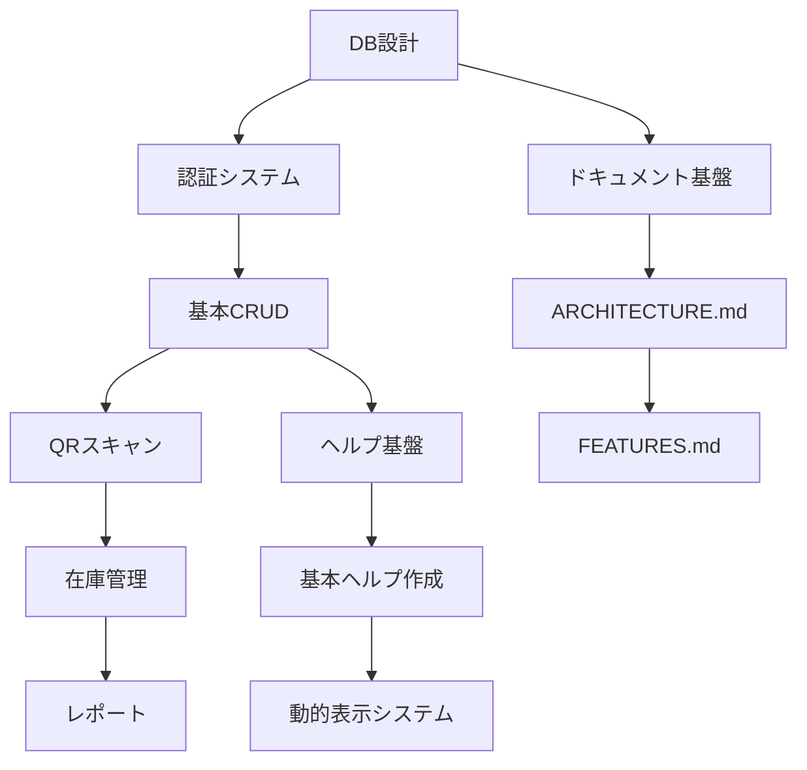

# 道具管理システム 最終仕様書（SaaS型マルチテナント版）

> **重要**: データベース設計は別ドキュメントに分離されました。
> - **テーブル定義・ER図**: [DATABASE_SCHEMA.md](./DATABASE_SCHEMA.md)を参照
> - **マイグレーション管理**: [MIGRATIONS.md](./MIGRATIONS.md)を参照

## 目次
1. [システム概要](#1-システム概要)
2. [対象業種と汎用性](#2-対象業種と汎用性)
3. [SaaS型アーキテクチャ](#3-saas型アーキテクチャ)
4. [セキュリティ設計](#4-セキュリティ設計)
5. [データモデル](#5-データモデル) ⚠️ **詳細は [DATABASE_SCHEMA.md](./DATABASE_SCHEMA.md) 参照**
6. [画面設計](#6-画面設計)
7. [QRスキャン機能](#7-qrスキャン機能)
8. [拡張性機能](#8-拡張性機能)
9. [技術仕様](#9-技術仕様)
10. [課金・プラン管理](#10-課金プラン管理)
11. [管理者機能](#11-管理者機能)
12. [導入・運用](#12-導入運用)
13. [開発ロードマップ](#13-開発ロードマップ)

---

## 1. システム概要

### 1.1 ビジネスモデル

本システムは**現場系業種に特化したマルチテナントSaaS型**の道具管理システムです。

```
【提供形態】
マルチテナントSaaS
- 複数企業が1つの統合システムを共有利用
- 企業ごとに完全にデータ分離（Row Level Security）
- サブドメインで企業を識別
- 月額課金制

【サービス提供者】
あなた（開発者）が統一環境を運用・管理

【顧客企業】
各企業は独自のサブドメインでアクセス
例:
- a-kensetsu.tool-manager.com（A建設株式会社）
- b-tosou.tool-manager.com（B塗装工業）
- c-denki.tool-manager.com（C電気工事）
```

---

### 1.2 課題と解決策

#### 顧客企業の課題
- 道具の数量・所在が不明確（現場 vs 会社倉庫）
- 20名程度のスタッフによる複雑な道具移動の管理困難
- アナログ管理によるDX化の遅れ
- 高価な工具の紛失リスク

#### 解決策
全道具に**一意のUUID + QRコード**を付与し、スマホでスキャンするだけで**リアルタイムな在庫・所在管理**を実現

---

## 2. 対象業種と汎用性

### 2.1 ターゲット業種

**現場系業種に特化**

| 業種 | 主な道具 | 特有ニーズ |
|------|---------|-----------|
| **建築** | 電動工具、手工具、測定器 | 重機管理、大型現場 |
| **土木** | 重機、測量機器、安全用具 | レンタル品管理 |
| **内装** | 電動工具、仕上げ工具、足場 | 細かい工具多数 |
| **電気工事** | 測定器、配線工具、テスター | 校正記録、絶縁工具 |
| **塗装** | スプレーガン、養生材、ハケ | 消耗品が多い |
| **設備** | 配管工具、溶接機、計測器 | 定期点検記録 |

---

### 2.2 現場系共通の要件

#### 共通する作業環境
- ✅ 屋外作業が多い（雨天・日光下）
- ✅ 手袋着用での操作
- ✅ 複数現場の掛け持ち
- ✅ 会社↔現場の道具移動
- ✅ スマホでの操作が中心

#### 共通する管理ニーズ
- ✅ 個別管理（高価な工具）
- ✅ 数量管理（消耗品）
- ✅ レンタル品管理
- ✅ 修理・点検記録
- ✅ 減価償却管理

---

### 2.3 必要な拡張性（現場系特化）

```
基本設計: 建築業をベースに設計

拡張ポイント:
1. カスタムフィールド（JSONB）
   - 校正日、レンタル返却期限、減価償却率等

2. カテゴリーのカスタマイズ
   - 企業ごとに独自カテゴリー定義可能
   - デフォルト: 電動工具、手工具、測定器、安全用具、消耗品

3. 数量管理
   - 高価な工具: 1個1QRコード（個別管理）
   - 消耗品: まとめて数量管理

4. ステータスの柔軟性
   - 基本: 正常、修理中、故障、廃棄済み
   - 追加可能: 校正済み、レンタル中、返却期限あり等
```

**結論**:
- 医療・飲食等の異業種対応は不要
- 現場系業種の多様性に対応できる**適度な拡張性**を確保
- 複雑すぎず、シンプルで使いやすい設計

---

## 3. SaaS型アーキテクチャ

### 3.1 システム構成図

#### 完全分離された2つのアプリケーション ✨NEW

```
┌─────────────────────────────────────────────────────┐
│      顧客向けアプリケーション                       │
│         app.fieldtool.com                           │
├─────────────────────────────────────────────────────┤
│  【対象ユーザー】                                   │
│  staff, leader, admin（顧客企業の従業員）          │
│                                                     │
│  【フロントエンド】                                 │
│  Next.js 14 (App Router) + TypeScript               │
│  ホスティング: Vercel                               │
│                                                     │
│  【バックエンド・データベース】                     │
│  Supabase PostgreSQL                                │
│  - マルチテナント対応（organization_id分離）       │
│  - Row Level Security (RLS)                         │
│  - Realtime Subscriptions                           │
│                                                     │
│  【認証】                                           │
│  Supabase Auth (JWT)                                │
│                                                     │
│  【ストレージ】                                     │
│  Supabase Storage（画像・PDF）                      │
└─────────────────────────────────────────────────────┘
                    ↓ 組織別アクセス
    ┌─────────────┬─────────────┬─────────────┐
    │  企業A      │  企業B      │  企業C      │
    │ ログイン後  │ ログイン後  │ ログイン後  │
    │ 自社データ  │ 自社データ  │ 自社データ  │
    └─────────────┴─────────────┴─────────────┘

┌─────────────────────────────────────────────────────┐
│        SaaS管理画面（完全独立）                      │
│         admin.fieldtool.com                         │
├─────────────────────────────────────────────────────┤
│  【対象ユーザー】                                   │
│  super_admin のみ（SaaS運営者）                     │
│                                                     │
│  【セキュリティ】                                   │
│  - 2FA認証必須                                      │
│  - IP制限                                           │
│  - 厳格なセッション管理（2時間/アイドル10分）       │
│  - 監査ログ（全操作記録）                          │
│                                                     │
│  【機能】                                           │
│  - 全顧客データ閲覧・管理                          │
│  - 契約・請求管理                                   │
│  - システム監視・保守                               │
│  - 売上分析・レポート                               │
└─────────────────────────────────────────────────────┘
```

---

### 3.2 データ分離の仕組み

#### マルチテナント設計の核心
```sql
-- 全テーブルに organization_id を持たせる
CREATE TABLE tools (
  id UUID PRIMARY KEY DEFAULT uuid_generate_v4(),
  organization_id UUID NOT NULL REFERENCES organizations(id),
  tool_code TEXT NOT NULL,  -- 表示用ID
  name TEXT,
  ...
);

-- Row Level Security で自動的にフィルタリング
ALTER TABLE tools ENABLE ROW LEVEL SECURITY;

CREATE POLICY "tools_isolation"
  ON tools FOR ALL
  USING (
    organization_id = (
      SELECT organization_id FROM users WHERE id = auth.uid()
    )
  );
```

**結果**:
- ユーザーは自分の企業のデータしか見えない・操作できない
- アプリケーションコードで organization_id を意識不要
- データベースレベルで完全分離

---

## 4. セキュリティ設計

### 4.1 QRコードのセキュリティ強化 ✨NEW

#### ❌ 従来の問題
```
QRコード内容: https://a-kensetsu.tool-manager.com/scan?id=A-0123

問題:
- IDが予測可能（A-0001, A-0002, A-0003...）
- 他企業のQRコードを推測して不正アクセス可能
- 連番攻撃のリスク
```

#### ✅ 改善後
```sql
-- tools テーブルに UUID を主キーとして使用
CREATE TABLE tools (
  id UUID PRIMARY KEY DEFAULT uuid_generate_v4(),
  organization_id UUID NOT NULL,
  tool_code TEXT NOT NULL,  -- 表示用（A-0123）ユーザーには見やすい
  name TEXT,
  ...
);

-- QRコード内容（UUID使用）
https://a-kensetsu.tool-manager.com/scan?id=550e8400-e29b-41d4-a716-446655440000

メリット:
✅ ID推測不可能（36桁のランダム文字列）
✅ tool_code は表示用として残す（ユーザーにとって分かりやすい「A-0123」）
✅ RLS により他企業のUUIDは無効（二重の安全策）
✅ セキュリティと使いやすさの両立
```

---

### 4.2 監査ログ（Audit Log）✨NEW

#### 目的
- 管理者権限の濫用防止
- セキュリティインシデントの追跡
- コンプライアンス対応
- データ変更履歴の記録

#### 実装
```sql
CREATE TABLE audit_logs (
  id UUID PRIMARY KEY DEFAULT uuid_generate_v4(),
  organization_id UUID REFERENCES organizations(id),
  user_id UUID REFERENCES users(id),

  -- 操作情報
  action TEXT NOT NULL,  -- 'create', 'update', 'delete', 'view'
  table_name TEXT NOT NULL,
  record_id UUID,

  -- 変更内容
  old_value JSONB,
  new_value JSONB,

  -- コンテキスト情報
  ip_address INET,
  user_agent TEXT,
  reason TEXT,  -- トラブルシューティング等の理由

  created_at TIMESTAMP DEFAULT NOW()
);

-- インデックス
CREATE INDEX idx_audit_logs_org ON audit_logs(organization_id);
CREATE INDEX idx_audit_logs_user ON audit_logs(user_id);
CREATE INDEX idx_audit_logs_created ON audit_logs(created_at DESC);
CREATE INDEX idx_audit_logs_table ON audit_logs(table_name, record_id);
```

#### ログ記録対象
- ✅ 道具の作成・編集・削除
- ✅ ユーザーの作成・編集・削除
- ✅ プラン変更
- ✅ **システム管理者による顧客データアクセス（重要）**
- ✅ 重要な設定変更

---

### 4.3 論理削除（Soft Delete）✨NEW

#### ❌ 従来の問題
```sql
-- 物理削除
DELETE FROM tools WHERE id = 'xxx';

問題:
- 誤削除時に復元不可能
- 請求書等の法的保持義務があるデータも削除される
- 監査証跡が失われる
```

#### ✅ 改善後
```sql
-- 全テーブルに deleted_at カラム追加
ALTER TABLE tools ADD COLUMN deleted_at TIMESTAMP;
ALTER TABLE users ADD COLUMN deleted_at TIMESTAMP;
ALTER TABLE tool_movements ADD COLUMN deleted_at TIMESTAMP;

-- RLS ポリシーを更新（削除済みは非表示）
CREATE POLICY "tools_own_organization"
  ON tools FOR SELECT
  USING (
    organization_id = (SELECT organization_id FROM users WHERE id = auth.uid())
    AND deleted_at IS NULL  -- ← 追加
  );

-- 削除は論理削除に変更
UPDATE tools SET deleted_at = NOW() WHERE id = 'xxx';

-- 完全削除は管理者のみ（保持期間経過後）
DELETE FROM tools WHERE deleted_at < NOW() - INTERVAL '3 years';
```

**メリット**:
- 誤削除からの復元可能
- 監査証跡の保持
- 法的要件への対応

---

### 4.4 レート制限（Rate Limiting）✨NEW

#### 目的
- ブルートフォース攻撃防止
- DoS攻撃防止
- API濫用防止
- システム安定性の確保

#### 実装（Upstash Redis使用）
```typescript
// lib/ratelimit.ts
import { Ratelimit } from '@upstash/ratelimit';
import { Redis } from '@upstash/redis';

const redis = new Redis({
  url: process.env.UPSTASH_REDIS_REST_URL!,
  token: process.env.UPSTASH_REDIS_REST_TOKEN!,
});

// QRスキャン: 1ユーザーあたり 100回/分
export const scanRatelimit = new Ratelimit({
  redis,
  limiter: Ratelimit.slidingWindow(100, '1 m'),
  analytics: true,
});

// ログイン試行: 5回/10分
export const loginRatelimit = new Ratelimit({
  redis,
  limiter: Ratelimit.slidingWindow(5, '10 m'),
  analytics: true,
});

// API一般: 1000回/時間
export const apiRatelimit = new Ratelimit({
  redis,
  limiter: Ratelimit.slidingWindow(1000, '1 h'),
  analytics: true,
});
```

#### 使用例
```typescript
// app/api/scan/route.ts
export async function POST(request: Request) {
  const userId = await getUserId(request);

  // レート制限チェック
  const { success } = await scanRatelimit.limit(userId);

  if (!success) {
    return NextResponse.json(
      { error: 'スキャン回数の上限に達しました。しばらくお待ちください。' },
      { status: 429 }
    );
  }

  // 通常処理
  // ...
}
```

---

### 4.5 サブドメインのセキュリティ強化 ✨NEW

#### ❌ 従来の問題
```
サブドメイン: a-kensetsu.tool-manager.com

問題:
- 企業名から顧客を特定できる
- 競合他社が顧客リストを把握可能
- ブルートフォースで存在企業を探索可能
```

#### ✅ 改善案（オプション）
```
サブドメインにランダム要素を追加

従来: a-kensetsu.tool-manager.com
改善: a-kensetsu-x7k2.tool-manager.com

organizations テーブル:
- subdomain: "a-kensetsu-x7k2"（8桁ランダム文字列追加）
```

**判断**:
- MVP段階では従来方式でOK
- セキュリティ要求が高い企業向けにオプション提供

---

## 5. データモデル

> **⚠️ 重要**:
> - **詳細なテーブル定義・SQL**: [DATABASE_SCHEMA.md](./DATABASE_SCHEMA.md) を参照
> - **マイグレーション管理**: [MIGRATIONS.md](./MIGRATIONS.md) を参照
> - このセクションは概要のみ記載。実装時は上記ドキュメントを必ず参照すること

### 5.1 マルチテナント対応ER図（概要）

```
Organization (組織・企業)
├── id (PK, UUID)
├── name "A建設株式会社"
├── subdomain "a-kensetsu" (UQ)
├── plan "basic" | "premium" | "enterprise"
├── payment_method "invoice" | "bank_transfer" ✨NEW
├── max_users 20
├── max_tools 500
├── is_active true
└── created_at

    ↓ 1:N

User (ユーザー)
├── id (PK, UUID)
├── organization_id (FK) ← 重要！
├── email
├── name
├── role "admin" | "leader" | "staff"
├── deleted_at (論理削除) ✨NEW
└── created_at

Tool (道具) ✨UUID主キー化
├── id (PK, UUID) ← QRコードに使用 ✨NEW
├── organization_id (FK) ← 重要！
├── tool_code TEXT ← 表示用（A-0123）✨NEW
├── category_id (FK)
├── name
├── model_number
├── manufacturer
├── purchase_date
├── purchase_price
├── status "normal" | "repair" | "broken" | "disposed"
├── current_location_id (FK)
├── management_type "individual" | "quantity" ✨NEW
├── current_quantity INTEGER ✨NEW
├── unit TEXT ✨NEW
├── custom_fields JSONB ✨NEW
├── deleted_at (論理削除) ✨NEW
└── created_at

ToolMovement (移動履歴)
├── id (PK, UUID)
├── organization_id (FK) ← 重要！
├── tool_id (FK → Tool.id UUID) ✨NEW
├── user_id (FK)
├── from_location_id (FK)
├── to_location_id (FK)
├── movement_type "checkout" | "checkin" | "transfer"
├── quantity INTEGER DEFAULT 1 ✨NEW
├── note
├── moved_at
├── deleted_at (論理削除) ✨NEW
└── created_at

Location (場所)
├── id (PK, UUID)
├── organization_id (FK) ← 重要！
├── type "company" | "site"
├── name
├── address
├── manager_name
├── is_active
├── deleted_at (論理削除) ✨NEW
└── created_at

ToolCategory (道具カテゴリ) ✨カスタマイズ可能
├── id (PK, UUID)
├── organization_id (FK) ← 重要！
├── name
├── code_prefix "A" | "B" | "C" | "D" | ...
├── display_order INTEGER
├── is_active BOOLEAN
└── created_at

AuditLog (監査ログ) ✨NEW
├── id (PK, UUID)
├── organization_id (FK)
├── user_id (FK)
├── action TEXT
├── table_name TEXT
├── record_id UUID
├── old_value JSONB
├── new_value JSONB
├── ip_address INET
├── user_agent TEXT
├── reason TEXT
└── created_at

OrganizationFeatures (機能フラグ)
├── id (PK, UUID)
├── organization_id (FK)
├── feature_key TEXT
├── is_enabled BOOLEAN
└── config JSONB

CustomFieldDefinitions (カスタムフィールド定義) ✨NEW
├── id (PK, UUID)
├── organization_id (FK)
├── entity_type "tool" | "location"
├── field_key TEXT
├── field_label TEXT
├── field_type "text" | "number" | "date" | "select"
├── field_options JSONB
├── is_required BOOLEAN
├── display_order INTEGER
└── created_at

Contract (契約管理) ✨NEW
├── id (PK, UUID)
├── organization_id (FK)
├── contract_number TEXT (UQ)
├── contract_type "monthly" | "annual"
├── plan "basic" | "premium" | "enterprise"
├── start_date DATE
├── end_date DATE
├── auto_renew BOOLEAN
├── monthly_fee DECIMAL(10, 2)
├── status "active" | "expired" | "cancelled"
├── billing_contact_name TEXT
├── billing_contact_email TEXT
├── billing_contact_phone TEXT
├── billing_address TEXT
├── notes TEXT
├── created_at TIMESTAMP
└── updated_at TIMESTAMP

Invoice (請求書) ✨NEW
├── id (PK, UUID)
├── organization_id (FK)
├── contract_id (FK)
├── invoice_number TEXT (UQ)
├── billing_period_start DATE
├── billing_period_end DATE
├── subtotal DECIMAL(10, 2)
├── tax DECIMAL(10, 2)
├── total DECIMAL(10, 2)
├── due_date DATE
├── status "draft" | "sent" | "paid" | "overdue" | "cancelled"
├── sent_date TIMESTAMP
├── paid_date TIMESTAMP
├── pdf_url TEXT
├── notes TEXT
├── created_at TIMESTAMP
└── updated_at TIMESTAMP

PaymentRecord (入金記録) ✨NEW
├── id (PK, UUID)
├── organization_id (FK)
├── invoice_id (FK)
├── payment_date DATE
├── amount DECIMAL(10, 2)
├── payment_method "bank_transfer" | "cash" | "other"
├── reference_number TEXT
├── bank_account_name TEXT
├── recorded_by UUID (FK → User)
├── notes TEXT
└── created_at TIMESTAMP
```

---

### 5.2 主要テーブル定義（TypeScript型）

#### Tool（道具マスタ）✨改善版
```typescript
interface Tool {
  // 基本情報
  id: string;                      // UUID ← QRコードに使用 ✨NEW
  organization_id: string;         // FK ← 重要！
  tool_code: string;               // "A-0123" 表示用ID ✨NEW
  category_id: string;             // FK
  name: string;                    // "ドライバーセット"
  model_number?: string;           // "XYZ-2000"
  manufacturer?: string;           // "マキタ"

  // 購入情報
  purchase_date?: Date;
  purchase_price?: number;         // 減価償却計算用

  // ステータス
  status: 'normal' | 'repair' | 'broken' | 'disposed';
  current_location_id: string;     // FK

  // 数量管理 ✨NEW
  management_type: 'individual' | 'quantity';
  current_quantity?: number;       // quantity の場合のみ使用
  unit?: string;                   // '個', '箱', 'kg', 'L'

  // カスタムフィールド ✨NEW
  custom_fields?: {
    [key: string]: any;
    // 例:
    // calibration_date?: string;  // 校正日
    // rental_due_date?: string;   // レンタル返却期限
    // depreciation_rate?: number; // 減価償却率
  };

  // メタデータ
  min_stock_alert?: number;
  photo_url?: string;
  manual_url?: string;

  // 論理削除 ✨NEW
  deleted_at?: Date;

  created_at: Date;
  updated_at: Date;
}
```

#### ToolMovement（移動履歴）✨改善版
```typescript
interface ToolMovement {
  id: string;                      // UUID
  organization_id: string;         // FK ← 重要！
  tool_id: string;                 // FK → Tool.id (UUID) ✨NEW
  user_id: string;                 // FK (実行者)
  from_location_id: string;        // FK (移動元)
  to_location_id: string;          // FK (移動先)
  movement_type: 'checkout' | 'checkin' | 'transfer';
  quantity: number;                // デフォルト1 ✨NEW
  note?: string;
  moved_at: Date;
  deleted_at?: Date;               // 論理削除 ✨NEW
  created_at: Date;
}
```

#### CustomFieldDefinition（カスタムフィールド定義）✨NEW
```typescript
interface CustomFieldDefinition {
  id: string;
  organization_id: string;
  entity_type: 'tool' | 'location';
  field_key: string;               // "calibration_date"
  field_label: string;             // "校正日"
  field_type: 'text' | 'number' | 'date' | 'select';
  field_options?: {
    choices?: Array<{ value: string; label: string }>;
    min?: number;
    max?: number;
  };
  is_required: boolean;
  display_order: number;
  created_at: Date;
}
```

> **📋 注**: 上記は概要図です。完全なテーブル定義（SQL、TypeScript型、インデックス、RLS）は [DATABASE_SCHEMA.md](./DATABASE_SCHEMA.md) を参照してください。

---

## 6. 画面設計

### 6.1 ホーム（ダッシュボード）

#### レイアウト
```
┌─────────────────────────────────┐
│ [ヘッダー]                      │
│ A建設株式会社      [通知🔔 3]  │
│ プレミアムプラン                │
├─────────────────────────────────┤
│ 【在庫サマリー】                │
│ ┌───────┐ ┌───────┐ ┌───────┐ │
│ │ 総在庫 │ │現場中 │ │会社  │ │
│ │ 324個│ │ 187個│ │ 137個│ │
│ └───────┘ └───────┘ └───────┘ │
├─────────────────────────────────┤
│ 【要注意アラート】 🚨           │
│ ⚠️ 在庫不足 (3件)              │
│ ・ドライバーセット 残り2個      │
│ → 発注管理へ                   │
│                                 │
│ 🔧 長期未返却 (2件)            │
│ ・現場A: ハンマー (7日間)      │
│ → 詳細を見る                   │
│                                 │
│ 📅 校正期限切れ (1件) ✨NEW   │
│ ・テスター #B-0045 (期限超過)  │
│ → メンテナンス管理へ           │
├─────────────────────────────────┤
│ 【直近の移動履歴】（最新5件）   │
│ 🔵 10:30 田中太郎            │
│    ドライバーセット → 現場A     │
│ 🟢 09:15 佐藤花子            │
│    サンダー → 会社倉庫         │
└─────────────────────────────────┘
```

---

### 6.2 QRスキャン画面

#### ステップ2: スキャン実行
```
┌─────────────────────────────────┐
│ [×]                   [💡ライト]│
│                                 │
│    ┌─────────────────┐          │
│    │                 │          │
│    │  QRコード       │          │
│    │  読み取り枠     │          │
│    │                 │          │
│    └─────────────────┘          │
│                                 │
│  道具のQRコードを枠内に合わせる │
│                                 │
│ ┌─────────────────────────────┐│
│ │ 📷 カメラでスキャン         ││
│ └─────────────────────────────┘│
│ ┌─────────────────────────────┐│
│ │ ⌨️  手動でID入力            ││
│ │ (例: A-0123)                ││
│ └─────────────────────────────┘│
└─────────────────────────────────┘
```

**重要**:
- QRコードには UUID が格納（セキュリティ）
- 手動入力には tool_code を使用（使いやすさ）
- 内部的に tool_code から UUID に変換

---

### 6.3 道具詳細画面

```
┌─────────────────────────────────┐
│ [×]        道具詳細             │
├─────────────────────────────────┤
│ 🔧 ドライバーセット             │
│ ID: A-0123 ✨表示用            │
│ 管理番号: 550e...440000（内部） │
├─────────────────────────────────┤
│ 基本情報                        │
│ ・カテゴリー: 電動工具          │
│ ・型番: XYZ-2000                │
│ ・メーカー: マキタ              │
│ ・購入日: 2023/04/15            │
│ ・購入金額: ¥28,000             │
│ ・状態: 🟢 正常                │
├─────────────────────────────────┤
│ カスタム情報 ✨NEW             │
│ ・校正日: 2024/11/01            │
│ ・次回校正: 2025/11/01          │
├─────────────────────────────────┤
│ 現在の所在                      │
│ 📍 現場A（渋谷ビル改修）        │
│ 👤 田中太郎                     │
│ 🕐 2024/11/29 10:30             │
├─────────────────────────────────┤
│ 移動履歴（最新5件）             │
│ 11/29 会社→現場A                │
│ 11/25 現場B→会社                │
│ → すべての履歴を見る            │
├─────────────────────────────────┤
│ [スキャン][編集][故障報告]      │
└─────────────────────────────────┘
```

---

### 6.6 取引先マスタ画面 ✨NEW

#### 取引先一覧画面
```
┌─────────────────────────────────────────┐
│ [←]  取引先管理                         │
├─────────────────────────────────────────┤
│ [🔍 検索]  [📁 分類]  [+ 新規登録]      │
├─────────────────────────────────────────┤
│ 【フィルター】                          │
│ ◉ すべて  ○ 顧客  ○ 仕入先  ○ 協力会社 │
│ ☑ 有効のみ表示                          │
├─────────────────────────────────────────┤
│ 取引先一覧 (35件)                       │
│                                         │
│ ┌─────────────────────────────────────┐ │
│ │ 🏢 株式会社ABC建設                  │ │
│ │ CL-0001 | 顧客                     │ │
│ │ 📍 東京都渋谷区...                 │ │
│ │ 📞 03-1234-5678                    │ │
│ │ 📊 累計取引: ¥12,450,000           │ │
│ │ 最終取引: 2024/11/15               │ │
│ │ [詳細] [編集]                      │ │
│ └─────────────────────────────────────┘ │
│                                         │
│ ┌─────────────────────────────────────┐ │
│ │ 🏭 XYZ資材株式会社                  │ │
│ │ CL-0002 | 仕入先                   │ │
│ │ 📍 東京都江東区...                 │ │
│ │ ⚠️ 未払い: ¥350,000                │ │
│ │ [詳細] [編集]                      │ │
│ └─────────────────────────────────────┘ │
└─────────────────────────────────────────┘
```

#### 取引先詳細画面
```
┌─────────────────────────────────────────┐
│ [←]  取引先詳細                         │
├─────────────────────────────────────────┤
│ 🏢 株式会社ABC建設                      │
│ CL-0001 | 顧客                          │
│ ⭐⭐⭐⭐⭐ (評価: 5.0)               │
├─────────────────────────────────────────┤
│ 【基本情報】                            │
│ ・正式名称: 株式会社ABC建設             │
│ ・略称: ABC建設                         │
│ ・フリガナ: カブシキガイシャエービー... │
│ ・業種: 総合建設業                      │
│                                         │
│ 【連絡先】                              │
│ ・郵便番号: 150-0001                    │
│ ・住所: 東京都渋谷区神宮前1-2-3         │
│ ・電話: 03-1234-5678                    │
│ ・FAX: 03-1234-5679                     │
│ ・Email: info@abc-kensetsu.co.jp        │
│ ・Web: https://abc-kensetsu.co.jp       │
│                                         │
│ 【担当者】                              │
│ ・氏名: 山田太郎                        │
│ ・部署: 工事部                          │
│ ・電話: 090-1234-5678                   │
│ ・Email: yamada@abc-kensetsu.co.jp      │
├─────────────────────────────────────────┤
│ 【取引条件】                            │
│ ・支払条件: 月末締め翌月末払い          │
│ ・支払方法: 銀行振込                    │
│ ・支払期日: 30日                        │
│ ・与信限度額: ¥5,000,000                │
│ ・現在残高: ¥350,000 (売掛金)           │
├─────────────────────────────────────────┤
│ 【銀行情報】                            │
│ ・銀行名: 三菱UFJ銀行                   │
│ ・支店名: 渋谷支店                      │
│ ・口座種別: 普通預金                    │
│ ・口座番号: 1234567                     │
│ ・口座名義: カ)エービーシーケンセツ     │
├─────────────────────────────────────────┤
│ 【税務情報】                            │
│ ・法人番号: 1234567890123               │
│ ・インボイス登録番号: T1234567890123    │
│ ・課税事業者: はい                      │
├─────────────────────────────────────────┤
│ 【取引実績】                            │
│ ・初回取引日: 2023/04/15                │
│ ・最終取引日: 2024/11/15                │
│ ・取引回数: 24回                        │
│ ・累計取引額: ¥12,450,000               │
├─────────────────────────────────────────┤
│ 【関連現場】(8件)                       │
│ 🏗️ 渋谷ビル改修工事                    │
│ 🏗️ 新宿マンション建設                  │
│ → すべての現場を見る                    │
├─────────────────────────────────────────┤
│ 【メモ】                                │
│ 長年のお付き合いのある優良顧客。        │
│ 支払いも確実で信頼性が高い。            │
│                                         │
│ 【社内用メモ】🔒                        │
│ 次回訪問予定: 2024/12/10                │
│ 担当営業: 鈴木                          │
├─────────────────────────────────────────┤
│ [編集] [現場追加] [見積作成] [請求書]  │
└─────────────────────────────────────────┘
```

#### 取引先登録・編集画面
```
┌─────────────────────────────────────────┐
│ [×]  取引先登録                         │
├─────────────────────────────────────────┤
│ 【基本情報】                            │
│ ┌─────────────────────────────────────┐ │
│ │ 取引先コード: [CL-0035] (自動)     │ │
│ │ 取引先名: [                       ]│ │
│ │ フリガナ: [                       ]│ │
│ │ 略称: [                           ]│ │
│ │ 分類: ⦿ 顧客 ○ 仕入先 ○ 協力会社  │ │
│ │       ○ 顧客兼仕入先               │ │
│ │ 業種: [▼ 選択                     ]│ │
│ └─────────────────────────────────────┘ │
│                                         │
│ 【連絡先情報】                          │
│ ┌─────────────────────────────────────┐ │
│ │ 郵便番号: [〒   -    ]             │ │
│ │ 住所: [                           ]│ │
│ │ 電話番号: [                       ]│ │
│ │ FAX番号: [                        ]│ │
│ │ Email: [                          ]│ │
│ │ Website: [                        ]│ │
│ └─────────────────────────────────────┘ │
│                                         │
│ 【担当者情報】                          │
│ ┌─────────────────────────────────────┐ │
│ │ 担当者名: [                       ]│ │
│ │ 部署: [                           ]│ │
│ │ 電話番号: [                       ]│ │
│ │ Email: [                          ]│ │
│ └─────────────────────────────────────┘ │
│                                         │
│ 【取引条件】                            │
│ ┌─────────────────────────────────────┐ │
│ │ 支払条件: [月末締め翌月末払い      ]│ │
│ │ 支払方法: [▼ 銀行振込             ]│ │
│ │ 支払期日: [30] 日                  │ │
│ │ 与信限度額: [¥                   ]│ │
│ └─────────────────────────────────────┘ │
│                                         │
│ 【銀行情報】(顧客の場合)                │
│ ┌─────────────────────────────────────┐ │
│ │ 銀行名: [                         ]│ │
│ │ 支店名: [                         ]│ │
│ │ 口座種別: [▼ 普通預金             ]│ │
│ │ 口座番号: [                       ]│ │
│ │ 口座名義: [                       ]│ │
│ └─────────────────────────────────────┘ │
│                                         │
│ 【税務情報】                            │
│ ┌─────────────────────────────────────┐ │
│ │ 法人番号: [                       ]│ │
│ │ インボイス登録番号: [T            ]│ │
│ │ ☐ 非課税事業者                     │ │
│ └─────────────────────────────────────┘ │
│                                         │
│ 【メモ】                                │
│ ┌─────────────────────────────────────┐ │
│ │ 備考:                              │ │
│ │ [                                 ]│ │
│ │                                    │ │
│ │ 社内用メモ (取引先には非表示):     │ │
│ │ [                                 ]│ │
│ └─────────────────────────────────────┘ │
│                                         │
│ [キャンセル]              [保存]        │
└─────────────────────────────────────────┘
```

#### 活用シーン
1. **現場登録時**: 取引先（発注者）を選択
2. **見積書作成**: 取引先情報を自動入力
3. **請求書発行**: 取引先の支払条件・銀行情報を使用
4. **作業報告書**: 報告先として取引先を指定
5. **売上管理**: 取引先別の売上集計
6. **支払い管理**: 仕入先・協力会社への支払い管理

---

## 7. QRスキャン機能

### 7.1 QRコード設計 ✨改善版

#### QRコード内容フォーマット
```
https://a-kensetsu.tool-manager.com/scan?id=550e8400-e29b-41d4-a716-446655440000

構成:
- サブドメイン: a-kensetsu（企業識別）
- パス: /scan（スキャン画面へ遷移）
- パラメータ: id=UUID（道具のUUID） ✨セキュリティ強化
```

#### 仕様
- **サイズ**: 最小25mm × 25mm（読み取り距離10cm想定）
- **訂正レベル**: Level H（約30%復元可能）→ 汚れ・破損に強い
- **推奨印刷**: 耐水ラベル用紙、ラミネート加工
- **色**: 黒QRコード + 白背景（視認性最高）

#### 道具ID体系 ✨二重管理
```
【内部ID（UUID）】
- データベース主キー
- QRコードに格納
- 例: 550e8400-e29b-41d4-a716-446655440000
- 用途: セキュリティ、一意性保証

【表示用ID（tool_code）】
- ユーザーに表示
- 手動入力で使用
- 例: A-0123, B-0456, C-0789
- 命名規則: [カテゴリーコード]-[連番4桁]

カテゴリーコード（企業ごとにカスタマイズ可能）:
A: 電動工具
B: 手工具
C: 測定器
D: 安全用具
E: 消耗品
...
```

---

### 7.2 スキャン処理フロー

```typescript
// app/scan/page.tsx
async function handleQRScan(scannedValue: string) {
  // QRコードからUUIDを抽出
  const url = new URL(scannedValue);
  const toolId = url.searchParams.get('id'); // UUID

  // ツール情報取得（RLSで自動的に自社データのみ）
  const { data: tool, error } = await supabase
    .from('tools')
    .select('*')
    .eq('id', toolId)
    .single();

  if (error || !tool) {
    // エラーケース
    if (error?.code === 'PGRST116') {
      // データが見つからない = 他社のQRコードまたは存在しないID
      showError('このQRコードは登録されていません');
    }
    return;
  }

  // 成功: 移動登録画面へ
  navigateToMoveForm(tool);
}

// 手動入力の場合
async function handleManualInput(toolCode: string) {
  // tool_code で検索
  const { data: tool } = await supabase
    .from('tools')
    .select('*')
    .eq('tool_code', toolCode)  // A-0123 等
    .single();

  // 以下同じ処理
}
```

---

## 8. 拡張性機能

### 8.1 カスタムフィールド ✨NEW

#### 目的
現場系業種ごとの独自要件に対応

#### 実装方針
```sql
-- tools テーブルに JSONB カラム追加
ALTER TABLE tools ADD COLUMN custom_fields JSONB DEFAULT '{}';

-- カスタムフィールド定義テーブル
CREATE TABLE custom_field_definitions (
  id UUID PRIMARY KEY,
  organization_id UUID REFERENCES organizations(id),
  entity_type TEXT NOT NULL,  -- 'tool', 'location'
  field_key TEXT NOT NULL,
  field_label TEXT NOT NULL,
  field_type TEXT NOT NULL,  -- 'text', 'number', 'date', 'select'
  field_options JSONB,
  is_required BOOLEAN DEFAULT false,
  display_order INTEGER DEFAULT 0,

  UNIQUE(organization_id, entity_type, field_key)
);
```

#### 使用例

**電気工事業向け**
```sql
INSERT INTO custom_field_definitions (organization_id, entity_type, field_key, field_label, field_type) VALUES
  ('org-denki', 'tool', 'calibration_date', '校正日', 'date'),
  ('org-denki', 'tool', 'next_calibration', '次回校正日', 'date'),
  ('org-denki', 'tool', 'calibration_certificate', '校正証明書番号', 'text');

-- 道具データ
INSERT INTO tools (name, custom_fields) VALUES
  ('デジタルテスター', '{
    "calibration_date": "2024-11-01",
    "next_calibration": "2025-11-01",
    "calibration_certificate": "CERT-2024-11-001"
  }');
```

**土木業向け**
```sql
INSERT INTO custom_field_definitions (organization_id, entity_type, field_key, field_label, field_type) VALUES
  ('org-doboku', 'tool', 'rental_company', 'レンタル会社', 'text'),
  ('org-doboku', 'tool', 'rental_due_date', '返却期限', 'date'),
  ('org-doboku', 'tool', 'rental_cost', 'レンタル料', 'number');
```

**塗装業向け**
```sql
INSERT INTO custom_field_definitions (organization_id, entity_type, field_key, field_label, field_type) VALUES
  ('org-tosou', 'tool', 'last_maintenance', '最終メンテナンス日', 'date'),
  ('org-tosou', 'tool', 'nozzle_size', 'ノズルサイズ', 'select');
```

---

### 8.2 数量管理機能 ✨NEW

#### 目的
消耗品の効率的な管理

#### 実装
```sql
-- tools テーブルに追加
ALTER TABLE tools ADD COLUMN management_type TEXT DEFAULT 'individual';
-- 'individual': 個別管理（1個1QRコード）
-- 'quantity': 数量管理（まとめて在庫数のみ）

ALTER TABLE tools ADD COLUMN current_quantity INTEGER;
ALTER TABLE tools ADD COLUMN unit TEXT DEFAULT '個';

-- 移動履歴に数量を追加
ALTER TABLE tool_movements ADD COLUMN quantity INTEGER DEFAULT 1;
```

#### 使用例
```typescript
// 個別管理の道具（高価な工具）
{
  name: 'ドライバーセット',
  management_type: 'individual',
  // QRコード1個1個に対応
}

// 数量管理の道具（消耗品）
{
  name: '養生テープ',
  management_type: 'quantity',
  current_quantity: 50,
  unit: '巻'
}

// スキャン時の処理
if (tool.management_type === 'quantity') {
  // 数量入力を求める
  const quantity = prompt('移動する数量を入力してください（単位: ' + tool.unit + '）');

  // 在庫更新
  await supabase
    .from('tools')
    .update({ current_quantity: tool.current_quantity - quantity })
    .eq('id', tool.id);
}
```

---

### 8.3 カテゴリーのカスタマイズ ✨NEW

#### 実装
```sql
-- tool_categories テーブルに organization_id を追加
ALTER TABLE tool_categories ADD COLUMN organization_id UUID REFERENCES organizations(id);

-- 企業ごとに独自カテゴリー定義
INSERT INTO tool_categories (organization_id, name, code_prefix) VALUES
  -- 建築業
  ('org-kensetsu', '電動工具', 'A'),
  ('org-kensetsu', '手工具', 'B'),
  ('org-kensetsu', '測定器', 'C'),
  ('org-kensetsu', '安全用具', 'D'),

  -- 電気工事業
  ('org-denki', '測定器', 'A'),
  ('org-denki', '配線工具', 'B'),
  ('org-denki', 'テスター類', 'C'),
  ('org-denki', '絶縁工具', 'D'),

  -- 塗装業
  ('org-tosou', '塗装機器', 'A'),
  ('org-tosou', '養生材', 'B'),
  ('org-tosou', 'ハケ・ローラー', 'C'),
  ('org-tosou', '保護具', 'D');
```

---

### 8.4 倉庫内位置管理機能 ✨NEW

#### 8.4.1 目的

倉庫内のどこに何があるかを即座に把握し、道具の探索時間を削減する。企業ごとに異なる倉庫レイアウト（棚、壁掛け、床置き、コンテナなど）に柔軟に対応。

#### 8.4.2 設計コンセプト

**完全カスタマイズ可能な階層構造**

各企業が自社の倉庫レイアウトに合わせて、階層の名称と深さを自由に設定できる。

```
例1: 整理された倉庫（3階層）
└── エリア（A, B, C）
    └── 棚（1, 2, 3）
        └── 段（上, 中, 下）

コード例: "A-1-上"
表示名例: "Aエリア 1番棚 上段"

例2: シンプルな倉庫（1階層）
└── 場所（北側, 南側, 入口付近）

コード例: "北側"
表示名例: "北側エリア"

例3: 複雑な倉庫（4階層）
└── フロア（1F, 2F）
    └── エリア（工具, 電動, 消耗品）
        └── 保管方法（棚, 壁掛け, 床置き, コンテナ）
            └── 番号（1, 2, 3）

コード例: "1F-工具-壁掛け-3"
表示名例: "1階 工具エリア 壁掛け 3番"
```

#### 8.4.3 データモデル

```sql
-- 組織ごとの倉庫階層設定（テンプレート）
CREATE TABLE warehouse_location_templates (
  id UUID PRIMARY KEY DEFAULT gen_random_uuid(),
  organization_id UUID NOT NULL REFERENCES organizations(id),
  level INTEGER NOT NULL,              -- 階層レベル（1, 2, 3, 4...）
  label TEXT NOT NULL,                 -- 階層名（例：「エリア」「棚」「保管方法」）
  is_active BOOLEAN DEFAULT true,
  display_order INTEGER DEFAULT 0,
  created_at TIMESTAMPTZ NOT NULL DEFAULT NOW(),
  updated_at TIMESTAMPTZ NOT NULL DEFAULT NOW(),

  UNIQUE(organization_id, level)
);

-- 倉庫位置マスタ（階層構造）
CREATE TABLE warehouse_locations (
  id UUID PRIMARY KEY DEFAULT gen_random_uuid(),
  organization_id UUID NOT NULL REFERENCES organizations(id),
  code TEXT NOT NULL,                  -- 位置コード（例: "A-1-上", "北側-壁掛け-3"）
  display_name TEXT NOT NULL,          -- 表示名（例: "Aエリア 1番棚 上段"）
  parent_id UUID REFERENCES warehouse_locations(id), -- 親位置（階層構造）
  level INTEGER NOT NULL DEFAULT 0,    -- 階層レベル（0=ルート、1=第1階層...）
  qr_code TEXT UNIQUE,                 -- 位置QRコード（UUID）
  description TEXT,                    -- 説明（例：「入口から左手2番目の棚」）
  sort_order INTEGER DEFAULT 0,        -- 表示順
  is_active BOOLEAN DEFAULT true,
  created_at TIMESTAMPTZ NOT NULL DEFAULT NOW(),
  updated_at TIMESTAMPTZ NOT NULL DEFAULT NOW(),
  deleted_at TIMESTAMPTZ,

  UNIQUE(organization_id, code)
);

-- tool_items に倉庫位置を追加
ALTER TABLE tool_items
  ADD COLUMN warehouse_location_id UUID REFERENCES warehouse_locations(id);

-- インデックス
CREATE INDEX idx_warehouse_locations_org ON warehouse_locations(organization_id) WHERE deleted_at IS NULL;
CREATE INDEX idx_warehouse_locations_parent ON warehouse_locations(parent_id) WHERE deleted_at IS NULL;
CREATE INDEX idx_warehouse_locations_qr ON warehouse_locations(qr_code) WHERE qr_code IS NOT NULL;
CREATE INDEX idx_tool_items_warehouse_location ON tool_items(warehouse_location_id);

-- RLS ポリシー
ALTER TABLE warehouse_location_templates ENABLE ROW LEVEL SECURITY;
ALTER TABLE warehouse_locations ENABLE ROW LEVEL SECURITY;

CREATE POLICY "Users can view their organization's location templates"
  ON warehouse_location_templates FOR SELECT
  USING (organization_id IN (SELECT organization_id FROM users WHERE id = auth.uid()));

CREATE POLICY "Users can view their organization's warehouse locations"
  ON warehouse_locations FOR SELECT
  USING (organization_id IN (SELECT organization_id FROM users WHERE id = auth.uid()));

CREATE POLICY "Admins can manage warehouse locations"
  ON warehouse_locations FOR ALL
  USING (
    organization_id IN (
      SELECT organization_id FROM users
      WHERE id = auth.uid() AND role IN ('admin', 'super_admin')
    )
  );
```

#### 8.4.4 主要機能

##### 1. 階層設定（組織管理者のみ）

企業ごとに倉庫の階層構造をカスタマイズ。

**設定画面イメージ**
```
┌─────────────────────────────────────────────────┐
│ 倉庫位置管理 - 階層設定                         │
├─────────────────────────────────────────────────┤
│ 貴社の倉庫レイアウトに合わせて階層を設定       │
│                                                 │
│ レベル1: [エリア_____________] ☑有効           │
│          （例: A, B, C / 北側, 南側）          │
│                                                 │
│ レベル2: [保管方法___________] ☑有効           │
│          （例: 棚, 壁掛け, 床置き, コンテナ）  │
│                                                 │
│ レベル3: [番号_______________] ☑有効           │
│          （例: 1, 2, 3）                       │
│                                                 │
│ レベル4: [段_________________] ☐有効           │
│          （例: 上, 中, 下）                    │
│                                                 │
│ [保存して位置登録へ]                           │
└─────────────────────────────────────────────────┘
```

##### 2. 位置マスタ登録

設定した階層に基づいて具体的な位置を登録。

**位置登録画面イメージ**
```
┌─────────────────────────────────────────────────┐
│ 倉庫位置 新規登録                               │
├─────────────────────────────────────────────────┤
│ エリア: [▼A____________]                       │
│                                                 │
│ 保管方法: [▼壁掛け______]                      │
│                                                 │
│ 番号: [3_______________]                        │
│                                                 │
│ ↓ 自動生成                                     │
│ コード: A-壁掛け-3                              │
│                                                 │
│ 表示名: [Aエリア 壁掛け 3番________________]   │
│                                                 │
│ 説明: [入口から左手、壁掛けフックの3番目___]   │
│ [________________________________]              │
│                                                 │
│ ☑ QRコードを自動生成                           │
│   （印刷して位置に貼り付けます）               │
│                                                 │
│ [登録]  [キャンセル]                           │
└─────────────────────────────────────────────────┘
```

##### 3. 道具への位置割り当て

倉庫に道具を返却する際、位置を指定。

**方法1: 位置QRスキャン**
```
1. 道具のQRをスキャン → 移動画面へ
2. 「倉庫に戻す」を選択
3. 「位置をスキャン」ボタンをタップ
4. 位置QRコードをスキャン → 自動入力
5. 登録完了
```

**方法2: ドロップダウン選択**
```
1. 道具のQRをスキャン → 移動画面へ
2. 「倉庫に戻す」を選択
3. 「位置を選択」をタップ
4. 階層的にドロップダウンで選択
   - エリア: A
   - 保管方法: 壁掛け
   - 番号: 3
5. 登録完了（位置: A-壁掛け-3）
```

##### 4. 位置検索・フィルター

**位置から道具を探す**
```
┌─────────────────────────────────────────────────┐
│ 倉庫位置: A-壁掛け-3                            │
├─────────────────────────────────────────────────┤
│ この位置にある道具 (5個)                        │
│                                                 │
│ ☐ インパクトドライバー #001                    │
│ ☐ インパクトドライバー #005                    │
│ ☐ サンダー #001                                 │
│ ☐ 電動ドリル #003                               │
│ ☐ 充電器 #002                                   │
│                                                 │
│ [一括移動]  [位置変更]                         │
└─────────────────────────────────────────────────┘
```

**道具から位置を探す**
```
┌─────────────────────────────────────────────────┐
│ インパクトドライバー #001                       │
├─────────────────────────────────────────────────┤
│ 現在地: 📍 倉庫                                 │
│                                                 │
│ 倉庫内位置: A-壁掛け-3                          │
│ （Aエリア 壁掛け 3番）                          │
│                                                 │
│ 💡 入口から左手、壁掛けフックの3番目           │
│                                                 │
│ [位置を変更]  [📦 移動]                        │
└─────────────────────────────────────────────────┘
```

##### 5. 位置一覧・管理

**位置マスタ一覧**
```
┌─────────────────────────────────────────────────┐
│ 倉庫位置マスタ管理                              │
├─────────────────────────────────────────────────┤
│ [+ 新規登録]  [QR一括印刷]  [階層設定]        │
│                                                 │
│ 検索: [___________]  エリア: [▼すべて]        │
│                                                 │
│ ┌─────────┬────────────┬──────┬────┬────┐       │
│ │コード   │表示名      │階層  │道具数│QR │       │
│ ├─────────┼────────────┼──────┼────┼────┤       │
│ │A-棚-1-上│Aエリア...  │レベル3│ 12 │📄│       │
│ │A-棚-1-中│Aエリア...  │レベル3│  8 │📄│       │
│ │A-壁掛け-1│Aエリア...  │レベル2│  5 │📄│       │
│ │B-床置き-1│Bエリア...  │レベル2│  3 │📄│       │
│ └─────────┴────────────┴──────┴────┴────┘       │
└─────────────────────────────────────────────────┘
```

#### 8.4.5 QRコード活用

**位置QRコードの生成と印刷**
```typescript
// 位置登録時にUUIDベースのQRコードを自動生成
const qrCode = crypto.randomUUID(); // 例: "550e8400-e29b-41d4-a716-446655440000"

// QRコード印刷用データ
{
  qr_value: qrCode,
  display_text: "A-壁掛け-3",
  description: "Aエリア 壁掛け 3番"
}
```

**運用フロー**
1. 位置マスタ登録時にQRコード自動生成
2. QRコードを印刷（ラベルシールまたはA4用紙）
3. 該当位置にQRコードを貼り付け
4. スタッフは位置QRをスキャンして道具の位置を記録
5. 道具を探す際も位置から検索可能

#### 8.4.6 ユースケース

**ケース1: 倉庫返却時の位置登録**
```
1. 現場から道具を返却
2. 道具QRをスキャン → 「倉庫に戻す」
3. 収納する棚の位置QRをスキャン
4. システムに「A-棚-2-中」として記録
```

**ケース2: 道具を探す**
```
スタッフ: 「インパクトドライバー #001 どこ？」

検索 → 道具詳細画面に表示:
📍 倉庫 > A-棚-2-中（Aエリア 2番棚 中段）
💡 入口から右手2番目の棚の中段
```

**ケース3: 位置変更**
```
倉庫レイアウト変更時:
1. 「位置マスタ管理」画面で位置を編集
2. 表示名や説明を更新
3. 該当位置の道具は自動的に新しい表示に反映
```

**ケース4: 一括移動**
```
棚の整理時:
1. 「A-棚-1-上」位置画面を開く
2. その位置にある道具一覧が表示（12個）
3. 全て選択して「B-棚-3-下」に一括移動
```

#### 8.4.7 実装上の注意点

**階層の柔軟性**
- 企業によって1階層～5階層まで対応
- 階層名は完全カスタマイズ可能
- 途中階層の無効化も可能（例：レベル1とレベル3のみ使用）

**コード生成ルール**
```typescript
// 階層が有効な場合のみコードに含める
function generateLocationCode(values: Record<number, string>, template: Template[]): string {
  const parts = [];
  for (const tmpl of template.filter(t => t.is_active)) {
    if (values[tmpl.level]) {
      parts.push(values[tmpl.level]);
    }
  }
  return parts.join('-'); // 例: "A-壁掛け-3"
}
```

**現場との違い**
- `current_location = 'warehouse'` の場合のみ `warehouse_location_id` が有効
- 現場にいる道具は `warehouse_location_id = NULL`
- 移動履歴には位置情報も記録（オプション）

**検索最適化**
```sql
-- 位置から道具を検索
SELECT * FROM tool_items
WHERE warehouse_location_id = '...'
AND current_location = 'warehouse';

-- 部分一致検索（例: "A-"で始まる位置）
SELECT * FROM tool_items ti
JOIN warehouse_locations wl ON ti.warehouse_location_id = wl.id
WHERE wl.code LIKE 'A-%';
```

#### 8.4.8 将来的な拡張

**フェーズ2以降で実装可能な機能**
- 📐 倉庫レイアウト図（ビジュアルマップ）
- 🔥 ヒートマップ（よく使う位置を色分け）
- 📊 位置別在庫レポート
- 🔔 位置別の容量アラート（「A-棚-1 が満杯です」）
- 📸 位置写真の登録（新人でもわかりやすく）

---

## 9. 技術仕様

### 9.1 技術スタック

```json
{
  "dependencies": {
    // フレームワーク
    "next": "^14.0.0",
    "react": "^18.0.0",
    "typescript": "^5.0.0",

    // UI
    "tailwindcss": "^3.4.0",
    "@headlessui/react": "^1.7.0",
    "lucide-react": "^0.300.0",

    // QRコード
    "html5-qrcode": "^2.3.8",
    "qrcode": "^1.5.3",

    // 状態管理
    "zustand": "^4.4.0",

    // フォーム
    "react-hook-form": "^7.48.0",
    "zod": "^3.22.0",

    // データフェッチ
    "@tanstack/react-query": "^5.0.0",

    // 日付
    "date-fns": "^2.30.0",

    // PWA
    "next-pwa": "^5.6.0",

    // データベース（Supabase）
    "@supabase/supabase-js": "^2.38.0",
    "@supabase/auth-helpers-nextjs": "^0.8.0",

    // レート制限（Upstash Redis）✨NEW
    "@upstash/ratelimit": "^0.4.0",
    "@upstash/redis": "^1.25.0"
  }
}
```

---

### 9.2 インフラ構成とコスト

```
【フロントエンド】
Vercel Pro: $20/月
- Next.js デプロイ
- エッジネットワーク（CDN）
- 自動HTTPS、カスタムドメイン

【バックエンド・データベース】
Supabase:
- 無料プラン: $0/月（1-3社）
- Pro プラン: $25/月（4-10社）
- Team プラン: $599/月（50社以上）

【レート制限・キャッシュ】✨NEW
Upstash Redis:
- 無料プラン: $0/月（10,000リクエスト/日）
- Pro プラン: $10/月（100万リクエスト/月）

【合計見積もり】
初期（1-3社）: $20/月（約¥3,000/月）
成長期（4-10社）: $55/月（約¥8,250/月）
スケール期（50社以上）: $629/月（約¥94,000/月）
```

---

### 9.3 PWA対応（オフライン機能）

#### 実装方針
```typescript
// Service Worker 実装
interface OfflineQueueItem {
  id: string;
  tool_id: string;  // UUID
  action: 'checkout' | 'checkin' | 'transfer';
  from_location: string;
  to_location: string;
  user_id: string;
  timestamp: Date;
  synced: boolean;
}

// フロー:
// 1. スキャンデータをIndexedDBに一時保存
// 2. オンライン復帰時に自動同期
// 3. 同期完了を通知
```

---

## 10. 契約管理・請求システム ✨NEW

### 10.1 契約管理システム

#### 契約書管理機能
```typescript
interface ContractManagement {
  // 契約情報
  contractId: string;
  organizationId: string;
  contractType: 'monthly' | 'annual';
  startDate: Date;
  endDate?: Date;
  autoRenew: boolean;

  // 契約条件
  plan: 'basic' | 'premium' | 'enterprise';
  monthlyFee: number;  // 個別設定可能
  maxUsers: number;
  maxTools: number;

  // 担当者情報
  billingContact: {
    name: string;
    email: string;
    phone: string;
    address: string;
  };
}
```

**主要機能:**
- 契約書テンプレート生成
- 契約期間管理（開始日・終了日）
- 更新通知機能（30日前、7日前）
- 契約履歴管理

#### 顧客情報管理
```typescript
interface CustomerInfo {
  // 会社情報
  companyName: string;
  companyAddress: string;
  companyPhone: string;

  // 請求先情報
  billingAddress: string;
  billingDepartment?: string;

  // 契約条件
  contractConditions: {
    monthlyFee: number;      // 月額料金（個別設定）
    userLimit: number;        // ユーザー数上限
    toolLimit?: number;       // 道具数上限
    storageLimit: number;     // ストレージ上限(GB)
  };
}
```

---

### 10.2 請求書発行システム

#### 請求書自動生成機能
```typescript
interface InvoiceGeneration {
  // 請求書情報
  invoiceId: string;
  invoiceNumber: string;  // 連番管理
  organizationId: string;

  // 請求内容
  billingPeriod: {
    from: Date;
    to: Date;
  };

  items: Array<{
    description: string;
    quantity: number;
    unitPrice: number;
    amount: number;
  }>;

  // 金額
  subtotal: number;
  tax: number;
  total: number;

  // ステータス
  status: 'draft' | 'sent' | 'paid' | 'overdue';
  dueDate: Date;
  paidDate?: Date;
}
```

**主要機能:**
- 月次請求書の定期発行
- PDF形式での出力
- メール送信機能
- 請求書テンプレートカスタマイズ

#### 請求管理
```
【請求ステータス管理】
┌─────────────────────────────────┐
│ 請求管理ダッシュボード          │
├─────────────────────────────────┤
│ 未請求: 5件                    │
│ 請求済（未入金）: 12件         │
│ 入金済: 8件                    │
│ 延滞: 2件 ⚠️                  │
├─────────────────────────────────┤
│ 今月の請求予定                  │
│ ・11/30 A建設 ¥XX,XXX         │
│ ・11/30 B塗装 ¥XX,XXX         │
└─────────────────────────────────┘
```

---

### 10.3 入金管理機能

#### 入金確認ワークフロー
```typescript
interface PaymentConfirmation {
  // 入金記録
  recordPayment(data: {
    invoiceId: string;
    amount: number;
    paymentDate: Date;
    paymentMethod: 'bank_transfer' | 'cash' | 'other';
    reference?: string;  // 振込人名義等
  }): Promise<void>;

  // アカウント有効化
  activateAccount(organizationId: string): Promise<void>;

  // 入金照合
  matchPayment(bankData: BankTransaction): Promise<Invoice>;
}
```

#### 入金履歴管理
```sql
CREATE TABLE payment_records (
  id UUID PRIMARY KEY,
  organization_id UUID REFERENCES organizations(id),
  invoice_id UUID REFERENCES invoices(id),

  -- 入金情報
  payment_date DATE NOT NULL,
  amount DECIMAL(10, 2) NOT NULL,
  payment_method TEXT NOT NULL,
  reference_number TEXT,
  bank_account_name TEXT,

  -- 記録情報
  recorded_by UUID REFERENCES users(id),
  notes TEXT,
  created_at TIMESTAMP DEFAULT NOW()
);
```

---

### 10.4 アカウント制御機能

#### 利用制限管理
```typescript
interface AccountControl {
  // アカウント状態
  accountStatus: 'active' | 'suspended' | 'expired' | 'trial';

  // 制限チェック
  checkPaymentStatus(): {
    isOverdue: boolean;
    daysOverdue: number;
    suspensionDate?: Date;
  };

  // アカウント操作
  suspendAccount(reason: string): Promise<void>;
  reactivateAccount(): Promise<void>;

  // 契約期限チェック
  checkContractExpiry(): {
    isExpired: boolean;
    expiryDate: Date;
    daysRemaining: number;
  };
}
```

#### 契約プラン適用
```typescript
interface PlanEnforcement {
  // 機能制限
  enforceUserLimit(current: number, limit: number): boolean;
  enforceToolLimit(current: number, limit: number): boolean;
  enforceStorageLimit(current: number, limit: number): boolean;

  // 警告通知
  sendLimitWarning(type: 'user' | 'tool' | 'storage', percentage: number): void;
}
```

---

### 10.5 レポート機能

#### 売上管理レポート
```
【月次売上レポート】
┌─────────────────────────────────┐
│ 2024年11月 売上サマリー        │
├─────────────────────────────────┤
│ 請求額合計: ¥X,XXX,XXX        │
│ 入金済: ¥X,XXX,XXX            │
│ 未入金: ¥XXX,XXX              │
│ 入金率: 92%                    │
├─────────────────────────────────┤
│ 顧客別売上TOP5                 │
│ 1. A建設: ¥XXX,XXX            │
│ 2. B塗装: ¥XXX,XXX            │
│ 3. C電気: ¥XXX,XXX            │
└─────────────────────────────────┘
```

#### 契約状況レポート
- アクティブ契約数
- 契約更新予定一覧
- 解約率分析
- プラン別契約分布

---

### 10.6 通知システム

#### 顧客向け通知
```typescript
interface CustomerNotifications {
  // 請求関連
  sendInvoiceNotification(invoice: Invoice): Promise<void>;
  sendPaymentReminder(daysOverdue: number): Promise<void>;
  sendPaymentConfirmation(payment: Payment): Promise<void>;

  // 契約関連
  sendContractRenewalNotice(daysRemaining: number): Promise<void>;
  sendPlanLimitWarning(limitType: string, usage: number): Promise<void>;
}
```

#### 管理者向け通知
```typescript
interface AdminNotifications {
  // 新規契約・解約
  notifyNewContract(organization: Organization): Promise<void>;
  notifyCancellation(organization: Organization): Promise<void>;

  // 支払い関連
  notifyPaymentReceived(payment: Payment): Promise<void>;
  notifyOverdueAccount(organization: Organization): Promise<void>;

  // システムアラート
  notifySystemIssue(issue: SystemIssue): Promise<void>;
}
```

---

### 10.7 プラン体系

#### ベーシックプラン
```
月額: 要相談（顧客規模により個別設定）
- ユーザー数: 20名まで
- 道具登録数: 500個まで
- ストレージ: 1GB
- 機能:
  ✅ 道具マスタ管理
  ✅ QRスキャン（入出庫）
  ✅ 在庫・所在管理
  ✅ 移動履歴
  ✅ 低在庫アラート
  ✅ 基本レポート（CSV出力）
  ✅ カスタムカテゴリー（5個まで）
  ✅ メールサポート
```

#### プレミアムプラン
```
月額: 要相談（顧客規模により個別設定）
- ユーザー数: 50名まで
- 道具登録数: 無制限
- ストレージ: 5GB
- 機能:
  ✅ ベーシックプランの全機能
  ✅ 損耗・修理管理
  ✅ コスト分析
  ✅ 高度なレポート（グラフ化）
  ✅ カスタムフィールド（無制限）✨NEW
  ✅ カスタムカテゴリー（無制限）
  ✅ 数量管理機能 ✨NEW
  ✅ 監査ログ閲覧 ✨NEW
  ✅ 電話サポート
```

#### エンタープライズプラン ✨NEW
```
月額/年額: 個別見積もり
- カスタム要件対応
- 専任サポート
- SLA保証
- オンプレミス選択可
```

---

## 11. 管理者機能

### 11.1 完全分離されたSaaS管理アーキテクチャ ✨重要

#### 2つの独立したアプリケーション

```
┌──────────────────────────────┬──────────────────────────────┐
│  顧客向けアプリケーション    │  SaaS管理画面               │
├──────────────────────────────┼──────────────────────────────┤
│ URL: app.fieldtool.com       │ URL: admin.fieldtool.com     │
│ 対象: staff, leader, admin   │ 対象: super_admin のみ       │
│ 目的: 日常の道具管理業務     │ 目的: SaaS運営・顧客管理    │
│ 認証: Supabase Auth          │ 認証: 独立した認証システム   │
│ セキュリティ: 標準           │ セキュリティ: 2FA必須/IP制限 │
└──────────────────────────────┴──────────────────────────────┘
```

**分離の理由:**
- 🔒 **セキュリティ**: 攻撃対象領域の最小化、権限昇格リスクの排除
- 📈 **スケーラビリティ**: 独立したデプロイメント、リソース管理
- 🛠️ **保守性**: 明確な責務分離、独立した開発サイクル
- 👥 **ユーザビリティ**: 役割に特化したUI/UX

### 11.2 SaaS管理画面（admin.fieldtool.com）

#### 顧客管理ダッシュボード
```
┌─────────────────────────────────────────────────────┐
│ 🔒 SaaS管理コンソール - IP: XXX.XXX.XXX.XXX       │
│ [2FA確認済] セッション残り: 1時間45分              │
├─────────────────────────────────────────────────────┤
│ 顧客管理                                            │
├───┬────────┬──────┬─────┬─────┬──────┬─────┤
│企業│サブ    │プラン│ユーザ│道具数│ステータス│MRR  │
├───┼────────┼──────┼─────┼─────┼──────┼─────┤
│A建設│a-kensetsu│Premium│18/20│324  │✅有効 │¥50K │
├───┼────────┼──────┼─────┼─────┼──────┼─────┤
│B塗装│b-tosou │Basic │12/20│189  │✅有効 │¥25K │
├───┼────────┼──────┼─────┼─────┼──────┼─────┤
│C電気│c-denki │Premium│25/50│567  │✅有効 │¥50K │
└───┴────────┴──────┴─────┴─────┴──────┴─────┘

【サマリー】
総顧客数: 28社
有効顧客: 25社
月間収益（MRR）: ¥X,XXX,XXX/月
年間予測（ARR）: ¥XX,XXX,XXX/年
```

#### SaaS管理機能一覧

**顧客管理**
- 新規顧客登録・契約作成
- 顧客情報編集・プラン変更
- アカウント停止/再開
- 利用統計・ログ閲覧

**請求・入金管理**
- 請求書発行（PDF生成）
- 入金記録・照合
- 延滞管理・督促
- 売上レポート

**システム監視**
- サーバーヘルスチェック
- エラーログモニタリング
- パフォーマンス分析
- セキュリティアラート

**データ管理**
- バックアップ実行
- データエクスポート
- メンテナンスモード切替

---

### 11.3 SaaS管理画面 実装計画（Phase 6）

#### 11.3.1 プロジェクト構造

SaaS管理画面は**完全に独立したプロジェクト**として構築します。

```
FieldToolManagerAdmin/  ← 新規プロジェクト（admin.fieldtool.com用）
├── app/
│   ├── login/                    # 管理者ログイン画面
│   │   └── page.tsx
│   ├── 2fa-verify/              # 2FA認証画面
│   │   └── page.tsx
│   └── (admin)/                 # 認証後のルート
│       ├── layout.tsx           # 管理画面レイアウト
│       ├── dashboard/           # ダッシュボード
│       │   └── page.tsx
│       ├── organizations/       # 顧客管理
│       │   ├── page.tsx        # 顧客一覧
│       │   ├── new/            # 新規顧客登録
│       │   └── [id]/           # 顧客詳細・編集
│       ├── contracts/           # 契約管理
│       │   ├── page.tsx        # 契約一覧
│       │   ├── new/            # 契約新規作成
│       │   └── [id]/           # 契約詳細・編集
│       ├── invoices/            # 請求書管理
│       │   ├── page.tsx        # 請求書一覧
│       │   ├── generate/       # 請求書発行
│       │   └── [id]/           # 請求書詳細
│       ├── payments/            # 入金管理
│       │   ├── page.tsx        # 入金記録一覧
│       │   └── record/         # 入金記録
│       ├── reports/             # 分析・レポート
│       │   ├── revenue/        # 売上レポート
│       │   ├── customers/      # 顧客統計
│       │   └── contracts/      # 契約状況
│       └── system/              # システム保守
│           ├── health/         # システムヘルス
│           ├── logs/           # エラーログ
│           ├── features/       # 機能管理
│           └── backup/         # バックアップ
├── components/
│   ├── admin/                   # 管理画面専用コンポーネント
│   ├── charts/                  # グラフ・チャート
│   └── tables/                  # データテーブル
├── lib/
│   ├── admin-auth.ts           # 管理者認証ロジック
│   ├── 2fa.ts                  # 2FA実装
│   ├── supabase/
│   │   ├── admin-client.ts    # 管理者用Supabaseクライアント
│   │   └── rls-bypass.ts      # RLS回避（super_admin専用）
│   └── monitoring/
│       ├── health-check.ts    # ヘルスチェック
│       └── error-tracker.ts   # エラー追跡
├── middleware.ts               # super_admin専用認証チェック
└── next.config.js             # admin.fieldtool.com設定
```

#### 11.3.2 Phase 6-1: 基盤構築（1週間）

**タスク一覧:**

1. **プロジェクト初期化**
   - [x] Next.js 14 + TypeScript セットアップ
   - [x] Tailwind CSS 導入
   - [x] 環境変数設定（`.env.local`）
   - [x] Supabase接続設定（admin用）

2. **認証システム構築**
   - [x] 管理者ログイン画面作成
   - [x] 2FA用テーブル作成（admin_2fa_secrets）
   - [x] 2FA認証実装（TOTP: speakeasy/otpauth）
     - [x] QRコード生成（Google Authenticator連携）
     - [x] 6桁コード検証
     - [x] バックアップコード生成
   - [x] セッション管理
     - [x] セッションタイムアウト: 2時間
     - [x] アイドルタイムアウト: 10分
     - [x] セッション再生成（ログイン時）
   - [x] IP制限機能（オプション）
     - [x] 環境変数でIP許可リスト設定
     - [ ] アクセス拒否時のログ記録

3. **Middleware実装**
   - [x] super_admin専用チェック
   - [x] 2FA未完了時のリダイレクト
   - [x] セッション有効性チェック
   - [ ] 監査ログ自動記録

4. **監査ログ基盤**
   - [ ] 全操作の自動記録
   - [ ] IPアドレス、User-Agent記録
   - [ ] 操作内容の詳細保存

**成果物:**
- ✅ 独立した管理画面プロジェクト
- ✅ セキュアな認証システム（2FA）
- ✅ 基本的なダッシュボード
- 🔄 監査ログ機能（Phase 6-5で実装予定）

**Phase 6-1 完了状況: 95%**
- プロジェクト初期化 ✅
- 認証システム（ログイン + 2FA） ✅
- Middleware（セキュリティチェック） ✅
- ダッシュボード基本構造 ✅
- 監査ログ 🔄 (Phase 6-5で実装)

---

#### 11.3.3 Phase 6-2: 顧客管理機能（2週間）

**タスク一覧:**

1. **ダッシュボード**
   - [ ] KPIサマリーカード
     - 総顧客数（アクティブ/停止中）
     - 月次売上（MRR）
     - 年間予測売上（ARR）
     - チャーンレート（解約率）
   - [ ] グラフ・チャート
     - 売上推移（月次）- Recharts使用
     - 新規顧客数推移
     - プラン別内訳（円グラフ）
   - [ ] 最近のアクティビティ
     - 新規顧客登録
     - 契約更新
     - 入金記録

2. **顧客一覧画面**
   - [x] データテーブル実装（react-table）
     - [x] 基本テーブル表示
     - 🔄 ページネーション（20件/ページ）
     - 🔄 ソート機能（名前、プラン、登録日等）
     - [x] 検索機能（企業名、サブドメイン）
   - [x] フィルタリング
     - [x] プラン別（basic/premium/enterprise）
     - [x] ステータス別（active/suspended/expired）
     - 🔄 契約期間（今月更新、期限切れ間近等）
   - [x] 表示項目
     - [x] 企業名、サブドメイン
     - [x] プラン、ユーザー数/上限
     - [x] 道具数、契約状況
     - 🔄 MRR、次回更新日
   - 🔄 一括操作
     - CSV/Excelエクスポート
     - 請求書一括発行

3. **新規顧客登録**
   - [x] 入力フォーム
     - [x] 企業基本情報（名前、業種、住所、電話）
     - [x] サブドメイン自動生成（重複チェック）
     - [x] プラン選択（basic/premium/enterprise）
     - [x] 契約種別（月次/年次）
     - [x] 初期管理者情報（名前、メールアドレス）
   - [x] バリデーション
     - [x] 必須項目チェック
     - [x] メールアドレス形式チェック
     - [x] サブドメイン使用可能文字チェック
   - [x] 登録処理
     - [x] organizationsテーブルへ登録
     - [x] contractsテーブルへ契約作成
     - [x] 初期管理者アカウント作成（Supabase Auth）
     - 🔄 ウェルカムメール送信（Phase 6-5で実装）

4. **顧客詳細・編集画面**
   - [x] タブ構成
     - [x] 基本情報タブ
     - [x] ユーザータブ
     - [x] 道具タブ
     - [x] 契約情報タブ
     - [x] 請求・入金履歴タブ
     - 🔄 利用統計タブ（Phase 6-4で実装）
     - 🔄 機能設定タブ（Phase 6-5で実装）
   - [x] 基本情報
     - [x] 企業情報表示
     - 🔄 企業情報編集
     - 🔄 プラン変更履歴表示
     - [x] 作成日、最終更新日
   - 🔄 利用統計
     - ユーザー数推移グラフ
     - 道具数推移グラフ
     - 月間アクティブユーザー数
     - 月間QRスキャン回数
     - ストレージ使用量
   - 🔄 機能設定
     - 機能フラグON/OFF切替
     - カスタム機能追加
     - ベータ機能の個別有効化

5. **アカウント停止/再開**
   - [x] 停止処理
     - [x] 停止理由入力（未払い/規約違反/顧客要望）
     - [x] 停止日時記録
     - 🔄 顧客へ通知メール送信（Phase 6-5で実装）
     - [x] ログイン無効化（全ユーザー無効化）
   - [x] 再開処理
     - [x] 再開理由記録
     - [x] アカウント有効化
     - 🔄 再開通知メール（Phase 6-5で実装）

**成果物:**
- ✅ 顧客管理の完全な機能セット
- ✅ 直感的なUI/UX
- ✅ リアルタイム統計表示

**進捗状況: 95% 完了**
- ✅ 顧客一覧画面（基本機能）
- ✅ 新規顧客登録（完全実装）
- ✅ 顧客詳細画面（タブ構成、基本情報、ユーザー、道具、契約、請求書）
- ✅ 顧客編集機能（企業情報、プラン変更、上限値カスタマイズ）
- ✅ アカウント停止/再開機能（理由記録、ユーザー一括無効化/有効化）
- ✅ 検索・フィルタリング機能（企業名、サブドメイン、プラン、ステータス）
- 🔄 通知メール機能（Phase 6-5で実装）

---

#### 11.3.4 Phase 6-3: 契約・請求管理（2週間）

**タスク一覧:**

1. **契約管理**
   - [x] 契約一覧画面
     - [x] ステータス表示（active/expired/suspended）
     - [x] 更新日アラート（30日前、7日前）
     - [x] 検索・フィルター（顧客名、ステータス、プラン、契約種別）
     - [x] 自動更新設定の可視化
   - [x] 契約新規作成
     - [x] 契約種別選択（月次/年次）
     - [x] プラン設定（料金自動計算）
     - [x] 契約開始日・終了日（自動計算）
     - [x] 標準料金/カスタム金額対応
     - [x] 自動更新設定
   - [x] 契約詳細画面
     - [x] 基本情報表示
     - [x] ステータスバッジ
     - [x] 請求・入金状況サマリー
     - [x] 関連請求書一覧
   - [x] 契約編集
     - [x] プラン変更（標準料金自動提案）
     - [x] 契約種別変更（終了日自動再計算）
     - [x] 契約期間延長
     - [x] 料金調整（標準料金/カスタム金額）
     - [x] ステータス変更
     - [x] 自動更新ON/OFF
     - [x] 変更内容の可視化
     - [x] 監査ログ記録
   - [x] 契約更新/解約
     - [x] 自動更新処理（cron jobで実装）
       - 毎日深夜0:00実行
       - auto_renew=trueの契約を自動更新
       - 監査ログ記録
     - 🔄 手動更新フロー
     - 🔄 解約処理（理由記録、データ保持期間設定）
     - 🔄 解約予定アラート

2. **請求書管理**
   - [x] 請求書一覧
     - [x] ステータス別表示（未発行/発行済み/支払済み/未払い/期限超過）
     - [x] 検索（請求書番号、顧客名、期間）
     - [x] フィルター（ステータス、発行月、プラン）
     - [x] 合計金額サマリー
   - [x] 請求書手動発行機能
     - [x] 顧客・契約選択
     - [x] 請求期間の自動計算（契約種別に応じて）
     - [x] 支払期限の自動計算（30日後）
     - [x] 契約金額/カスタム金額対応
     - [x] 備考欄記入
     - [x] 監査ログ記録
   - [x] 請求書自動発行（cron job）
     - [x] 毎月1日に自動実行
     - [x] 前月分の利用料計算
     - [x] PDF自動生成
     - [x] メール自動送信
     - [x] 監査ログ記録
   - [x] PDF生成
     - [x] テンプレート作成（@react-pdf/renderer使用）
     - [x] 企業情報、請求先情報
     - [x] 明細（プラン料金、消費税計算）
     - [x] 合計金額、消費税計算
     - [x] 振込先情報
     - [x] QRコード（請求書番号）
   - [x] メール送信（Resend使用）
     - [x] 請求書PDF添付
     - [x] ウェルカムメールテンプレート
     - [x] 請求書送付メールテンプレート
     - [x] 支払いリマインダーテンプレート
     - [x] 監査ログ記録

3. **未払い管理**
   - [ ] 未払い一覧
     - 支払期限超過日数表示
     - 金額別ソート
     - 督促ステータス（未送信/1回目/2回目/最終通告）
   - [ ] 督促メール
     - 自動送信スケジュール
       - 支払期限7日後: 1回目
       - 支払期限14日後: 2回目
       - 支払期限30日後: 最終通告
     - 手動送信機能
     - 送信履歴記録
   - [ ] アカウント停止連携
     - 支払期限30日超過で自動停止
     - 停止前の最終通知
     - 停止理由記録

4. **入金管理**
   - [x] 入金記録画面
     - [x] 請求書選択（詳細ページから）
     - [x] 入金日、金額、支払方法入力
     - [x] 備考欄（振込名義人、確認者等）
   - [x] 請求書との紐付け
     - [x] 手動紐付け
     - [x] 部分入金対応
     - [x] 過不足処理（過払い金の記録）
     - 🔄 自動マッチング（金額一致）
   - [x] 入金確認フロー
     - 🔄 銀行振込照合（CSVインポート機能）
     - 🔄 入金確認通知メール（Phase 6-5）
     - [x] 自動アカウント有効化
   - [x] 入金履歴
     - [x] 請求書別入金一覧
     - 🔄 顧客別入金一覧
     - 🔄 月別入金集計
     - 🔄 入金遅延分析

**成果物:**
- ✅ 契約ライフサイクル管理
- ✅ 請求書自動発行システム
- ✅ 入金管理・照合機能

---

#### 11.3.5 Phase 6-4: 分析・レポート機能（1週間）

**タスク一覧:**

1. **ダッシュボード強化**
   - [x] MRR/ARR計算・表示
   - [x] 売上・請求サマリー表示
   - [x] 最近登録された顧客表示
   - [x] システムステータス表示

2. **売上レポート**
   - [x] 月次売上集計
     - [x] MRR（Monthly Recurring Revenue）推移
     - [x] プラン別売上内訳（進捗バー付き）
     - [x] 月別売上推移（過去12ヶ月）
     - [x] 入金率KPI
     - [x] 今月の新規契約数
     - [x] 契約種別内訳（月次/年次）
     - [x] プラン別ARPU（顧客別平均単価）
   - [ ] 年次売上分析
     - ARR（Annual Recurring Revenue）
     - YoY成長率
     - 四半期別推移
   - [ ] 顧客別売上
     - ランキング表示
     - 顧客単価（ARPU）
     - LTV（Life Time Value）推定
   - [ ] エクスポート機能
     - CSV出力
     - PDF出力（グラフ付き）
     - Excel出力

2. **顧客利用統計**
   - [ ] アクティビティ分析
     - 月間アクティブユーザー数（MAU）
     - 週間アクティブユーザー数（WAU）
     - 日次ログイン数
   - [ ] 機能利用状況
     - 機能別利用回数
     - QRスキャン回数
     - 道具登録数推移
     - 移動回数統計
   - [ ] 顧客活動度スコア
     - アクティビティに基づくスコアリング
     - 解約リスク検出
     - アップセル機会の特定

3. **契約状況レポート**
   - [x] 契約更新予定一覧
     - [x] 今月更新予定（30日以内）
     - [x] 契約終了日順ソート
     - [x] 自動更新フラグ表示
   - [x] チャーンレート分析
     - [x] 月次チャーン率（過去3ヶ月）
     - [x] 解約契約数の可視化
     - 🔄 理由別分析（解約理由記録機能実装後）
     - 🔄 チャーン予測
   - [x] プラン分布
     - [x] プラン別顧客数（Basic/Premium/Enterprise）
     - [x] プラン別割合表示
     - 🔄 プラン変更履歴
     - 🔄 アップグレード/ダウングレード率

4. **詳細分析ページ**
   - [x] 顧客活動ランキング
     - [x] アクティビティスコア算出（ユーザー数×10 + 道具数）
     - [x] 上位10社表示
     - [x] ユーザー数・道具数の詳細表示
   - [x] 顧客統計サマリー
     - [x] 平均ユーザー数
     - [x] 平均道具数
     - [x] プラン別分布円グラフ

4. **ダッシュボード強化**
   - [ ] カスタマイズ可能なウィジェット
   - [ ] リアルタイムアラート表示
   - [ ] KPIトレンド表示
   - [ ] データエクスポート機能

**成果物:**
- ✅ 包括的な売上分析（月次売上集計完了）
- ✅ 顧客インサイト（活動ランキング、統計サマリー完了）
- ✅ 契約状況分析（更新予定、チャーン率、プラン分布完了）
- ✅ 詳細分析ページ（/admin/reports/analytics）
- 🔄 意思決定支援レポート（年次分析、顧客別売上、エクスポート機能は未実装）

---

#### 11.3.6 Phase 6-5: システム保守機能（1週間）

**タスク一覧:**

1. **監査ログ**
   - [x] 監査ログ一覧画面
   - [x] 監査ログ記録ライブラリ
   - [x] アクション種別定義
   - [x] 既存APIへの監査ログ記録追加（組織作成、更新、停止、再開、入金記録）
   - [x] フィルタリング機能実装
     - [x] 検索フィルター（ユーザー名・メール・顧客名）
     - [x] アクションフィルター（ログイン/顧客更新/請求書発行等）
     - [x] 期間フィルター（今日/今週/今月）
     - [x] useMemo最適化
     - [x] フィルタークリア機能
   - [x] CSVエクスポート
     - [x] 日時、アクション、実行者、対象顧客、IPアドレス
     - [x] UTF-8 BOM対応（Excel表示対応）
     - [x] クライアント側Blob生成
     - [x] ダウンロード日付ファイル名

2. **機能管理**
   - 🔄 顧客別機能設定
     - 機能フラグ一覧表示
     - ON/OFF切替（即時反映）
     - 機能有効化履歴
   - [ ] システム全体設定
     - グローバル機能フラグ
     - メンテナンスモード
     - デフォルトプラン設定
     - 料金表管理
   - [ ] ベータ機能管理
     - ベータ機能リスト
     - 選定顧客への提供
     - フィードバック収集

2. **システムヘルス監視**
   - [x] リアルタイム監視（基本実装）
     - [x] データベース接続状態
     - [x] API応答時間測定
     - [x] 30秒ごとの自動更新
     - [x] ステータスバッジ表示
     - 🔄 詳細メトリクス（CPU/メモリ使用率）
   - [ ] ストレージ管理
     - データベースサイズ
     - ファイルストレージ使用量
     - 顧客別使用量
   - [ ] パフォーマンスメトリクス
     - 平均レスポンスタイム
     - スループット（req/sec）
     - P95/P99レイテンシ
   - [ ] アラート設定
     - しきい値設定
     - メール/Slack通知
     - 自動スケーリングトリガー

3. **エラーログ確認**
   - [ ] ログ集約
     - 全組織のエラーログ集約（Sentry/Datadog連携）
     - エラー種別分類
     - スタックトレース表示
   - [ ] フィルタリング
     - 期間指定
     - エラーレベル（info/warning/error/critical）
     - 顧客別、機能別
   - [ ] アラート管理
     - 重大エラー自動通知
     - エラー頻度しきい値
     - エスカレーションルール

4. **監査ログ**
   - [ ] 操作履歴表示
     - 管理者操作履歴
     - 顧客データアクセスログ
     - 設定変更履歴
   - [ ] 検索・フィルター
     - 日時範囲
     - 操作者
     - 操作種別（作成/更新/削除）
     - 対象リソース
   - [ ] エクスポート
     - CSV出力
     - JSON出力
     - コンプライアンス対応

5. **バックアップ管理**
   - [ ] 自動バックアップ
     - スケジュール設定（日次/週次）
     - リテンション期間設定
     - バックアップ先（S3等）
   - [ ] 手動バックアップ
     - 即時実行
     - バックアップ範囲指定
   - [ ] バックアップ履歴
     - 実行日時、サイズ
     - 成功/失敗ステータス
     - ストレージ容量管理
   - [ ] リストア機能
     - バックアップ選択
     - リストア先指定
     - テスト環境へのリストア

6. **データ移行ツール**
   - [ ] エクスポート
     - 組織データの完全エクスポート
     - 形式選択（JSON/CSV）
   - [ ] インポート
     - バルクインポート
     - データ整合性チェック
     - ロールバック機能

**成果物:**
- ✅ 監査ログシステム（フィルタリング・CSVエクスポート完全実装）
- ✅ リアルタイム監視（基本実装完了: DB接続・API応答時間）
- ✅ 透明性の高い監査システム（完全記録・分析可能）
- 🔄 機能管理（顧客別機能設定は部分実装）
- 🔄 システム保守ツール群（エラーログ、バックアップ、データ移行は未実装）

---

#### 11.3.7 セキュリティ要件

**必須実装項目:**

1. **認証・認可**
   - ✅ 2FA認証（TOTP: Google Authenticator/Authy）
   - ✅ セッションタイムアウト（2時間）
   - ✅ アイドルタイムアウト（10分）
   - ✅ ログイン試行回数制限（5回/10分）
   - ✅ アカウントロックアウト（30分）

2. **アクセス制御**
   - ✅ IP制限（ホワイトリスト方式）
   - ✅ super_admin専用チェック（middleware）
   - ✅ RLS回避（管理者専用データベースロール）

3. **通信セキュリティ**
   - ✅ HTTPS強制（admin.fieldtool.com）
   - ✅ HSTS有効化（max-age: 31536000）
   - ✅ CSP設定（XSS対策）
   - ✅ セキュアCookie（SameSite=Strict, Secure, HttpOnly）

4. **監査・ログ**
   - ✅ 全操作の監査ログ記録
   - ✅ IPアドレス、User-Agent記録
   - ✅ ログの改ざん防止（append-only）
   - ✅ 90日間ログ保持

5. **データ保護**
   - ✅ 機密情報の暗号化（at rest）
   - ✅ APIキーのハッシュ化
   - ✅ 個人情報アクセスログ

---

#### 11.3.8 技術スタック

```typescript
// 管理画面専用の技術スタック

{
  "framework": "Next.js 14 (App Router)",
  "language": "TypeScript",
  "styling": "Tailwind CSS + shadcn/ui",
  "database": "Supabase (PostgreSQL)",
  "authentication": {
    "base": "Supabase Auth",
    "2fa": "speakeasy + qrcode",
    "session": "jose (JWT)"
  },
  "charts": "Recharts",
  "tables": "@tanstack/react-table",
  "forms": "react-hook-form + zod",
  "pdf": "react-pdf + pdfmake",
  "monitoring": {
    "errors": "Sentry",
    "analytics": "Vercel Analytics",
    "logs": "Datadog (optional)"
  },
  "email": "Resend",
  "storage": "Supabase Storage / S3",
  "cron": "Vercel Cron / Supabase Edge Functions"
}
```

---

#### 11.3.9 実装スケジュール

```
Week 1: Phase 6-1（基盤構築）
├── Day 1-2: プロジェクト初期化、認証システム設計
├── Day 3-4: 2FA実装、セッション管理
└── Day 5: Middleware、監査ログ基盤

Week 2-3: Phase 6-2（顧客管理）
├── Day 1-3: ダッシュボード、顧客一覧
├── Day 4-5: 新規顧客登録
├── Day 6-8: 顧客詳細・編集
└── Day 9-10: アカウント停止/再開

Week 4-5: Phase 6-3（契約・請求管理）
├── Day 1-3: 契約管理
├── Day 4-6: 請求書管理、PDF生成
├── Day 7-8: 未払い管理
└── Day 9-10: 入金管理

Week 6: Phase 6-4（分析・レポート）
├── Day 1-2: 売上レポート
├── Day 3: 顧客利用統計
└── Day 4-5: 契約状況レポート、ダッシュボード強化

Week 7: Phase 6-5（システム保守）
├── Day 1-2: 機能管理、システムヘルス監視
├── Day 3: エラーログ、監査ログ
└── Day 4-5: バックアップ管理、データ移行

Week 8: テスト・デプロイ
├── Day 1-2: E2Eテスト（Playwright）
├── Day 3: セキュリティテスト
├── Day 4: パフォーマンステスト
└── Day 5: 本番デプロイ、ドキュメント整備
```

**総期間: 8週間（2ヶ月）**

---

#### 11.3.10 成功指標（KPI）

実装完了後、以下の指標で成功を測定：

1. **セキュリティ**
   - ✅ 2FA有効化率 100%
   - ✅ セキュリティインシデント 0件
   - ✅ 監査ログ記録率 100%

2. **パフォーマンス**
   - ✅ ページロード時間 < 2秒
   - ✅ APIレスポンスタイム < 500ms (P95)
   - ✅ システム稼働率 99.9%

3. **運用効率**
   - ✅ 新規顧客登録時間 < 5分
   - ✅ 請求書発行時間 < 1分/社
   - ✅ 月次請求処理の自動化率 100%

4. **ユーザビリティ**
   - ✅ 主要操作のクリック数 ≤ 3回
   - ✅ 管理画面習得時間 < 30分
   - ✅ エラー率 < 1%

---

## 12. 導入・運用

### 12.1 初期導入ステップ（顧客企業向け）

#### フェーズ1: 準備（1-2週間）
1. 既存道具の棚卸し
2. カテゴリー分類とID付与ルール決定
3. QRコードラベル印刷・貼付
4. 現場マスタ登録
5. スタッフアカウント作成

#### フェーズ2: パイロット運用（2-4週間）
1. 1現場で試験運用
2. フィードバック収集
3. UI/UX改善

#### フェーズ3: 本格展開（1ヶ月〜）
1. 全現場へ展開
2. 運用ルール徹底教育
3. 定期棚卸し

---

## 13. 開発ロードマップ

### MVP（フェーズ1）- 0-3ヶ月

**セキュリティ基盤** ✨必須
- ✅ UUID によるQRコード生成
- ✅ Row Level Security (RLS)
- ✅ レート制限（Upstash Redis）
- ✅ 監査ログ
- ✅ 論理削除

**顧客向けアプリケーション（app.fieldtool.com）**
- ✅ マルチテナント基盤
- ✅ 道具マスタ管理
- ✅ QRスキャン（入出庫）
- ✅ 在庫・所在管理
- ✅ 移動履歴記録
- ✅ 低在庫アラート
- ✅ 役割別UI（staff/leader/admin）

**SaaS管理画面（admin.fieldtool.com）** ✅ 完全実装済み（別プロジェクト: fieldtool-admin）
- ✅ 独立認証システム（2FA必須、JWT + speakeasy）
- ✅ 顧客管理（登録・編集・停止・再開）
- ✅ 契約管理（作成・編集・自動更新）
- ✅ 請求書発行・入金管理（PDF生成、メール送信、自動生成cron）
- ✅ システム監視ダッシュボード（MRR/ARR計算、統計）
- ✅ 監査ログ機能
- ✅ レポート・分析機能
- 📍 **実装場所**: `~/fieldtool-admin/` (ポート3001)

**現場系特化の拡張性**
- ✅ カスタムフィールド（JSONB）
- ✅ カテゴリーカスタマイズ
- ✅ 数量管理機能

**目標**: 建築業3社の顧客獲得

---

### フェーズ2（+3ヶ月）

**プレミアム機能**
- 📊 ダッシュボードのグラフ化
- 🔧 損耗・修理管理
- 💰 コスト分析
- 📧 メール通知

**業種拡大**
- 電気工事業向けテンプレート
- 塗装業向けテンプレート
- 土木業向けテンプレート

**目標**: 10社（建築5、電気3、塗装2）

---

### フェーズ3（+6ヶ月）

**拡張機能（アドオン）**
- 📄 見積管理
- 💳 請求管理
- 📷 道具写真・マニュアル添付

**エンタープライズ機能**
- 🔌 API公開
- 📊 高度な分析
- 🔒 サブドメインセキュアモード（オプション）
  - 標準モード: `a-kensetsu.tool-manager.com`
  - セキュアモード: `a-kensetsu-x7k2.tool-manager.com`
  - Enterprise プラン向けに標準提供
  - Basic/Premium プランでもオプション選択可能

**目標**: 50社（多業種展開）

---

## まとめ

本システムは**現場系業種に特化したSaaS型マルチテナントアーキテクチャ**により、以下を実現します：

### セキュリティ面 ✨強化完了
1. ✅ UUID によるQRコード（推測不可能）
2. ✅ 監査ログ（管理者アクセスの追跡）
3. ✅ 論理削除（データ保護）
4. ✅ レート制限（攻撃防止）
5. ✅ Row Level Security（データベースレベル分離）

### 汎用性・拡張性面（現場系特化）
1. ✅ カスタムフィールド（業種特有の情報）
2. ✅ カテゴリーカスタマイズ（企業ごと）
3. ✅ 数量管理（消耗品対応）
4. ✅ 適度な拡張性（複雑すぎない）

### ビジネス面
1. ✅ ターゲット明確（現場系業種のみ）
2. ✅ 運用効率（1つの環境で全顧客管理）
3. ✅ 安定収益（月額課金）
4. ✅ 高利益率（インフラコスト低）

**成功の鍵**:
- セキュアで安心できるシステム
- 現場作業に最適化されたUI/UX
- 業種の多様性に対応できる適度な拡張性
- シンプルで使いやすい設計

このシステムにより、現場系業種の**DX化**と**業務効率の劇的な改善**を実現し、持続可能なSaaSビジネスを構築できます。

---

## 14. 機能フラグシステム（Feature Flags）

### 14.1 システム概要

#### 目的
すべての機能を事前に開発し、企業ごとに必要な機能のみを有効化することで、効率的なカスタマイズと運用を実現する仕組み。

#### メリット
- **開発効率**: 全機能を一度に開発、テスト済みの安定したコード
- **即座の提供**: 新規顧客への即日セットアップが可能
- **柔軟な価格設定**: 機能単位での課金モデルに対応
- **段階的アップグレード**: 顧客の成長に応じた機能追加

---

### 14.2 標準機能一覧

#### 基本機能（全プラン共通・変更不可）
```typescript
const CORE_FEATURES = {
  'tool_management': '道具マスタ管理',
  'qr_scanning': 'QRコードスキャン',
  'inventory_tracking': '在庫・所在管理',
  'movement_history': '移動履歴記録'
};
```

#### オプション機能（選択可能）

##### データ管理機能
| feature_key | 機能名 | 説明 | 推奨プラン |
|------------|--------|------|-----------|
| custom_fields | カスタムフィールド | 業種特有の項目を追加 | Premium以上 |
| bulk_import | 一括インポート | Excel/CSVから一括登録 | Premium以上 |
| quantity_management | 数量管理 | 消耗品の在庫数管理 | Basic以上 |
| tool_sets | 道具セット管理 | よく使う道具の組み合わせ登録・一括移動 | Basic以上 |
| warehouse_locations | 倉庫内位置管理 | 倉庫内の詳細な位置管理（棚、壁掛け等） | Premium以上 |

##### レポート・分析機能
| feature_key | 機能名 | 説明 | 推奨プラン |
|------------|--------|------|-----------|
| advanced_reports | 高度なレポート | グラフ・チャート表示 | Premium以上 |
| cost_analysis | コスト分析 | 購入・修理コスト集計 | Premium以上 |
| depreciation_tracking | 減価償却管理 | 資産価値の自動計算 | Enterprise |

##### 通知・連携機能
| feature_key | 機能名 | 説明 | 推奨プラン |
|------------|--------|------|-----------|
| email_notifications | メール通知 | 重要イベントをメールで通知 | Basic以上 |
| slack_integration | Slack連携 | Slackチャンネルへ通知 | Enterprise |
| low_stock_alerts | 低在庫アラート | 在庫不足を自動検知（組織設定でON/OFF、各道具でも個別ON/OFF可能） | Basic以上 |

##### メンテナンス機能
| feature_key | 機能名 | 説明 | 推奨プラン |
|------------|--------|------|-----------|
| maintenance_scheduling | 保守スケジュール | 定期メンテナンス計画 | Premium以上 |
| calibration_tracking | 校正管理 | 測定器の校正期限管理 | Premium以上 |
| repair_management | 修理管理 | 修理履歴・コスト記録 | Premium以上 |

##### 拡張機能
| feature_key | 機能名 | 説明 | 推奨プラン |
|------------|--------|------|-----------|
| multi_location | 複数拠点管理 | 支社・営業所別の管理 | Enterprise |
| rental_management | レンタル管理 | レンタル品の返却期限管理 | Premium以上 |
| api_access | API アクセス | 外部システム連携 | Enterprise |

---

### 14.3 プランと機能のデフォルトマッピング

```typescript
const PLAN_DEFAULT_FEATURES = {
  basic: [
    // コア機能（自動的に含まれる）
    ...CORE_FEATURES,
    // 基本オプション
    'quantity_management',
    'tool_sets',
    'email_notifications',
    'low_stock_alerts'
  ],

  premium: [
    // Basicの全機能
    ...PLAN_DEFAULT_FEATURES.basic,
    // 追加機能
    'custom_fields',
    'bulk_import',
    'warehouse_locations',
    'advanced_reports',
    'cost_analysis',
    'maintenance_scheduling',
    'calibration_tracking',
    'repair_management',
    'rental_management'
  ],

  enterprise: [
    // 全機能利用可能
    'ALL_FEATURES'
  ]
};
```

---

### 14.4 業種別推奨パック

#### 建築業パック
```typescript
const CONSTRUCTION_PACK = {
  name: '建築業パック',
  features: [
    ...CORE_FEATURES,
    'custom_fields',
    'bulk_import',
    'cost_analysis',
    'multi_location',
    'low_stock_alerts'
  ],
  custom_fields: [
    { key: 'inspection_date', label: '点検日', type: 'date' },
    { key: 'warranty_expire', label: '保証期限', type: 'date' }
  ]
};
```

#### 電気工事業パック
```typescript
const ELECTRICAL_PACK = {
  name: '電気工事業パック',
  features: [
    ...CORE_FEATURES,
    'calibration_tracking',
    'maintenance_scheduling',
    'custom_fields',
    'advanced_reports'
  ],
  custom_fields: [
    { key: 'calibration_date', label: '校正日', type: 'date' },
    { key: 'next_calibration', label: '次回校正日', type: 'date' },
    { key: 'insulation_resistance', label: '絶縁抵抗値', type: 'number' }
  ]
};
```

#### 塗装業パック
```typescript
const PAINTING_PACK = {
  name: '塗装業パック',
  features: [
    ...CORE_FEATURES,
    'quantity_management',
    'low_stock_alerts',
    'bulk_import'
  ],
  custom_fields: [
    { key: 'last_maintenance', label: '最終メンテナンス日', type: 'date' },
    { key: 'nozzle_size', label: 'ノズルサイズ', type: 'select' }
  ]
};
```

#### 土木業パック
```typescript
const CIVIL_ENGINEERING_PACK = {
  name: '土木業パック',
  features: [
    ...CORE_FEATURES,
    'rental_management',
    'depreciation_tracking',
    'multi_location',
    'cost_analysis'
  ],
  custom_fields: [
    { key: 'rental_company', label: 'レンタル会社', type: 'text' },
    { key: 'rental_due_date', label: '返却期限', type: 'date' },
    { key: 'rental_cost', label: 'レンタル料', type: 'number' }
  ]
};
```

---

### 14.5 管理方法

#### システム管理者による設定フロー

1. **新規顧客作成時**
   ```
   ┌─────────────────────────────────────┐
   │ 1. 基本情報入力                     │
   │    - 企業名、業種、プラン選択        │
   ├─────────────────────────────────────┤
   │ 2. 機能選択                         │
   │    - 業種別パック選択 or            │
   │    - カスタム選択（チェックボックス） │
   ├─────────────────────────────────────┤
   │ 3. 確認・作成                       │
   │    - 選択内容の確認                 │
   │    - アカウント作成実行              │
   └─────────────────────────────────────┘
   ```

2. **運用中の機能追加/削除**
   - 管理画面から即座に変更可能
   - 変更は即座に反映
   - 変更履歴は監査ログに記録

#### データベース実装
```sql
-- 機能フラグの設定例
INSERT INTO organization_features (organization_id, feature_key, is_enabled, config) VALUES
  ('org-123', 'custom_fields', true, '{"max_fields": 10}'),
  ('org-123', 'bulk_import', true, '{"max_file_size": "10MB"}'),
  ('org-123', 'calibration_tracking', true, '{"reminder_days": 30}'),
  ('org-123', 'api_access', false, '{}');

-- 機能の有効化
UPDATE organization_features
SET is_enabled = true,
    enabled_at = NOW(),
    config = '{"rate_limit": 1000}'
WHERE organization_id = 'org-123'
  AND feature_key = 'api_access';
```

---

### 14.6 実装ガイドライン

#### フロントエンドでの制御

```typescript
// hooks/useFeatureFlag.ts
import { useOrganization } from '@/contexts/OrganizationContext';

export function useFeatureFlag(featureKey: string): boolean {
  const { organization } = useOrganization();

  // 組織の機能フラグを確認
  const feature = organization?.features?.find(
    f => f.feature_key === featureKey
  );

  return feature?.is_enabled || false;
}

// コンポーネントでの使用例
function ToolManagementPage() {
  const hasCustomFields = useFeatureFlag('custom_fields');
  const hasBulkImport = useFeatureFlag('bulk_import');

  return (
    <div>
      <ToolList />

      {hasCustomFields && (
        <CustomFieldsSection />
      )}

      {hasBulkImport && (
        <Button onClick={handleBulkImport}>
          一括インポート
        </Button>
      )}
    </div>
  );
}
```

#### APIレベルでの制御

```typescript
// middleware/checkFeatureAccess.ts
export async function checkFeatureAccess(
  request: NextRequest,
  featureKey: string
): Promise<boolean> {
  const session = await getSession(request);

  const { data } = await supabase
    .from('organization_features')
    .select('is_enabled')
    .eq('organization_id', session.organizationId)
    .eq('feature_key', featureKey)
    .single();

  return data?.is_enabled || false;
}

// API Route例
export async function POST(request: NextRequest) {
  // 機能アクセス確認
  const hasAccess = await checkFeatureAccess(request, 'bulk_import');

  if (!hasAccess) {
    return NextResponse.json(
      { error: 'この機能は利用できません' },
      { status: 403 }
    );
  }

  // 機能の処理を実行
  return handleBulkImport(request);
}
```

#### Row Level Security (RLS)での制御

```sql
-- カスタムフィールドへのアクセス制御
CREATE POLICY "custom_fields_access"
  ON custom_field_definitions
  FOR ALL
  USING (
    EXISTS (
      SELECT 1 FROM organization_features
      WHERE organization_id = custom_field_definitions.organization_id
        AND feature_key = 'custom_fields'
        AND is_enabled = true
    )
  );
```

---

### 14.7 料金計算

#### 機能単位の価格設定

```typescript
interface FeaturePricing {
  // 基本料金
  base_monthly_fee: 30000,  // ¥30,000/月

  // 追加機能料金（月額）
  additional_features: {
    'custom_fields': 5000,       // +¥5,000/月
    'api_access': 10000,        // +¥10,000/月
    'multi_location': 8000,     // +¥8,000/月
    'slack_integration': 3000,   // +¥3,000/月
    'advanced_reports': 5000     // +¥5,000/月
  },

  // パック割引
  pack_discounts: {
    'construction_pack': 0.9,    // 10%割引
    'electrical_pack': 0.9,      // 10%割引
    'painting_pack': 0.85,       // 15%割引
    'civil_engineering_pack': 0.9 // 10%割引
  }
}

// 月額料金計算例
function calculateMonthlyFee(organization: Organization): number {
  let fee = FEATURE_PRICING.base_monthly_fee;

  // 有効な追加機能の料金を加算
  organization.features
    .filter(f => f.is_enabled)
    .forEach(feature => {
      const additionalFee = FEATURE_PRICING.additional_features[feature.feature_key];
      if (additionalFee) {
        fee += additionalFee;
      }
    });

  // パック割引の適用
  if (organization.feature_pack) {
    const discount = FEATURE_PRICING.pack_discounts[organization.feature_pack];
    fee = fee * discount;
  }

  return fee;
}
```

---

### 14.8 移行戦略

#### 既存顧客への適用

1. **現在の利用機能を分析**
   - 実際に使用されている機能を特定
   - 不要な機能の洗い出し

2. **段階的移行**
   ```
   Phase 1: 機能フラグシステムを裏側で実装
   Phase 2: 新規顧客から適用開始
   Phase 3: 既存顧客へ順次移行（合意の上）
   ```

3. **コミュニケーション**
   - 機能の整理による料金最適化の提案
   - アップグレードオプションの案内

---

### 14.9 監視とレポート

#### 機能利用状況の追跡

```sql
-- 機能利用統計テーブル
CREATE TABLE feature_usage_stats (
  id UUID PRIMARY KEY DEFAULT uuid_generate_v4(),
  organization_id UUID REFERENCES organizations(id),
  feature_key TEXT,
  usage_date DATE,
  usage_count INTEGER DEFAULT 0,
  unique_users INTEGER DEFAULT 0,

  UNIQUE(organization_id, feature_key, usage_date)
);

-- 日次集計
INSERT INTO feature_usage_stats (organization_id, feature_key, usage_date, usage_count)
VALUES ('org-123', 'bulk_import', CURRENT_DATE, 1)
ON CONFLICT (organization_id, feature_key, usage_date)
DO UPDATE SET usage_count = feature_usage_stats.usage_count + 1;
```

#### 管理者向けダッシュボード

```
┌─────────────────────────────────────────────────────┐
│ 機能利用状況レポート                                │
├─────────────────────────────────────────────────────┤
│ 最も利用されている機能TOP5                         │
│ 1. custom_fields (85% の顧客が利用)               │
│ 2. bulk_import (72% の顧客が利用)                │
│ 3. low_stock_alerts (68% の顧客が利用)           │
│                                                     │
│ 未使用機能（検討対象）                             │
│ - slack_integration (5% の顧客のみ)              │
│ - api_access (8% の顧客のみ)                     │
└─────────────────────────────────────────────────────┘
```

---

### 14.10 今後の拡張計画

#### A/Bテスト機能
```typescript
// 新機能を一部顧客でテスト
const AB_TEST_CONFIG = {
  'new_feature_x': {
    rollout_percentage: 10,  // 10%の顧客に展開
    target_segment: 'premium',  // プレミアムプランのみ
    start_date: '2024-12-01',
    end_date: '2024-12-31'
  }
};
```

#### 自動最適化
- 利用頻度の低い機能の自動提案
- 利用パターンに基づく機能推奨
- コスト最適化の提案

#### 機能リクエスト管理
- 顧客からの機能要望受付
- 投票システムによる優先度決定
- ロードマップの透明化

---

## 15. UI/UX詳細設計と実装タスク

### 15.1 デザインシステム構築タスク

#### 15.1.1 カラーパレット定義
```
□ プライマリーカラー選定（ブランドカラー）
  - メインカラー: #3B82F6（青系）
  - サブカラー: #10B981（緑系・成功）
  - アクセントカラー: #F59E0B（黄系・警告）

□ セマンティックカラー定義
  - 成功: #10B981（緑）
  - エラー: #EF4444（赤）
  - 警告: #F59E0B（黄）
  - 情報: #3B82F6（青）

□ グレースケール定義（10段階）
  - gray-50: #F9FAFB
  - gray-100: #F3F4F6
  - gray-200: #E5E7EB
  - gray-300: #D1D5DB
  - gray-400: #9CA3AF
  - gray-500: #6B7280
  - gray-600: #4B5563
  - gray-700: #374151
  - gray-800: #1F2937
  - gray-900: #111827

□ 背景色定義
  - プライマリー背景: #FFFFFF
  - セカンダリー背景: #F9FAFB
  - カード背景: #FFFFFF
  - ホバー背景: #F3F4F6

□ テキストカラー定義
  - プライマリーテキスト: #111827
  - セカンダリーテキスト: #6B7280
  - 無効テキスト: #9CA3AF
  - リンクテキスト: #3B82F6
```

#### 15.1.2 タイポグラフィ設計
```
□ フォントファミリー選定
  - 日本語: Noto Sans JP
  - 英数字: Inter
  - コード: JetBrains Mono

□ フォントサイズスケール定義
  - text-xs: 0.75rem (12px)
  - text-sm: 0.875rem (14px)
  - text-base: 1rem (16px)
  - text-lg: 1.125rem (18px)
  - text-xl: 1.25rem (20px)
  - text-2xl: 1.5rem (24px)
  - text-3xl: 1.875rem (30px)
  - text-4xl: 2.25rem (36px)
  - text-5xl: 3rem (48px)

□ フォントウェイト定義
  - font-light: 300
  - font-normal: 400
  - font-medium: 500
  - font-semibold: 600
  - font-bold: 700

□ 行間（line-height）定義
  - leading-tight: 1.25
  - leading-snug: 1.375
  - leading-normal: 1.5
  - leading-relaxed: 1.625
  - leading-loose: 2
```

#### 15.1.3 スペーシングシステム
```
□ 基本スペーシング単位（4pxベース）
  - space-0: 0px
  - space-1: 0.25rem (4px)
  - space-2: 0.5rem (8px)
  - space-3: 0.75rem (12px)
  - space-4: 1rem (16px)
  - space-5: 1.25rem (20px)
  - space-6: 1.5rem (24px)
  - space-8: 2rem (32px)
  - space-10: 2.5rem (40px)
  - space-12: 3rem (48px)
  - space-16: 4rem (64px)

□ コンテナ幅定義
  - max-w-sm: 24rem (384px)
  - max-w-md: 28rem (448px)
  - max-w-lg: 32rem (512px)
  - max-w-xl: 36rem (576px)
  - max-w-2xl: 42rem (672px)
  - max-w-4xl: 56rem (896px)
  - max-w-6xl: 72rem (1152px)
  - max-w-7xl: 80rem (1280px)
```

#### 15.1.4 ブレークポイント定義
```
□ レスポンシブブレークポイント
  - mobile: 0px - 639px
  - tablet: 640px - 1023px
  - desktop: 1024px - 1279px
  - wide: 1280px以上

□ デバイス別最適化
  - iPhone SE: 375px
  - iPhone 14: 390px
  - iPad: 768px
  - iPad Pro: 1024px
```

---

### 15.2 基本コンポーネント実装タスク

#### 15.2.1 ボタンコンポーネント
```
□ Button基本コンポーネント作成
  - バリアント: primary, secondary, outline, ghost, danger
  - サイズ: sm, md, lg
  - 状態: default, hover, active, disabled, loading

□ IconButton作成（アイコンのみボタン）
□ ButtonGroupコンポーネント作成
□ FloatingActionButton作成（モバイル用）
```

#### 15.2.2 フォーム関連コンポーネント
```
□ Input（テキスト入力）
  - タイプ: text, email, password, number, tel, url
  - バリデーション表示
  - エラーメッセージ表示
  - ヘルパーテキスト表示

□ TextArea（複数行テキスト）
  - 自動リサイズオプション
  - 文字数カウンター

□ Select（プルダウン）
  - 単一選択
  - 検索機能付き
  - グループ化オプション

□ MultiSelect（複数選択）
  - チップ表示
  - 全選択/全解除

□ Checkbox
  - 単体チェックボックス
  - チェックボックスグループ
  - インデターミネート状態

□ RadioButton
  - ラジオボタングループ
  - カード型ラジオボタン

□ Switch（トグル）
  - ON/OFF表示
  - ラベル付き

□ DatePicker
  - 単一日付選択
  - 日付範囲選択
  - 時間選択オプション

□ FileUpload
  - ドラッグ&ドロップ対応
  - 複数ファイル対応
  - プレビュー機能
  - プログレス表示
```

#### 15.2.3 データ表示コンポーネント
```
□ Table（テーブル）
  - ソート機能
  - フィルター機能
  - ページネーション
  - 行選択
  - 固定ヘッダー
  - レスポンシブ対応

□ DataGrid（高機能テーブル）
  - 仮想スクロール
  - 列のリサイズ
  - 列の並び替え
  - Excel風編集

□ Card
  - 基本カード
  - 画像付きカード
  - アクションカード
  - スタッツカード

□ List
  - シンプルリスト
  - アイコン付きリスト
  - アバター付きリスト
  - アクションリスト

□ Badge
  - ステータスバッジ
  - カウントバッジ
  - ドットバッジ

□ Tag/Chip
  - 削除可能タグ
  - カテゴリータグ
  - ステータスチップ
```

#### 15.2.4 フィードバックコンポーネント
```
□ Alert
  - 情報/成功/警告/エラー
  - 閉じるボタン付き
  - アクション付き

□ Toast/Snackbar
  - 自動消去タイマー
  - アクションボタン
  - 位置指定（上下左右）

□ Modal/Dialog
  - 基本モーダル
  - 確認ダイアログ
  - フルスクリーンモーダル
  - ドロワー型

□ Popover/Tooltip
  - ツールチップ
  - ポップオーバー
  - コンテキストメニュー

□ Progress
  - 線形プログレスバー
  - 円形プログレス
  - ステッププログレス

□ Skeleton
  - テキストスケルトン
  - カードスケルトン
  - テーブルスケルトン

□ Spinner/Loading
  - スピナー各種サイズ
  - ローディングオーバーレイ
  - ボタン内ローディング
```

#### 15.2.5 ナビゲーションコンポーネント
```
□ Header/Navbar
  - デスクトップ版
  - モバイル版（ハンバーガーメニュー）
  - 検索バー統合
  - 通知アイコン
  - ユーザーメニュー

□ Sidebar
  - 折りたたみ可能
  - マルチレベルメニュー
  - アイコン付き
  - アクティブ状態表示

□ Breadcrumb
  - 基本パンくずリスト
  - ドロップダウン付き

□ Tabs
  - 基本タブ
  - アイコン付きタブ
  - スクロール可能タブ
  - バッジ付きタブ

□ Pagination
  - 基本ページネーション
  - 簡易版（前/次のみ）
  - ジャンプ機能付き

□ Stepper
  - 水平ステッパー
  - 垂直ステッパー
  - エラー状態表示
```

---

### 15.3 画面別実装タスク

#### 15.3.1 認証関連画面
```
【ログイン画面】
□ ワイヤーフレーム作成
□ デザインモックアップ作成
□ 実装タスク:
  - ロゴ配置
  - メールアドレス入力フィールド
  - パスワード入力フィールド
  - パスワード表示/非表示トグル
  - ログインボタン
  - 「パスワードを忘れた方」リンク
  - エラーメッセージ表示エリア
  - ローディング状態
  - Remember meチェックボックス

【パスワードリセット画面】
□ ワイヤーフレーム作成
□ デザインモックアップ作成
□ 実装タスク:
  - メールアドレス入力
  - 送信ボタン
  - 成功メッセージ
  - ログイン画面へのリンク

【初回パスワード設定画面】
□ ワイヤーフレーム作成
□ デザインモックアップ作成
□ 実装タスク:
  - 新パスワード入力
  - パスワード確認入力
  - パスワード強度インジケーター
  - パスワード要件表示
  - 設定ボタン
```

#### 15.3.2 ダッシュボード画面
```
【メインダッシュボード】
□ ワイヤーフレーム作成
□ デザインモックアップ作成
□ 実装タスク:
  - ヘッダーコンポーネント配置
  - サイドバーメニュー配置
  - 在庫サマリーカード（3枚）
    * 総在庫数
    * 現場使用中
    * 会社倉庫在庫
  - アラートセクション
    * 低在庫アラート
    * 未返却アラート
    * メンテナンス期限アラート
  - 直近の移動履歴テーブル
  - クイックアクションボタン
    * QRスキャン
    * 新規道具登録
  - グラフ/チャート配置
    * 在庫推移グラフ
    * カテゴリ別円グラフ

【モバイル版ダッシュボード】
□ ワイヤーフレーム作成
□ デザインモックアップ作成
□ 実装タスク:
  - ボトムナビゲーション
  - カード型サマリー（縦並び）
  - 折りたたみ可能なセクション
  - プルダウンリフレッシュ
```

#### 15.3.3 道具管理画面
```
【道具一覧画面】
□ ワイヤーフレーム作成
□ デザインモックアップ作成
□ 実装タスク:
  - 検索バー
    * キーワード検索
    * カテゴリフィルター
    * ステータスフィルター
    * 場所フィルター
  - 表示切り替えボタン
    * テーブルビュー
    * カードビュー
  - データテーブル
    * 道具コード列
    * 道具名列
    * カテゴリ列
    * 現在地列
    * ステータス列
    * アクション列（編集/削除）
  - ページネーション
  - 一括操作ツールバー
  - エクスポートボタン

【道具詳細画面】
□ ワイヤーフレーム作成
□ デザインモックアップ作成
□ 実装タスク:
  - 基本情報セクション
    * 道具画像表示
    * QRコード表示
    * 基本情報フィールド
  - カスタムフィールドセクション
  - 移動履歴タイムライン
  - メンテナンス履歴
  - 編集ボタン
  - QRコード印刷ボタン
  - 削除ボタン

【道具登録/編集画面】
□ ワイヤーフレーム作成
□ デザインモックアップ作成
□ 実装タスク:
  - 基本情報入力フォーム
    * 道具名
    * カテゴリ選択
    * 型番
    * メーカー
    * 購入日
    * 購入金額
  - 管理設定
    * 管理タイプ選択
    * 初期配置場所
  - カスタムフィールド動的生成
  - 画像アップロード
  - 保存ボタン
  - キャンセルボタン
  - バリデーションメッセージ

【一括インポート画面】
□ ワイヤーフレーム作成
□ デザインモックアップ作成
□ 実装タスク:
  - テンプレートダウンロードボタン
  - ファイルアップロードエリア
  - アップロード進捗表示
  - エラー結果表示
  - 成功結果表示
  - インポート履歴
```

#### 15.3.4 QRスキャン機能
```
【QRスキャン画面】
□ ワイヤーフレーム作成
□ デザインモックアップ作成
□ 実装タスク:
  - カメラビューファインダー
  - スキャンフレーム
  - フラッシュトグルボタン
  - 手動入力切り替えボタン
  - スキャン結果表示
  - アクション選択
    * 入庫
    * 出庫
    * 移動

【スキャン後アクション画面】
□ ワイヤーフレーム作成
□ デザインモックアップ作成
□ 実装タスク:
  - 道具情報表示
  - 移動先選択
  - 数量入力（数量管理の場合）
  - メモ入力
  - 確認ボタン
  - キャンセルボタン
```

#### 15.3.5 レポート画面
```
【在庫レポート画面】
□ ワイヤーフレーム作成
□ デザインモックアップ作成
□ 実装タスク:
  - 期間選択
  - レポートタイプ選択
  - グラフ表示エリア
    * 棒グラフ
    * 折れ線グラフ
    * 円グラフ
  - サマリーテーブル
  - エクスポートボタン
  - 印刷ボタン

【移動履歴画面】
□ ワイヤーフレーム作成
□ デザインモックアップ作成
□ 実装タスク:
  - フィルター設定
    * 期間
    * 道具
    * ユーザー
    * 場所
  - タイムライン表示
  - 詳細モーダル
  - CSVエクスポート
```

#### 15.3.6 ユーザー管理画面
```
【ユーザー一覧画面】
□ ワイヤーフレーム作成
□ デザインモックアップ作成
□ 実装タスク:
  - ユーザーテーブル
    * 名前
    * メールアドレス
    * 役割
    * 最終ログイン
    * ステータス
    * アクション
  - 新規ユーザー追加ボタン
  - 一括招待機能
  - 権限フィルター

【ユーザー詳細/編集画面】
□ ワイヤーフレーム作成
□ デザインモックアップ作成
□ 実装タスク:
  - プロフィール情報
  - 権限設定
  - アクティビティログ
  - パスワードリセット
  - アカウント無効化
```

#### 15.3.7 システム管理者画面
```
【顧客管理画面】
□ ワイヤーフレーム作成
□ デザインモックアップ作成
□ 実装タスク:
  - 顧客企業テーブル
  - 新規顧客追加ボタン
  - 契約情報表示
  - 利用状況サマリー
  - アクション（編集/停止/削除）

【機能フラグ設定画面】
□ ワイヤーフレーム作成
□ デザインモックアップ作成
□ 実装タスク:
  - 機能一覧チェックボックス
  - 業種別テンプレート選択
  - カスタムフィールド設定
  - プレビュー機能
  - 保存/適用ボタン

【請求管理画面】
□ ワイヤーフレーム作成
□ デザインモックアップ作成
□ 実装タスク:
  - 請求一覧テーブル
  - 請求書作成フォーム
  - 入金記録
  - 請求書PDF生成
  - メール送信機能

【システム監視ダッシュボード】
□ ワイヤーフレーム作成
□ デザインモックアップ作成
□ 実装タスク:
  - システムステータス
  - エラーログ
  - パフォーマンスメトリクス
  - 利用統計グラフ
```

#### 15.3.8 設定画面
```
【企業設定画面】
□ ワイヤーフレーム作成
□ デザインモックアップ作成
□ 実装タスク:
  - 基本情報編集
  - ロゴアップロード
  - カテゴリ管理
  - 場所管理
  - カスタムフィールド管理

【個人設定画面】
□ ワイヤーフレーム作成
□ デザインモックアップ作成
□ 実装タスク:
  - プロフィール編集
  - パスワード変更
  - 通知設定
  - 言語設定
  - テーマ設定
```

---

### 15.4 モバイル最適化タスク

#### 15.4.1 タッチ操作最適化
```
□ タップターゲットサイズ確保（最小44×44px）
□ スワイプジェスチャー実装
  - リスト項目の左右スワイプ
  - タブの横スワイプ
  - 下引きリフレッシュ
□ 長押しコンテキストメニュー
□ ピンチズーム（画像・QRコード）
```

#### 15.4.2 モバイル専用UI
```
□ ボトムナビゲーション実装
□ FAB（フローティングアクションボタン）
□ ボトムシート実装
□ プルダウンリフレッシュ
□ 無限スクロール実装
□ オフライン表示
```

#### 15.4.3 レスポンシブ対応
```
□ グリッドレイアウト調整
  - モバイル: 1カラム
  - タブレット: 2カラム
  - デスクトップ: 3-4カラム
□ テーブルのモバイル表示
  - カード型変換
  - 横スクロール対応
□ モーダルのフルスクリーン化
□ フォントサイズの動的調整
```

---

### 15.5 アクセシビリティ実装タスク

#### 15.5.1 WCAG 2.1準拠
```
□ カラーコントラスト確認
  - 通常テキスト: 4.5:1以上
  - 大きなテキスト: 3:1以上
□ フォーカス表示実装
□ キーボードナビゲーション
  - Tabキー移動
  - Enterキー決定
  - Escキーキャンセル
□ スクリーンリーダー対応
  - aria-label設定
  - role属性設定
  - alt属性設定
```

#### 15.5.2 多言語対応準備
```
□ i18n設定
□ 日本語リソースファイル作成
□ 英語リソースファイル作成
□ 日付フォーマット対応
□ 通貨フォーマット対応
```

---

### 15.6 パフォーマンス最適化タスク

#### 15.6.1 画像最適化
```
□ 画像圧縮設定
□ WebP形式対応
□ 遅延読み込み実装
□ レスポンシブ画像実装
□ プレースホルダー表示
```

#### 15.6.2 コード最適化
```
□ コンポーネント分割
□ 動的インポート実装
□ メモ化（useMemo, useCallback）
□ 仮想スクロール実装
□ デバウンス/スロットル実装
```

#### 15.6.3 キャッシュ戦略
```
□ ブラウザキャッシュ設定
□ APIレスポンスキャッシュ
□ 静的アセットCDN配信
□ Service Worker実装
```

---

### 15.7 テスト・品質保証タスク

#### 15.7.1 コンポーネントテスト
```
□ 各基本コンポーネントのユニットテスト作成
□ スナップショットテスト実装
□ インタラクションテスト作成
□ アクセシビリティテスト実装
```

#### 15.7.2 E2Eテスト
```
□ 主要ユーザーフローのE2Eテスト
  - ログイン→ダッシュボード表示
  - 道具登録フロー
  - QRスキャン→移動登録
  - レポート生成
□ クロスブラウザテスト
□ モバイルデバイステスト
```

#### 15.7.3 デザインQA
```
□ デザインモックアップとの比較
□ レスポンシブデザイン確認
□ ダークモード対応確認
□ アニメーション動作確認
```

---

### 15.8 ドキュメント作成タスク

#### 15.8.1 デザインドキュメント
```
□ デザインシステムドキュメント作成
□ コンポーネントカタログ作成（Storybook）
□ UIガイドライン文書化
□ ブランドガイドライン作成
```

#### 15.8.2 開発ドキュメント
```
□ コンポーネントAPI仕様書
□ スタイルガイド作成
□ コーディング規約文書
□ Git運用ルール文書
```

#### 15.8.3 ユーザードキュメント
```
□ ユーザーマニュアル作成
□ 管理者マニュアル作成
□ FAQ作成
□ トラブルシューティングガイド
```

---

### 15.9 実装スケジュール

#### Phase 1: 基盤構築（2週間）
```
Week 1:
□ デザインシステム構築
□ カラーパレット・タイポグラフィ確定
□ 基本コンポーネント作成（ボタン、フォーム基本要素）

Week 2:
□ レイアウトコンポーネント作成
□ ナビゲーションコンポーネント作成
□ Storybook環境構築
```

#### Phase 2: 認証・基本画面（2週間）
```
Week 3:
□ 認証画面実装
□ ダッシュボード画面実装
□ レスポンシブ対応

Week 4:
□ 道具一覧画面実装
□ 道具詳細画面実装
□ 道具登録/編集画面実装
```

#### Phase 3: 機能画面実装（3週間）
```
Week 5:
□ QRスキャン機能実装
□ モバイル最適化

Week 6:
□ レポート画面実装
□ ユーザー管理画面実装

Week 7:
□ システム管理者画面実装
□ 設定画面実装
```

#### Phase 4: 品質向上（2週間）
```
Week 8:
□ アクセシビリティ対応
□ パフォーマンス最適化

Week 9:
□ テスト実装
□ バグ修正
□ ドキュメント整備
```

---

### 15.10 デザインツール・技術選定

#### 15.10.1 デザインツール
```
□ Figma - UIデザイン・プロトタイプ
□ Adobe XD - 代替デザインツール
□ Lucidchart - ワイヤーフレーム作成
□ Draw.io - システム構成図
```

#### 15.10.2 開発ツール・ライブラリ
```
□ UIフレームワーク選定
  - Shadcn/ui（推奨）
  - Material-UI
  - Ant Design
  - Chakra UI

□ アイコンライブラリ
  - Lucide React
  - Heroicons
  - Tabler Icons

□ アニメーション
  - Framer Motion
  - React Spring

□ グラフ・チャート
  - Recharts
  - Chart.js
  - D3.js

□ テーブル
  - TanStack Table
  - AG Grid

□ フォーム管理
  - React Hook Form
  - Formik

□ 状態管理
  - Zustand
  - Redux Toolkit

□ 開発支援
  - Storybook
  - ESLint
  - Prettier
```

#### 15.10.3 テストツール
```
□ Jest - ユニットテスト
□ React Testing Library - コンポーネントテスト
□ Cypress - E2Eテスト
□ Playwright - クロスブラウザテスト
□ Pa11y - アクセシビリティテスト
```

---

### 15.11 成果物チェックリスト

#### 最終成果物
```
□ デザインシステム完成
□ 全画面のワイヤーフレーム
□ 全画面のデザインモックアップ
□ コンポーネントライブラリ完成
□ Storybookカタログ公開
□ 全画面実装完了
□ レスポンシブ対応完了
□ テスト網羅率80%以上
□ ドキュメント完成
□ パフォーマンス目標達成
  - LCP: 2.5秒以内
  - FID: 100ms以内
  - CLS: 0.1以内
```

---

## 16. ユーザー向けヘルプシステム・説明ページ

### 16.1 システム概要

#### 目的
各企業の有効な機能に応じて、動的にヘルプコンテンツを表示し、ユーザーが必要な情報に常にアクセスできる仕組みを提供。

#### 特徴
- **機能フラグ連動**: 有効な機能のみのヘルプを表示
- **コンテキスト対応**: 現在の画面に関連するヘルプを優先表示
- **多様な形式**: テキスト、画像、動画、インタラクティブガイド
- **検索機能**: キーワードでヘルプコンテンツを検索

---

### 16.2 ヘルプコンテンツ管理システム

#### 16.2.1 データベース設計タスク
```
□ help_contentsテーブル作成
  CREATE TABLE help_contents (
    id UUID PRIMARY KEY DEFAULT uuid_generate_v4(),
    feature_key TEXT NOT NULL,  -- 機能フラグと連動
    content_key TEXT NOT NULL UNIQUE,
    title_ja TEXT NOT NULL,
    title_en TEXT,
    content_ja TEXT NOT NULL,
    content_en TEXT,
    content_type TEXT, -- 'text', 'video', 'interactive'
    category TEXT,
    tags TEXT[],
    display_order INTEGER,
    is_active BOOLEAN DEFAULT true,
    created_at TIMESTAMP DEFAULT NOW(),
    updated_at TIMESTAMP DEFAULT NOW()
  );

□ help_categoriesテーブル作成
  CREATE TABLE help_categories (
    id UUID PRIMARY KEY,
    category_key TEXT UNIQUE NOT NULL,
    name_ja TEXT NOT NULL,
    name_en TEXT,
    icon TEXT,
    display_order INTEGER
  );

□ help_search_indexテーブル作成（全文検索用）
□ user_help_viewsテーブル作成（閲覧履歴）
□ help_feedbackテーブル作成（「役に立った」評価）

□ docs/ARCHITECTURE.mdにヘルプシステムのDB設計を追記
```

#### 16.2.2 コンテンツ作成タスク（機能別）

##### 基本機能
```
□ 道具マスタ管理の説明コンテンツ作成
  - 概要説明
  - 道具登録方法
  - 道具編集方法
  - 道具削除方法
  - よくある質問

□ QRコードスキャンの説明コンテンツ作成
  - QRスキャンの基本操作
  - カメラ権限の設定方法
  - 手動入力の方法
  - トラブルシューティング
  - 動画チュートリアル作成

□ 在庫・所在管理の説明コンテンツ作成
  - 在庫確認方法
  - 所在地変更方法
  - 在庫アラート設定
  - レポート出力方法

□ 移動履歴の説明コンテンツ作成
  - 履歴の見方
  - フィルター機能
  - エクスポート方法
```

##### オプション機能（機能フラグ対応）
```
□ カスタムフィールドの説明コンテンツ作成
  - カスタムフィールドとは
  - 設定方法
  - 活用事例
  - スクリーンショット付き手順

□ 一括インポートの説明コンテンツ作成
  - テンプレートダウンロード
  - データ準備の注意点
  - インポート手順
  - エラー対処法
  - 動画チュートリアル

□ 数量管理の説明コンテンツ作成
  - 個別管理と数量管理の違い
  - 数量管理の設定方法
  - 在庫調整方法

□ 高度なレポートの説明コンテンツ作成
  - レポートの種類
  - グラフの見方
  - カスタマイズ方法
  - エクスポート形式

□ コスト分析の説明コンテンツ作成
□ 減価償却管理の説明コンテンツ作成
□ メール通知の説明コンテンツ作成
□ Slack連携の説明コンテンツ作成
□ 低在庫アラートの説明コンテンツ作成
□ 保守スケジュールの説明コンテンツ作成
□ 校正管理の説明コンテンツ作成
□ 修理管理の説明コンテンツ作成
□ 複数拠点管理の説明コンテンツ作成
□ レンタル管理の説明コンテンツ作成
□ API アクセスの説明コンテンツ作成
```

---

### 16.3 ヘルプUI実装タスク

#### 16.3.1 ヘルプセンター画面
```
□ ワイヤーフレーム作成
□ デザインモックアップ作成
□ 実装タスク:
  - ヘルプカテゴリー一覧
  - 検索バー
  - 人気の記事セクション
  - 最近更新された記事
  - 機能別フィルター（有効な機能のみ表示）
  - 記事詳細ビュー
  - 関連記事表示
  - フィードバックボタン（役に立った/立たなかった）
  - 印刷ビュー

□ docs/FEATURES.mdにヘルプセンター機能を追記
```

#### 16.3.2 コンテキストヘルプ実装
```
□ ヘルプアイコンコンポーネント作成
  - 各画面の右上に配置
  - クリックでその画面のヘルプを表示

□ ツールチップヘルプ作成
  - 重要な機能にホバーヘルプ
  - 初回利用時のガイド表示

□ インラインヘルプ作成
  - フォーム項目の説明
  - エラーメッセージと解決方法
```

#### 16.3.3 インタラクティブガイド
```
□ 初回ログイン時のウォークスルー作成
  - ステップバイステップガイド
  - スキップ可能
  - 進捗表示

□ 機能別チュートリアル作成
  - QRスキャンチュートリアル
  - 道具登録チュートリアル
  - レポート作成チュートリアル

□ ビデオプレイヤー実装
  - 再生速度調整
  - 字幕表示
  - チャプター機能
```

#### 16.3.4 ヘルプウィジェット
```
□ フローティングヘルプボタン作成
  - 画面右下に固定配置
  - クリックでヘルプパネル展開

□ ヘルプパネル実装
  - よくある質問
  - お問い合わせフォーム
  - ライブチャット（将来実装）
  - 関連ドキュメントリンク
```

---

### 16.4 管理者向けヘルプ管理機能

#### 16.4.1 ヘルプコンテンツ管理画面
```
□ システム管理者用ヘルプエディター作成
  - WYSIWYGエディター実装
  - 画像アップロード機能
  - 動画埋め込み機能
  - プレビュー機能
  - バージョン管理
  - 公開/非公開設定

□ コンテンツと機能フラグの紐付け設定
  - 機能別コンテンツ管理
  - 一括有効/無効化

□ docs/FEATURES.mdにヘルプ管理機能を追記
```

#### 16.4.2 利用統計ダッシュボード
```
□ ヘルプ利用分析画面作成
  - よく見られている記事
  - 検索キーワード分析
  - 解決率統計
  - フィードバック集計

□ レポート生成機能
  - 月次利用レポート
  - 未解決の質問リスト
```

---

### 16.5 コンテンツ生成自動化

#### 16.5.1 機能フラグ連動コンテンツ生成
```
□ 企業別ヘルプページ自動生成システム
  - 有効な機能のみを含むヘルプを生成
  - PDFマニュアル自動生成
  - HTMLヘルプ自動生成

□ APIドキュメント自動生成（API利用企業向け）
  - OpenAPI仕様書生成
  - サンプルコード生成
```

---

## 17. ドキュメント管理タスク

### 17.1 各開発フェーズでのドキュメント更新タスク

#### 17.1.1 Phase 1: 基盤構築時のドキュメント更新
```
□ データベース設計時
  - docs/ARCHITECTURE.mdに以下を追記:
    * 全テーブル定義
    * ER図
    * インデックス設計
    * RLSポリシー設計

□ 認証システム実装時
  - docs/ARCHITECTURE.mdに追記:
    * 認証フロー図
    * セッション管理方式
    * トークン管理
  - docs/FEATURES.mdに追記:
    * ログイン機能仕様
    * パスワードリセット機能

□ 基本コンポーネント作成時
  - docs/CONTRIBUTING.mdに追記:
    * コンポーネント作成ガイドライン
    * 命名規則
    * ディレクトリ構造
```

#### 17.1.2 Phase 2: コア機能実装時のドキュメント更新
```
□ 道具管理機能実装時
  - docs/FEATURES.mdに追記:
    * 道具登録フロー
    * QRコード生成仕様
    * 一括インポート仕様
  - docs/MANUAL.mdに追記:
    * 道具登録手順
    * QRラベル印刷手順

□ QRスキャン機能実装時
  - docs/FEATURES.mdに追記:
    * スキャン処理フロー
    * エラーハンドリング
  - docs/ARCHITECTURE.mdに追記:
    * QRコード設計（UUID方式）
    * カメラAPI利用方法

□ 在庫管理機能実装時
  - docs/FEATURES.mdに追記:
    * 在庫計算ロジック
    * 移動履歴記録仕様
  - docs/MANUAL.mdに追記:
    * 在庫確認方法
    * 移動登録手順
```

#### 17.1.3 Phase 3: 拡張機能実装時のドキュメント更新
```
□ カスタムフィールド実装時
  - docs/ARCHITECTURE.mdに追記:
    * JSONB設計
    * 動的フィールド生成
  - docs/FEATURES.mdに追記:
    * カスタムフィールド定義仕様
  - docs/CONTRIBUTING.mdに追記:
    * カスタムフィールドの拡張方法

□ レポート機能実装時
  - docs/FEATURES.mdに追記:
    * レポート種類一覧
    * 集計ロジック
    * エクスポート形式
  - docs/MANUAL.mdに追記:
    * レポート作成手順

□ 通知機能実装時
  - docs/ARCHITECTURE.mdに追記:
    * 通知システム設計
    * メール送信フロー
    * Slack Webhook連携
  - docs/FEATURES.mdに追記:
    * 通知トリガー一覧
    * 通知テンプレート
```

#### 17.1.4 Phase 4: 管理機能実装時のドキュメント更新
```
□ システム管理者機能実装時
  - docs/ARCHITECTURE.mdに追記:
    * 管理者権限設計
    * マルチテナント分離
  - docs/FEATURES.mdに追記:
    * 顧客管理機能
    * 請求管理機能
    * 機能フラグ管理

□ 機能フラグシステム実装時
  - docs/ARCHITECTURE.mdに追記:
    * 機能フラグDB設計
    * フラグ評価ロジック
  - docs/FEATURES.mdに追記:
    * 機能一覧と依存関係
  - docs/CONTRIBUTING.mdに追記:
    * 新機能追加時のフラグ設定方法

□ 請求システム実装時
  - docs/ARCHITECTURE.mdに追記:
    * 請求データモデル
    * 料金計算ロジック
  - docs/FEATURES.mdに追記:
    * 請求書発行フロー
    * 入金管理フロー
```

#### 17.1.5 Phase 5: 本番環境移行とセキュリティ強化

```
□ 本番環境移行タスク（GitHub Issue #35）
  - DNS設定:
    * ワイルドカードDNS設定 (*.tool-manager.com)
    * サブドメインの動作確認
  - SSL/TLS証明書:
    * ワイルドカードSSL証明書の取得
    * 証明書の設定とHTTPS化
  - 環境変数:
    * NEXT_PUBLIC_APP_URLを本番ドメインに変更
    * Supabase本番プロジェクトのURL・APIキー設定
    * その他の環境変数を本番用に更新
  - Supabase:
    * 本番プロジェクトの作成
    * マイグレーションの実行
    * RLSポリシーの確認
    * 認証設定の移行
  - セキュリティ:
    * Cloudflare設定（DDoS対策、CDN、WAF）
    * レート制限の有効化
    * CORS設定の確認
    * サブドメインセキュアモード実装（オプション機能）
      - organizations.subdomain_security_mode カラム追加
      - 標準モード: "a-kensetsu" （デフォルト）
      - セキュアモード: "a-kensetsu-x7k2" （8桁ランダム文字列追加）
      - オンボーディング画面でモード選択UI追加
      - Enterprise プラン向けに標準提供
  - 動作確認:
    * 複数組織でのログインテスト
    * サブドメイン検証の動作確認
    * RLSによるデータ分離の確認
    * 異常系テスト（間違った組織でアクセス）
  - モニタリング:
    * エラートラッキング設定（Sentry等）
    * パフォーマンスモニタリング
    * ログ収集設定
  - 参考資料:
    * docs/DEVELOPMENT_MULTITENANT.md
    * docs/ENVIRONMENT_SETUP.md

□ 監査ログ実装時
  - docs/ARCHITECTURE.mdに追記:
    * 監査ログ設計
    * ログ保持ポリシー
  - docs/FEATURES.mdに追記:
    * ログ記録対象操作

□ レート制限実装時
  - docs/ARCHITECTURE.mdに追記:
    * Redis設定
    * レート制限ルール
  - docs/CONTRIBUTING.mdに追記:
    * API実装時のレート制限設定

□ 暗号化実装時
  - docs/ARCHITECTURE.mdに追記:
    * 暗号化方式
    * キー管理
```

### 17.2 API・統合ドキュメント

#### 17.2.1 API仕様書作成
```
□ OpenAPI仕様書作成
  - 全エンドポイント定義
  - リクエスト/レスポンススキーマ
  - 認証方式
  - エラーコード一覧

□ GraphQL スキーマ定義（将来実装の場合）
□ Webhook仕様書作成

□ docs/API.md新規作成
  - API概要
  - 認証方法
  - レート制限
  - サンプルコード（curl, JavaScript, Python）
```

#### 17.2.2 統合ガイド作成
```
□ Slack統合ガイド作成
□ メール設定ガイド作成
□ Webhook設定ガイド作成
□ docs/INTEGRATIONS.md新規作成
```

### 17.3 運用・保守ドキュメント

#### 17.3.1 デプロイメントガイド
```
□ docs/DEPLOYMENT.md作成
  - Vercelデプロイ手順
  - 環境変数設定
  - Supabase設定
  - ドメイン設定
  - SSL証明書設定
```

#### 17.3.2 バックアップ・リカバリー
```
□ docs/BACKUP.md作成
  - データベースバックアップ手順
  - リストア手順
  - 障害時対応フロー
```

#### 17.3.3 監視・メトリクス
```
□ docs/MONITORING.md作成
  - 監視項目一覧
  - アラート設定
  - パフォーマンスメトリクス
  - ログ分析方法
```

### 17.4 ドキュメント品質管理

#### 17.4.1 レビュープロセス
```
□ ドキュメントレビューチェックリスト作成
  - 技術的正確性
  - 読みやすさ
  - 完全性
  - 最新性

□ 自動チェックツール導入
  - リンク切れチェック
  - スペルチェック
  - マークダウンリンター
```

#### 17.4.2 バージョン管理
```
□ 各ドキュメントにバージョン情報追加
  - 最終更新日
  - 変更履歴
  - 対応するシステムバージョン

□ CHANGELOG.md作成
  - 機能追加履歴
  - バグ修正履歴
  - 破壊的変更の記録
```

### 17.5 ドキュメント自動生成

#### 17.5.1 コード from ドキュメント
```
□ TypeDoc設定・実行
  - TypeScriptインターフェース文書化
  - 関数・クラスドキュメント生成

□ Storybook Docs設定
  - コンポーネントドキュメント自動生成
  - 使用例自動取得

□ データベーススキーマドキュメント生成
  - テーブル定義書自動生成
  - ER図自動生成ツール導入
```

### 17.6 ドキュメント公開・配布

#### 17.6.1 開発者向けドキュメントサイト
```
□ Docusaurus or VitePress導入
  - ドキュメントサイト構築
  - 検索機能実装
  - バージョン別表示

□ GitHub Pages設定
  - 自動デプロイ設定
  - カスタムドメイン設定
```

#### 17.6.2 顧客向けドキュメント生成
```
□ 企業別マニュアルPDF生成システム
  - 有効機能のみを含むマニュアル
  - ロゴ・ブランディング対応
  - 印刷最適化

□ オンラインヘルプポータル
  - 企業別URL
  - 機能別表示制御
  - 多言語対応
```

---

## 18. 実装タスクの優先順位とマイルストーン

### 18.1 Critical Path（必須実装順序）



### 18.2 マイルストーン定義

#### Milestone 1: MVP（3ヶ月）
```
□ 必須機能実装
□ 基本ドキュメント完成
□ 基本ヘルプ作成
□ 3社でのパイロット運用
```

#### Milestone 2: 正式リリース（+2ヶ月）
```
□ 全機能実装完了
□ 完全なドキュメント
□ ヘルプシステム完成
□ 10社への展開
```

#### Milestone 3: スケール対応（+3ヶ月）
```
□ パフォーマンス最適化
□ 自動化システム完成
□ 50社運用体制
```

---

## 19. 重機管理機能（Phase 7）

### 19.1 概要

建設現場で使用される重機（バックホウ、ダンプトラック、クレーン車等）の管理機能を追加します。道具管理とは別系統で管理し、顧客が機能フラグで選択可能なオプション機能として提供します。

### 19.2 重機管理の核心ポイント

#### ✅ 必須機能（MVP - Phase 7.1）

1. **重機マスタ管理**
   - 登録・編集・削除機能
   - QRコード発行・印刷

2. **所有形態管理**（最重要）
   - 購入（自社所有）
   - リース（長期契約）
   - レンタル（短期借用）
   - 契約情報管理（契約番号、期間、月額費用）

3. **移動・使用記録**
   - 持出記録（会社→現場）
   - 返却記録（現場→会社）
   - 現場間移動記録
   - 使用者追跡

4. **車検・保険管理**（法令順守）
   - 車検日管理とアラート
   - 保険期限管理とアラート
   - 更新通知（60日前、30日前、7日前）

5. **アラート機能**
   - 車検期限切れ警告
   - 保険満期警告
   - リース契約満了警告

#### 🔘 オプション機能（Phase 7.2）

1. **メーター管理**（顧客がON/OFF選択可能）
   - 稼働時間メーター記録
   - メーター値の履歴管理

2. **点検記録詳細**
   - 簡易点検記録（標準）
   - 詳細点検チェックリスト（オプション）

3. **コスト分析**
   - リース費自動集計
   - 減価償却計算（自社所有）
   - 稼働率分析

#### 📄 将来拡張（Phase 8以降）

- 稼働日報機能との統合
- 作業報告書機能連携
- 資格管理（オペレーター免許）
- 燃料管理詳細
- 外部API連携

### 19.3 データベース設計

#### テーブル構成

```
heavy_equipment (重機マスタ)
├── equipment_code (重機コード)
├── name (機械名)
├── category_id (カテゴリ)
├── ownership_type (所有形態: owned/leased/rented) ★重要
├── purchase_price (購入価格)
├── supplier_company (リース会社)
├── contract_end_date (契約終了日)
├── monthly_cost (月額費用)
├── vehicle_inspection_date (車検日) ★重要
├── insurance_end_date (保険満期日) ★重要
├── enable_hour_meter (メーター管理ON/OFF) ★オプション
├── current_hour_meter (現在のメーター値)
├── status (ステータス)
└── qr_code (QRコード)

heavy_equipment_categories (カテゴリ)
├── name (カテゴリ名: バックホウ、ダンプ等)
└── code_prefix (コード接頭辞)

heavy_equipment_usage_records (使用記録)
├── equipment_id
├── user_id (使用者)
├── action_type (checkout/checkin/transfer)
├── from_location_id
├── to_location_id
├── hour_meter_reading (メーター値)
└── action_at (実施日時)

heavy_equipment_maintenance (点検記録)
├── equipment_id
├── maintenance_type (vehicle_inspection/insurance_renewal/repair)
├── maintenance_date (実施日)
├── cost (費用)
└── next_date (次回予定日)
```

詳細は `docs/DATABASE_SCHEMA.md` の「7. 重機管理テーブル」を参照。

### 19.4 画面設計

#### 19.4.1 重機一覧画面 `/heavy-equipment`

```
┌────────────────────────────────────────┐
│ 重機管理                   [+重機登録]  │
├────────────────────────────────────────┤
│ 🚨 車検期限切れ間近: 2台              │
│ ⚠️  保険更新必要: 1台                  │
│ ℹ️  リース契約満了間近: 1台            │
├────────────────────────────────────────┤
│ [フィルター]                           │
│ カテゴリ: [すべて▼]  ステータス: [すべて▼] │
│ 所有形態: [すべて▼]  場所: [すべて▼]   │
├────────────────────────────────────────┤
│ ┌──────────────────┐ ┌──────────────┐ │
│ │ HE-001           │ │ HE-002       │ │
│ │ バックホウ0.25m³ │ │ ダンプ2t     │ │
│ │ 📍 A現場         │ │ 📍 倉庫      │ │
│ │ 👤 田中太郎      │ │ ✓ 利用可能   │ │
│ │ [詳細] [持出]    │ │ [詳細] [返却]│ │
│ └──────────────────┘ └──────────────┘ │
└────────────────────────────────────────┘
```

#### 19.4.2 重機登録画面 `/heavy-equipment/new`

```
┌────────────────────────────────────────┐
│ 重機登録                               │
├────────────────────────────────────────┤
│ 【基本情報】                           │
│ 重機コード: [HE-___] (自動採番可)     │
│ カテゴリー: [バックホウ▼]             │
│ 機械名: [________________]             │
│ メーカー: [コマツ_______]              │
│ 型番: [PC30MR-5______]                 │
├────────────────────────────────────────┤
│ 【所有形態】★重要セクション           │
│ ◉ 自社所有（購入）                    │
│ ○ 長期リース                          │
│ ○ 短期レンタル                        │
│                                        │
│ ［自社所有の場合］                     │
│ 購入日: [2024-01-15]                  │
│ 購入価格: [5,000,000]円               │
│                                        │
│ ［リース・レンタルの場合］             │
│ リース会社: [______________]           │
│ 契約番号: [______________]             │
│ 契約期間: [2024-01-01] ～ [2026-12-31]│
│ 月額費用: [150,000]円                  │
├────────────────────────────────────────┤
│ 【車検・保険管理】★必須               │
│ ☑ 車検対象車両                        │
│   次回車検日: [2025-12-01]            │
│   アラート: [60]日前                   │
│                                        │
│ 保険会社: [東京海上日動___]            │
│ 保険満期日: [2025-06-30]              │
│ アラート: [60]日前                     │
├────────────────────────────────────────┤
│ 【オプション設定】                     │
│ ☑ 稼働時間メーター管理                │
│   現在のメーター値: [0.0]時間         │
├────────────────────────────────────────┤
│ [キャンセル]           [登録する]     │
└────────────────────────────────────────┘
```

#### 19.4.3 重機詳細画面 `/heavy-equipment/[id]`

タブ形式で情報を整理：

- **概要タブ**: 基本情報、所有形態、車検・保険情報
- **使用履歴タブ**: 持出・返却記録、使用者履歴
- **点検記録タブ**: 車検・保険更新・修理履歴
- **コストタブ**: リース費、減価償却、修理費集計

### 19.5 アラート仕様

```typescript
// アラート種類と発動タイミング

1. 車検期限アラート
   - 60日前: 情報通知（青）
   - 30日前: 警告通知（黄）
   - 7日前: 緊急通知（赤）
   - 当日: エラー通知（赤、使用不可）

2. 保険満期アラート
   - 60日前: 情報通知（青）
   - 30日前: 警告通知（黄）
   - 7日前: 緊急通知（赤）

3. リース契約満了アラート
   - 90日前: 情報通知（青）
   - 60日前: 警告通知（黄）
   - 30日前: 警告通知（黄）
```

### 19.6 実装フェーズ

#### Phase 7.1: MVP（2ヶ月）

**Week 1-2: データベース構築** ✅ 完了（2025-12-03）
- [x] heavy_equipmentテーブル作成
- [x] heavy_equipment_categoriesテーブル作成
- [x] heavy_equipment_usage_recordsテーブル作成
- [x] heavy_equipment_maintenanceテーブル作成
- [x] マイグレーションファイル作成
- [x] RLSポリシー設定
- [x] 初期データ投入（カテゴリマスタ）

**Week 3-4: 基本機能実装** ✅ 完了（2025-12-04）
- [x] 型定義作成（types/heavy-equipment.ts）
- [x] サイドメニューに重機管理追加
- [x] 重機一覧画面（フィルタ、アラート表示）
- [x] 重機登録画面（所有形態入力重視）
- [x] 重機編集画面
- [x] 重機詳細画面（タブUI: 基本情報・使用履歴・点検記録・QRコード）
- [x] QRコード生成・印刷機能

**Week 5-6: 移動・使用記録機能** ✅ 完了（2025-12-04）
- [x] サイドメニューに重機移動リンク追加
- [x] 持出機能（重機移動画面）
- [x] 返却機能（重機移動画面）
- [x] 現場間移動機能（重機移動画面）
- [x] 詳細画面に持出・返却ボタン追加
- [x] 使用履歴表示（詳細画面の使用履歴タブ）
- [x] メーター記録（オプション対応）

**Week 7-8: 車検・保険管理** ✅ 完了（2025-12-04）
- [x] 車検・保険情報入力フォーム（点検記録追加ページ）
- [x] アラート機能実装（日付ベースのアラート計算ロジック）
- [x] 通知一覧表示（詳細ページのアラート表示）
- [x] 点検記録簡易版（4種類: 車検・保険更新・修理・その他）
- [x] ダッシュボードウィジェット追加（車検・保険期限アラート）

#### Phase 7.2: 拡張機能（1.5ヶ月）

**Week 9-10: コスト管理** ✅ 完了（2025-12-04）
- [x] リース費自動計算（lib/equipment-cost.ts）
- [x] コスト集計レポート（/equipment/cost-report）
- [x] 減価償却計算（自社所有・定額法・法定耐用年数準拠）
- [x] コストダッシュボード（重機詳細ページのコストタブ）

**Week 11-12: 分析機能** ✅ 完了（2025-12-04）
- [x] 稼働率分析（稼働日数・稼働率・使用回数の算出）
- [x] コストパフォーマンス分析（コスト効率スコア算出）
- [x] 月次レポート機能（期間選択可能な分析レポート）
- [x] エクスポート機能（CSV: コストレポート・稼働率分析レポート）

#### Phase 8: 将来拡張（別タスク）

- [ ] 作業報告書機能との統合
- [ ] 資格管理機能
- [ ] 燃料管理詳細
- [ ] 外部API連携

### 19.7 機能フラグ設定

```typescript
// 組織設定での有効化
organization_settings.heavy_equipment_enabled = true/false

// オプション設定（顧客が選択）
organization_settings.heavy_equipment_settings = {
  enable_hour_meter: false,        // メーター管理
  enable_fuel_tracking: false,     // 燃料管理（Phase 8）
  vehicle_inspection_alert_days: 60,
  insurance_alert_days: 60,
  enable_operator_license_check: false  // 資格管理（Phase 8）
}
```

### 19.8 開発見積もり

| フェーズ | 期間 | 内容 |
|---------|------|------|
| Phase 7.1 | 2ヶ月 | MVP（基本機能・移動記録・車検保険管理） |
| Phase 7.2 | 1.5ヶ月 | 拡張機能（コスト管理・分析機能） |
| Phase 8 | 未定 | 作業報告書統合・資格管理 |

**合計: 約3.5ヶ月**

### 19.9 成功基準

1. **機能面**
   - 重機の登録・編集・削除が正常に動作
   - 持出・返却の記録が正確に保存される
   - 車検・保険アラートが適切なタイミングで発動
   - QRコードスキャンで素早く操作可能

2. **ユーザビリティ**
   - 所有形態の選択が直感的
   - モバイルで現場での入力が容易
   - アラートが見逃されない

3. **パフォーマンス**
   - 一覧画面の表示が2秒以内
   - QRスキャンから記録完了まで5秒以内

4. **ビジネス**
   - 3社以上の顧客が機能を有効化
   - 車検・保険の期限切れゼロ
   - 重機の所在不明ゼロ

---

## 20. スタッフ管理機能（Phase 8）

### 20.1 概要

**目的**: セットアップウィザード以外でスタッフの追加・編集・管理を可能にし、プラン別の人数制限と監査ログを実装する。

**背景**:
- 現在、スタッフ登録はセットアップウィザードでのみ可能
- 運用開始後にスタッフを追加・管理する機能が存在しない
- プラン別の人数制限が未実装
- スタッフの変更履歴（部署移動・権限変更）が記録されていない

**詳細設計書**: [STAFF_MANAGEMENT.md](./STAFF_MANAGEMENT.md)

### 20.2 プラン別スタッフ数上限

```typescript
プラン別上限:
- basic: 10人まで（小規模事業者）
- standard: 30人まで（中規模事業者）
- premium: 100人まで（大規模事業者）
- enterprise: 要相談（契約時に個別設定、例: 500人）
```

**上限到達時の挙動**:
- 「+ スタッフを追加」ボタンが無効化
- CSV一括登録で上限を超える場合、超過分は登録されない
- プランアップグレード誘導メッセージ表示

### 20.3 権限設計

#### admin（管理者）
- ✅ スタッフの追加・編集・削除
- ✅ 権限の変更（admin以外の権限を付与可能）
- ✅ 部署の変更
- ✅ アカウントの有効化/無効化
- ✅ パスワードの強制リセット
- ✅ スタッフの変更履歴閲覧
- ✅ CSV一括登録

#### leader（リーダー）
- ✅ 自分の所属部署のスタッフ一覧の閲覧
- ✅ スタッフの連絡先確認
- ❌ スタッフの追加・編集・削除不可

#### staff（一般スタッフ）
- ✅ 組織内のスタッフ一覧の閲覧（連絡先確認用）
- ❌ スタッフの追加・編集・削除不可

### 20.4 データベース設計

#### 20.4.1 usersテーブルの拡張

```sql
-- 既存のusersテーブルに追加
ALTER TABLE users ADD COLUMN IF NOT EXISTS department TEXT; -- 部署名
ALTER TABLE users ADD COLUMN IF NOT EXISTS is_active BOOLEAN DEFAULT true; -- アカウント状態
ALTER TABLE users ADD COLUMN IF NOT EXISTS invited_at TIMESTAMP; -- 招待日時
ALTER TABLE users ADD COLUMN IF NOT EXISTS last_login_at TIMESTAMP; -- 最終ログイン日時
ALTER TABLE users ADD COLUMN IF NOT EXISTS password_reset_token TEXT; -- パスワードリセットトークン
ALTER TABLE users ADD COLUMN IF NOT EXISTS password_reset_expires_at TIMESTAMP; -- トークン有効期限
ALTER TABLE users ADD COLUMN IF NOT EXISTS access_expires_at TIMESTAMP; -- 一時アクセス用（将来拡張）

-- インデックス追加
CREATE INDEX idx_users_is_active ON users(is_active);
CREATE INDEX idx_users_department ON users(department) WHERE department IS NOT NULL;
CREATE INDEX idx_users_password_reset_token ON users(password_reset_token) WHERE password_reset_token IS NOT NULL;
```

#### 20.4.2 user_historyテーブル（新規作成）

```sql
CREATE TABLE user_history (
  id UUID PRIMARY KEY DEFAULT uuid_generate_v4(),
  organization_id UUID NOT NULL REFERENCES organizations(id) ON DELETE CASCADE,
  user_id UUID NOT NULL REFERENCES users(id) ON DELETE CASCADE,
  changed_by UUID NOT NULL REFERENCES users(id), -- 変更実行者
  change_type TEXT NOT NULL CHECK (change_type IN (
    'created', 'updated', 'deleted', 'activated', 'deactivated',
    'role_changed', 'department_changed', 'password_reset'
  )),
  old_values JSONB, -- 変更前の値
  new_values JSONB, -- 変更後の値
  notes TEXT, -- メモ
  created_at TIMESTAMP DEFAULT NOW()
);

CREATE INDEX idx_user_history_organization ON user_history(organization_id);
CREATE INDEX idx_user_history_user ON user_history(user_id);
CREATE INDEX idx_user_history_changed_by ON user_history(changed_by);
CREATE INDEX idx_user_history_created_at ON user_history(created_at DESC);
CREATE INDEX idx_user_history_change_type ON user_history(change_type);

-- RLS有効化
ALTER TABLE user_history ENABLE ROW LEVEL SECURITY;
```

### 20.5 主要機能

#### 20.5.1 基本機能
1. **スタッフ一覧表示**
   - 検索・フィルタリング（名前、メール、部署、権限、ステータス）
   - ソート機能
   - ページネーション（50件/ページ）

2. **スタッフ追加**
   - 名前、メール、パスワード（初期）、権限、部署の登録
   - プラン上限チェック
   - メールでの招待通知

3. **スタッフ編集**
   - 基本情報の編集
   - 権限の変更
   - 部署の変更

4. **論理削除**
   - アカウントの論理削除（`deleted_at`設定）
   - 過去の履歴データは保持

5. **アカウント有効化/無効化**
   - `is_active`フラグの切り替え
   - 無効化されたスタッフはログイン不可
   - 履歴記録

6. **プラン上限チェック**
   - 利用状況表示（8/10人など）
   - 80%以上で警告表示
   - 100%で追加ボタン無効化

#### 20.5.2 管理機能
7. **変更履歴記録**
   - すべての変更を`user_history`に記録
   - 部署移動履歴
   - 権限変更履歴
   - パスワードリセット履歴

8. **パスワードリセット**
   - 管理者による強制パスワードリセット
   - トークン付きリンクをメール送信
   - トークンの有効期限（24時間）

9. **検索・フィルタリング**
   - リアルタイム検索（名前・メール）
   - 部署ドロップダウン（動的取得）
   - 権限フィルタ
   - 状態フィルタ（有効/無効）

10. **部署管理との連携**
    - 部署ごとのスタッフ数表示
    - 部署フィルタリング

#### 20.5.3 効率化機能
11. **CSV一括登録**
    - CSVテンプレートダウンロード
    - パース・バリデーション
    - プレビュー表示
    - プラン上限を超える場合のアラート

12. **利用状況アラート**
    - 現在の利用人数/上限の表示
    - 上限に近づいたときの警告
    - プランアップグレード誘導

13. **権限マトリックス表示**
    - admin/leader/staffの権限比較表
    - 機能ごとの可否を一覧表示

### 20.6 出退勤管理への対応（将来拡張）

**設計方針**:
- スタッフ管理は出退勤管理の基盤となる
- `user_id`を主キーとして、すべての機能で統一
- 出退勤機能は**オプション機能**として追加課金（月額+5,000円）

**データベース設計（将来実装）**:
```sql
-- 将来的に追加するテーブル（現時点では未実装）
CREATE TABLE attendance_records (
  id UUID PRIMARY KEY DEFAULT uuid_generate_v4(),
  organization_id UUID NOT NULL REFERENCES organizations(id) ON DELETE CASCADE,
  user_id UUID NOT NULL REFERENCES users(id) ON DELETE CASCADE,
  clock_in_at TIMESTAMP NOT NULL,
  clock_out_at TIMESTAMP,
  location_type TEXT CHECK (location_type IN ('site', 'warehouse', 'office', 'remote')),
  site_id UUID REFERENCES sites(id),
  warehouse_location_id UUID REFERENCES warehouse_locations(id),
  notes TEXT,
  created_at TIMESTAMP DEFAULT NOW(),
  updated_at TIMESTAMP DEFAULT NOW()
);
```

**組織設定への追加**:
```sql
ALTER TABLE organizations ADD COLUMN IF NOT EXISTS enable_attendance_tracking BOOLEAN DEFAULT false;
ALTER TABLE organizations ADD COLUMN IF NOT EXISTS attendance_addon_enabled_at TIMESTAMP;
```

### 20.7 実装フェーズ

#### Phase 8.1: 基本機能（2週間）✅ 完了

**Week 1: データベース・API構築** ✅
- [x] `users`テーブルのカラム追加マイグレーション
- [x] `user_history`テーブル作成マイグレーション
- [x] RLSポリシー設定（admin/leader/staff別）
- [x] スタッフ一覧API（`/api/staff`）
- [x] スタッフ追加API（`POST /api/staff`）
- [x] スタッフ編集API（`PATCH /api/staff/[id]`）
- [x] スタッフ削除API（`DELETE /api/staff/[id]`）
- [x] アカウント有効化/無効化API（`POST /api/staff/[id]/toggle-active`）

**Week 2: UI実装** ✅
- [x] スタッフ一覧ページ（`/staff`）
  - [x] 一覧表示
  - [x] 検索・フィルタリング
  - [x] ソート機能
  - [x] 利用状況バー（プラン上限表示）
- [x] スタッフ追加モーダル
  - [x] フォームバリデーション
  - [x] プラン上限チェック
  - [x] ランダムパスワード生成
- [x] スタッフ編集モーダル
  - [x] 変更検知
  - [x] admin権限削除防止
- [x] 論理削除確認ダイアログ
- [x] アカウント有効化/無効化トグル

#### Phase 8.2: 管理機能（1週間）✅ 完了

**Week 3: 履歴・管理機能** ✅
- [x] 変更履歴表示モーダル
  - [x] 時系列表示
  - [x] 変更者情報
  - [x] 変更内容の日本語表示
- [x] パスワードリセット機能
  - [x] トークン生成
  - [x] リセットリンクメール送信（開発環境ではURL表示）
  - [x] トークン検証
  - [x] パスワード更新画面
- [x] 部署一覧取得API（`/api/departments`）
- [x] 部署フィルタリング機能（Phase 8.1で実装済み）

#### Phase 8.3: 効率化機能（1週間）✅ 完了

**Week 4: 一括登録・分析機能** ✅
- [x] CSV一括登録機能
  - [x] CSVテンプレート生成
  - [x] CSV解析・バリデーション
  - [x] プレビュー表示
  - [x] 一括登録処理
- [x] 権限マトリックス表示コンポーネント
- [ ] スタッフ活動サマリー（オプション・実装スキップ）
- [ ] 部署別ダッシュボード（オプション・実装スキップ）

#### Phase 8.4: テスト・ドキュメント（3日）

**Day 1-2: テスト**
- [ ] E2Eテスト（スタッフ追加・編集・削除フロー）
- [ ] RLSポリシーのテスト
- [ ] プラン上限チェックのテスト
- [ ] 権限別アクセス制御のテスト

**Day 3: ドキュメント更新**
- [ ] ユーザーマニュアル更新（管理者向け）
- [ ] API仕様書更新
- [ ] MIGRATIONS.md更新

### 20.8 成功基準

1. **機能面**
   - スタッフの追加・編集・削除が正常に動作
   - プラン上限が正しく機能し、超過時に追加が拒否される
   - すべての変更が`user_history`に記録される
   - 権限別のアクセス制御が正しく動作

2. **ユーザビリティ**
   - 検索・フィルタリングが直感的で高速
   - CSV一括登録が簡単に実行できる
   - 変更履歴が見やすく、監査に使える

3. **パフォーマンス**
   - スタッフ一覧の表示が2秒以内
   - 検索結果の表示が1秒以内
   - CSV一括登録（100人）が30秒以内

4. **セキュリティ**
   - RLSポリシーが正しく動作
   - 権限のないユーザーがアクセスできない
   - パスワードリセットトークンが安全に管理される

5. **ビジネス**
   - プランアップグレード率の向上（上限到達時の誘導効果）
   - スタッフ管理の効率化による顧客満足度向上

### 20.9 実装スケジュール

```
Week 1-2: Phase 8.1（基本機能）
├── Day 1-3: データベース設計、マイグレーション、API構築
├── Day 4-7: スタッフ一覧ページ
└── Day 8-10: 追加・編集・削除モーダル

Week 3: Phase 8.2（管理機能）
├── Day 1-2: 変更履歴表示
├── Day 3-4: パスワードリセット機能
└── Day 5: 部署管理連携

Week 4: Phase 8.3（効率化機能）
├── Day 1-3: CSV一括登録
├── Day 4: 権限マトリックス表示
└── Day 5: スタッフ活動サマリー（オプション）

Week 5: Phase 8.4（テスト・ドキュメント）
├── Day 1-2: E2Eテスト、RLSテスト
└── Day 3: ドキュメント更新
```

**合計: 約1ヶ月（4-5週間）**

### 20.10 関連ドキュメント

- **詳細設計書**: [STAFF_MANAGEMENT.md](./STAFF_MANAGEMENT.md)
- **データベース設計**: [DATABASE_SCHEMA.md](./DATABASE_SCHEMA.md) - usersテーブル、user_historyテーブル
- **マイグレーション管理**: [MIGRATIONS.md](./MIGRATIONS.md)
- **権限設計**: [ROLE_BASED_ACCESS_CONTROL.md](./ROLE_BASED_ACCESS_CONTROL.md)

---

## 21. 出退勤管理機能（Phase 9）

### 21.1 概要

スタッフの出退勤を記録・管理し、勤怠データを可視化することで労務管理を効率化する機能。

**実装優先度**: Phase 9（Phase 8スタッフ管理完了後）

**詳細仕様**: [ATTENDANCE_MANAGEMENT_SPEC.md](./ATTENDANCE_MANAGEMENT_SPEC.md)

### 21.2 主要機能

#### 21.2.1 出退勤打刻

**打刻方法（企業が選択可能）**:
1. **手動打刻**: ダッシュボードからボタンをタップ
2. **QRスキャン**: 会社・現場のQRコードをスキャン
3. **QR常時表示**: タブレット/PC に QR を表示して放置

**出勤先の種類**:
- **会社出勤**: 本社・事務所への出勤
- **現場直行**: 現場に直接出勤（現場を選択）
- **リモート**: 在宅勤務（将来の拡張）

**退勤予定の記録**:
- 出勤時に退勤予定先も選択可能
- 同じ場所 / 直帰 / 別の現場 / 会社

#### 21.2.2 QRコード管理

**会社QRコード（定期更新型）**:
- 企業が更新頻度を選択（1日/3日/7日/30日）
- 有効期限付きで自動更新
- 印刷 or タブレット表示

**現場QRコード**:
- **リーダー発行型**: リーダーがアプリで毎日QR発行 → 他のスタッフがスキャン
- **固定QR型**: 管理者が生成 → 現場タブレットに表示 or 印刷

#### 21.2.3 休憩時間管理

企業が3つのモードから選択:
- **none**: 記録しない（6時間超過時に自動控除）
- **simple**: 1日1回の休憩（開始・終了）
- **detailed**: 複数回の休憩を記録可能

#### 21.2.4 勤怠一覧（管理者/マネージャー用）

**表示項目**:
- 日付、スタッフ名、出勤時刻、退勤時刻
- 出勤先、退勤先
- 勤務時間、休憩時間、実労働時間
- ステータス（勤務中/退勤済み/未出勤）

**フィルター機能**:
- 日付範囲、スタッフ、出勤先、ステータス

**アクション**:
- 手動追加（打刻忘れ対応）
- 手動修正
- CSVエクスポート

#### 21.2.5 月次集計レポート

**スタッフ別集計**:
- 出勤日数、欠勤日数、遅刻回数、早退回数
- 総勤務時間、平均勤務時間、残業時間

**現場別集計**:
- 稼働日数、延べ人数、総稼働時間、平均人数/日

#### 21.2.6 アラート通知

| アラート種類 | 対象 | タイミング | 通知方法 |
|------------|------|-----------|---------|
| 出勤忘れ | 本人 | 10:00時点で未出勤 | アプリ内通知 |
| 退勤忘れ | 本人 | 20:00時点で未退勤 | アプリ内通知 |
| 未出勤者レポート | 管理者 | 毎朝10:00 | アプリ内 + メール |
| 未退勤者レポート | 管理者 | 毎晩20:00 | アプリ内通知 |
| QR期限切れ | 管理者 | 更新1日前 | アプリ内 + メール |
| 長時間労働 | 管理者 | 12時間超過時 | アプリ内通知 |

### 21.3 データベーステーブル

出退勤管理用に以下のテーブルを追加:

1. **organization_attendance_settings** - 組織ごとの出退勤設定
2. **site_attendance_settings** - 現場ごとの設定
3. **office_qr_codes** - 会社QRコード
4. **site_qr_codes** - 現場QRコード
5. **attendance_records** - 出退勤記録
6. **attendance_alerts** - アラート履歴
7. **terminal_devices** - タブレット端末管理

**詳細**: [DATABASE_SCHEMA.md](./DATABASE_SCHEMA.md) 参照

### 21.4 API一覧

#### 設定API
- `GET /api/attendance/settings` - 設定取得
- `PUT /api/attendance/settings` - 設定更新（管理者のみ）

#### 打刻API
- `POST /api/attendance/clock-in` - 出勤打刻
- `POST /api/attendance/clock-out` - 退勤打刻
- `POST /api/attendance/break/start` - 休憩開始
- `POST /api/attendance/break/end` - 休憩終了

#### 勤怠管理API
- `GET /api/attendance/records` - 勤怠一覧取得
- `GET /api/attendance/records/[id]` - 詳細取得
- `PUT /api/attendance/records/[id]` - 手動修正（管理者のみ）
- `DELETE /api/attendance/records/[id]` - 削除（管理者のみ）

#### QRコード管理API
- `GET /api/attendance/qr/office/current` - 現在の会社QR取得
- `POST /api/attendance/qr/office/generate` - 会社QR生成
- `GET /api/attendance/qr/site/[site_id]/leader` - リーダーQR生成
- `GET /api/attendance/qr/site/[site_id]/fixed` - 固定QR取得
- `POST /api/attendance/qr/verify` - QR検証

#### 集計API
- `GET /api/attendance/monthly-report` - 月次レポート
- `GET /api/attendance/export/csv` - CSVエクスポート

#### アラートAPI
- `GET /api/attendance/alerts` - アラート一覧
- `PUT /api/attendance/alerts/[id]/resolve` - アラート解決

#### タブレットAPI
- `GET /api/attendance/terminal/[token]` - タブレット表示データ

### 21.5 画面設計

#### 21.5.1 ダッシュボードウィジェット

既存の在庫サマリーと同じスタイルで出退勤ウィジェットを追加:

```
┌────────────────────────────────┐
│ 📅 本日の出退勤                 │
├────────────────────────────────┤
│ 状態: 🟢 勤務中                 │
│ 出勤: 09:00 (会社)             │
│ 退勤: --:--                    │
│ 勤務時間: 3時間15分             │
├────────────────────────────────┤
│ [🏢 会社に出勤] [🏗️ 現場に直行] │
│ [📱 QRで打刻] [🚪 退勤する]     │
└────────────────────────────────┘
```

#### 21.5.2 出退勤管理ページ (/attendance)

**タブ構成**:
- 出退勤一覧
- 月次集計
- 設定（管理者のみ）

**フィルター・アクション**:
- 日付範囲選択
- スタッフ選択
- 出勤先フィルター
- 手動追加ボタン
- CSVエクスポートボタン

**データテーブル**:
| 日付 | スタッフ | 出勤 | 退勤 | 勤務時間 | 操作 |
|------|---------|------|------|---------|------|
| 12/04 | 山田 | 09:00<br>会社 | 18:00<br>会社 | 08:15 | [編集][削除] |
| 12/04 | 佐藤 | 08:00<br>A現場 | 17:00<br>直帰 | 08:00 | [編集][削除] |

#### 21.5.3 QR表示専用ページ（タブレット用）

**会社用** (`/attendance/office-terminal?token=xxx`):
```
┌─────────────────────────────────┐
│     ○○建設株式会社               │
│   出退勤管理システム             │
├─────────────────────────────────┤
│  📅 出退勤用QRコード             │
│                                 │
│  ┌─────────────┐               │
│  │  [大QRコード] │               │
│  └─────────────┘               │
│                                 │
│  有効期限: 2025/12/10 23:59まで  │
│  現在時刻: 2025/12/04 09:15:32  │
└─────────────────────────────────┘
```

**現場用** (`/attendance/site-terminal?token=xxx`):
```
┌─────────────────────────────────┐
│    A現場 出退勤端末              │
├─────────────────────────────────┤
│  現場名: 東京都渋谷区○○ビル     │
│                                 │
│  ┌─────────────┐               │
│  │  [大QRコード] │               │
│  └─────────────┘               │
│                                 │
│  現在時刻: 2025/12/04 08:30:15  │
└─────────────────────────────────┘
```

### 21.6 権限マトリックス

| 機能 | admin | manager | leader | staff |
|------|-------|---------|--------|-------|
| 自分の出退勤打刻 | ✓ | ✓ | ✓ | ✓ |
| 自分の履歴閲覧 | ✓ | ✓ | ✓ | ✓ |
| 全員の履歴閲覧 | ✓ | ✓ | ✗ | ✗ |
| 手動修正（全員） | ✓ | ✓ | ✗ | ✗ |
| 手動追加 | ✓ | ✓ | ✗ | ✗ |
| 月次レポート閲覧 | ✓ | ✓ | ✗ | ✗ |
| CSVエクスポート | ✓ | ✓ | ✗ | ✗ |
| 設定変更 | ✓ | ✗ | ✗ | ✗ |
| 会社QR生成 | ✓ | ✓ | ✗ | ✗ |
| リーダーQR発行 | ✓ | ✓ | ✓ | ✗ |
| 固定QR生成 | ✓ | ✓ | ✗ | ✗ |

### 21.7 セキュリティ要件

#### 21.7.1 QRコードのセキュリティ
- 会社QRは定期自動更新（1/3/7/30日）
- QRデータに有効期限を含める
- 期限切れQRは使用不可
- 暗号化トークンを使用

#### 21.7.2 不正打刻の防止
- 同じユーザーが5分以内に複数回打刻できない
- QRコードは組織IDと紐付けて検証
- タブレット端末のアクセストークン管理
- 打刻時のデバイス情報を記録

#### 21.7.3 データプライバシー
- RLSポリシーで組織間のデータ隔離
- スタッフは自分の勤怠のみ閲覧可能
- 管理者/マネージャーは組織内全員を閲覧可能
- 手動修正の履歴を記録（誰が・いつ・なぜ）

### 21.8 実装フェーズ

#### Phase 9.1: 基本機能（2-3週間）✅ 完了

**Week 1: データベース + 設定** ✅
- [x] データベースマイグレーション作成
- [x] 組織設定API実装
- [x] 設定画面UI実装

**Week 2: 打刻機能** ✅
- [x] 出勤打刻API（手動のみ）
- [x] 退勤打刻API（手動のみ）
- [x] ダッシュボードウィジェット
- [x] 重複打刻防止機能

**Week 3: 一覧・履歴** ✅
- [x] 勤怠一覧API
- [x] 勤怠一覧ページ
- [x] 自分の履歴ページ
- [x] 休憩時間管理
- [x] 手動修正機能

#### Phase 9.2: QR機能（2週間）✅ 完了

**Week 4: 会社QR** ✅
- [x] 会社QRコード自動生成
- [x] QR表示専用ページ（会社用）
- [x] QRスキャン打刻API
- [x] QRコード検証機能
- [x] タブレット端末管理UI

**Week 5: 現場QR** ✅
- [x] リーダー用QR発行API
- [x] リーダー用QR発行画面
- [x] 固定QR生成機能
- [x] QR表示専用ページ（現場用）

#### Phase 9.3: 通知・レポート（1-2週間）✅ 完了

**Week 6: アラート** ✅
- [x] アラートテーブル作成
- [x] 出勤忘れ通知
- [x] 退勤忘れ通知
- [x] 管理者向け日次レポート
- [x] メール通知機能（実装済み）

**Week 7: 集計・エクスポート** ✅
- [x] 月次集計API
- [x] 月次集計ページ
- [x] CSVエクスポート機能
- [x] 勤務時間計算ロジック

#### Phase 9.4: メニュー統合・権限整備（追加実装）✅ 完了

**勤怠管理メニュー統合** ✅
- [x] 勤怠管理アコーディオンメニュー作成
- [x] 権限別メニュー表示制御（staff/leader/manager/admin）
- [x] 月次レポートをmanager以上に制限
- [x] 設定系機能をadminのみに制限

**合計: 約6-7週間（1.5-2ヶ月）**

### 21.9 成功指標（KPI）

1. **機能性**
   - 出退勤打刻が5秒以内に完了
   - QRスキャンの認識率が95%以上
   - 月次集計の計算が正確

2. **ユーザビリティ**
   - スタッフが迷わず打刻できる
   - 管理者が勤怠確認を5分以内に完了
   - QR表示画面が安定動作（タブレット）

3. **パフォーマンス**
   - 勤怠一覧の表示が2秒以内
   - 月次集計の生成が10秒以内
   - CSVエクスポートが30秒以内

4. **セキュリティ**
   - RLSポリシーが正しく動作
   - QRコードの不正利用が防止される
   - 打刻データの改ざんが検知される

5. **ビジネス**
   - 労務管理の効率化による顧客満足度向上
   - 勤怠データの正確性向上
   - 給与計算との連携準備

### 21.10 関連ドキュメント

- **詳細設計書**: [ATTENDANCE_MANAGEMENT_SPEC.md](./ATTENDANCE_MANAGEMENT_SPEC.md)
- **データベース設計**: [DATABASE_SCHEMA.md](./DATABASE_SCHEMA.md) - 出退勤管理テーブル
- **マイグレーション管理**: [MIGRATIONS.md](./MIGRATIONS.md)
- **権限設計**: [ROLE_BASED_ACCESS_CONTROL.md](./ROLE_BASED_ACCESS_CONTROL.md)

### 21.11 将来の拡張（Phase 10以降）

- **顔認証打刻**: タブレット設置企業向け（[AI_FEATURES_SPEC.md](./AI_FEATURES_SPEC.md) 参照）
- **GPS位置情報記録**: 不正打刻の防止（オプション）
- **シフト管理**: 予定シフトと実績の比較
- **給与計算連携**: 勤怠データをCSVエクスポートして給与計算ソフトへ
- **作業報告書連携**: 出勤時に作業予定、退勤時に作業実績を入力

---

